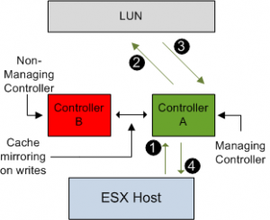
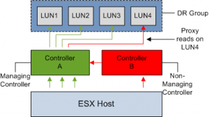

Some of my customers use HP Continuous Access to replicate VM data between storage arrays. Lately a couple of LUN balancing powershell- and Perl scripts were introduced in the VMware community. First of all, there is nothing wrong with those scripts. For example, Justin Emerson wrote an excellent script that balances the active paths to an active/active SAN. But using an auto balance scripts when Continuous Access is used in the Virtual Infrastructure can result in added IO latency and unnecessary storage processor load. Here’s why: <!--more--> **AA type** The HP EVA array range (4x,6x,8x) are categorized by VMware as active-active arrays. Active/active storage arrays are further divided into two categories: • Symmetrical Active-Active (SAA) • Asymmetric Active-Active (AAA) SAA arrays are considered by many as true active-active arrays. IO request can be issued over all paths and every controller in the array can accept and send IO to the LUN. EMC DMXs and HP XPs are SAA arrays. **Asymmetric Active-Active and Asymmetric Logical Unit Access (ALUA) compliance** The arrays from the EVA family are dual controller AAA arrays and are compliant with the SCSI Asymmetric Logical Unit Access (ALUA) standard for LUN access/failover and I/O processing. In an Asymmetric Active-Active Array both controllers are online and both can accept IO, but only one controller is assigned as the owning controller of the LUN. The owning controller can issue IO commands directly to the LUN, this is called an optimized path. The non-owning controller, or proxy controller can accept IO commands, but cannot communicate with the LUN. This is called an non-optimized path. If a read request reaches the array through the proxy controller, it will be forwarded to the owning controller of the LUN. This behavior is called a proxy read. It looks like I’m describing an active/passive array, but the main difference is that Active-Passive arrays transfer the ownership as soon as it receives IO on the non-owning controller. IO request are transferred between the controllers on the back-end of an AAA, making the process transparent to the ESX host. In a asymmetric Active-Active Array, storage processor ports have a certain port state with respect to a given LUN: **• Active\\Optimized • Active\\Non-Optimized • Standby • Unavailable • Transitioning** If the access characteristics of a port differs from another port asymmetric logical unit access occurs. ALUA provides a way to allow to report the states of the port to the host, the host can use the states of the port to prioritize paths. Unfortunately, ESX 3.x does not support ALUA, what that actually means is that ESX does not has the ability to identify, the LUN controller ownership, or to put it more precisely the the active\\optimized or active non-optimized paths. ALUA support is implemented in the PSA (Pluggable Storage Architecture) of ESX4. **Proxy reads** Read IO requests received by the proxy controller (1) are sent to the owning controller (2), which retrieves the data from disk (3), caches the read data (4) and mirrors the data to the cache of the proxy controller (5). The proxy controller satisfies the host read request (6), making this process transparent to the ESX host. Proxy reads add unnecessary latency to the IO request. It also creates higher mirror port utilization. IO-Write commands to the proxy controller suffer less performance impact. Due to fault protection all writes are mirrored in both controllers’ caches, but the owning controller is still responsible for flushing the data to disk.  **Mirror Port** The controller mirror ports are used for cache writes and proxy reads. If you setup your environment with correct multipathing, the mirror ports will only have to handle the write mirroring.  **Implicit LUN transition** If the EVA array detects, in a period of 60 minutes, that at least 66% of the total read request to a LUN are proxy reads, ownership is transitioned to the non-owning proxy controller and making it the owning controller. Justin’s powershell script assigns the same path to every server the same way. This way the EVA should switch the managing controller within the hour. (If you have multiple ESX hosts run multiple VM’s on the LUN of course) **Continuous Access DR Groups** If HP Continuous Access (CA) is used to replicate LUNs between two arrays, extra care must be taken when planning to use a LUN balancing script. CA sets up replication relationships between LUNs on different arrays; this is called a Data Replication (DR) group. A DR group can be considered a consistency group, all LUNs in a DR group fail over together, share a log and preserve write order within the group. Because of this requirements, one controller is assigned as managing (owning) controller for all member LUNS. **Implicit LUN transition** Because one controller manages a group of LUNs, CA disables implicit LUN transitions for all DR group members. Mixing Implicit LUN transition (ILT) together with a large DR group can be a recipe for disaster. Imagine if ILT was switched on and the array detects too much proxy reads on a LUN in the group.  The array will evoke an ILT for that LUN. Because all the LUN in the DR group must use the same controller to meet the consistency requirement all members are transitioned together.  So far so good, but you can bet on it that a new proxy read situation appears, due to the multiple hosts communicating with the disks. This will evoke another Implicit LUN transition.  And now we are back where we started. Enabling Implicit LUN transition can create some sort of bouncing group of LUNs between controllers. This is a sure way of giving you SAN administrator a small stroke. The downside of disabling ILT on a DR group is the possibility that LUNs may experience excessive proxy reads. **Using auto balance script on CA managed LUNs** Because ESX does not inquire about the status of the port when testing the path, the auto balance scripts cannot discover the optimized path. When paths are being initialized during the boot of the ESX host, it will just enumerate the paths available to it. Scanning the first controller and the lowest device number, this path might not necessarily be the path to the managing controller. Because all paths are active, the script will select the next path for a LUN. This can lead to IO requests arriving at the proxy controller and because implicit LUN transition is disabled, proxy reads will keep occurring. **Custom load balancing** If you have high workload intensity you might experience negative impact on IO performance when running a generic LUN balancing script. If you implement CA in your virtual infrastructure, it is better to take some time to design a custom load balance script. Using a well designed load balancing script along with fixed multipathing policy does not eliminate proxy reads, but it should only occur as a temporary condition during failures.  In the example, each DR group contains 5 LUNS, because every LUN in the DR group share the same managing controller, the optimized path for LUN 1-5 is through Storage Processor A. Alternating HBA's are used to load balance on the ESX side. **Determining the managing controller** To correctly load balance on EVA arrays you must know which controller owns the LUN. Command View EVA shows the managing controller of the LUN, but checking several LUNs via Command View EVA can be a lengthy process. Using Command view EVA (CVE) • On the presentation tab of the LUN (vdisk) properties • On the general tab of the DR Group properties HP Storage System Scripting Utility (SSSU) can help you to speed up discovering the management controller.Using SSSU: LS VDISK (Name will suffice, no need for complete path) The owning controller is listed as online controller (controller name) I’m not aware of any powershell tools to manage an EVA storage array. My contacts at HP cannot confirm if any new tooling except SSSU and CVE will appear soon
