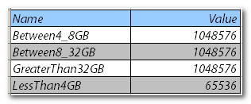
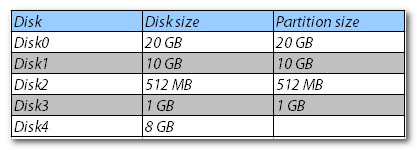
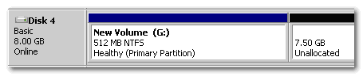

Due to many performance studies about disk performance it is well known that disk alignment for both VMFS partitions and NTFS file systems improve IO performance such as reduced latency and increased throughput. Alignment of VMFS partitions are done when configuring storage via the VI client but aligning NTFS partitions in Windows system prior to Windows 2008 is a manual task. Windows Server 2008 use a partition starting offset of 1,048,576 bytes (1,024 KB) for disk larger than 4GB. This provides a well enough alignment for most disks. According to the official documentation, windows 2008 uses a different partition starting offset for disks smaller than 4GB. Or as MS states in the document [Performance Tuning Guidelines for Windows Server 2008](http://download.microsoft.com/download/9/c/5/9c5b2167-8017-4bae-9fde-d599bac8184a/Perf-tun-srv.docx) _“Note that Windows Server 2008 defaults to a smaller power-of-two offset for small drives.”_ But which starting offset does W2K8 exactly use for smaller disks? <!--more--> **Registry** The default setting is configurable and therefore it can be found in the registry. The key _“HKLM\\SYSTEM\\CurrentControlSet\\Services\\VDS\\Alignment.”_ holds several values: This means that Windows 2008 uses a 1,024KB boundary for every disk from 4GB to 2TB, a 64KB partition starting offset is used for disks smaller than 4 GB.  Let’s check if this is true.  

**Partition starting offset check** You can examine the used partition starting offset of a basic disk by issuing the following command in the command prompt:  _wmic partition get Index, Name, StartingOffset_ I’ve created a virtual machine with five disks (vmdk’s): A primary partition of 512MB will be placed on disk 4. When opening Disk Management (diskmgmt.msc) the disk is shown as followed: When checking the disks in windows with the wmnic command it shows the following list: (w_mic partition get Index, Name, StartingOffset_) Wmic does not show disk 4.   A partition of 512MB is placed on Disk 4: The wmic command shows the following: As expected the third and forth disk have a different Starting Offset than disks larger than 4 GB. The last disk, disk 5, or what wmnic refers to as disk #4 has an offset of 1024Kb despite the size (512mb) of the partition (less than 4GB) This is because Windows 2008 sets the starting partition offset according to the size of the “physical disk” in the Virtual world, i.e. the size of the VMDK and not the size of the first partition. So when creating a 8GB vmdk and installing a 512MB partition, Windows 2008 selects the 1024 partition starting offset. I have used the wmic command to check the starting offset because basic disks where used, if dynamic disks are used you can check the partition starting offset with the tool dmddiag.exe –v (windows 2003) or diskdiag.exe –v in windows 2008. Both tools are in the support tools directory. Do not use diskpart to check the disk alignment, diskpart rounds up values, windows uses a partition starting offset of 32,256 bytes, which equals to 31.5 KB. Diskpart shows the offset as 32 KB (32768 bytes)    **System disks** Disk #0 is the system disk and Windows 2008 automatically aligns every disk out of the box, so even the system disk is now aligned. Prior to windows 2008, it was not recommend and according to Microsoft not even possible to align the system disk. Windows 2008 aligns the system disk as well.  Disks created by older versions of windows and presented to a windows 2008 will be left untouched and the disks will maintain the settings which they were created with.   **Virtual Machine template** I come across many VM’s where the guest OS disks are not properly aligned. This can have many reasons. Some administrators aren’t aware of the mis-alignment, or sometimes they forget aligning the newly added disk. Windows 2008 alleviates the problem by using a 1024KB boundary instead of the 31,5KB used by its predecessors. When dealing with deployment of VM’s by using templates this feature can be a blessing from heaven. Prior to windows 2008, NTFS partitions needed to be aligned manually by using the diskpart utility. All the diskpart commands are simple to perform, but partition alignment must be done at partition creation time, prior to partitions being formatted. Adjusting the partition alignment afterwards will destroy any data written on the disk! This additional work is really a pain in the butt, when creating a new virtual machine. The VM administrator must remember to align the partition and use the proper NTFS cluster size.  And you all know, when deploying VM’s sometimes settings done by hand will not applied every time. To solve this problem some companies use a template VM with several dummy hard disks. Each the size of 1 GB, properly aligned and formatted with the right cluster size. When deploying the VM, the size of the disk (vmdk) will be increased and the extend command of the diskpart.exe file is used in windows to enlarge the NTFS partition to utilize the newly added disk space. This “workaround” is still viable, but beware, when using disk with less then 4 GB of space, windows 2008 will use a different starting partition offset. (64KB) The disk is still properly aligned, but you can end up different configured systems in your virtual environment. Because of the default alignment of Windows 2008, the template doesn’t have to be equipped with dummy disks. The only thing left to worry about is a proper cluster size of the NTFS partition.    **Cluster size (file allocation unit)** When formatting the partition with a NTFS file system, a proper cluster size must be selected. Unfortunately there isn’t a one-size-fits-all cluster size. Some applications thrive when using a 64KB cluster size (SQL) some applications will perform at their best when formatting the partition with a 32KB cluster size. If you decide on the cluster size to use, you can automate the creation of the NTFS partitions by using diskpart in scripted mode.   **Diskpart Script** For this example, a diskpart script is used to create a primary partition on the last disk of the VM. Insert the commands in a simple text document (script.txt) and issue the command: diskpart /s script.txt Here’s what the script.txt looks like:

_select disk 4 create partition primary assign letter=G format fs=ntfs unit=64K label="scripted" nowait_ The nowait command forces the command to return immediately while the format process is still in progress, because of this, multiple formats can be issued at once. Windows 2008 saves the VM administrator a lot of trouble by auto aligning partitions, due to this fact some admins might have to take a look at there current deploy method and their templates.
