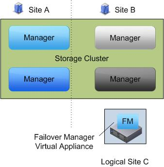

**Disclaimer: This article contains references to the words master and slave. I recognize these as exclusionary words. The words are used in this article for consistency because it's currently the words that appear in the software, in the UI, and in the log files. When the software is updated to remove the words, this article will be updated to be in alignment.** 

Please note that this article has been written in 2009. I do not know if Lefthand changed their solution. Please check with your HP representative for updates!

I recently had the opportunity to deliver a virtual infrastructure that uses HP Lefthand SAN solution.  Setting up a Lefthand SAN is not that difficult, but there are some factors to take into consideration when planning and designing a Lefthand SAN properly. These are my lessons learned. <!--more--> **Lefthand, not the traditional Head-Shelf configuration** HP lefthand SANs are based on iSCSI and are formed by Storage nodes. In traditional storage architectures, a controller manages arrays of disk drives. A Lefthand SAN is composed of storage modules. A Network Storage Module 2120 G2 (NSM node) is basically an HP DL185 server with 12 SAS or SATA drivers running SAN/iQ software.

This architecture enables the aggregation of multiple storage nodes to create a storage cluster and this solves one of the toughest design questions when sizing a SAN.  Instead of estimating growth and buying a storage array to “grow into”, you can add storage nodes to the cluster when needed. This concludes the sales pitch. But this technique of aggregating separate NSM nodes into a cluster raises some questions.  Questions such as;

- Where will the blocks of a single LUN be stored; all on one node, or across nodes?
- How are LUNs managed?
- How is datapath load managed?
- What is the impact of failure of a NSM node ?

**Block placement and Replication level** The placement of blocks of a LUN depends on the configured replication level. Replication level is a feature called Network RAID Level. Network RAID stripes and mirrors multiple copies of data across a cluster of storage nodes. Up to four levels of synchronous replication at LUN level can be configured;

- None
- 2-way
- 3-way
- 4-way

Blocks will be stored on storage nodes according to the replication level. If a LUN is created with the default replication level of 2-way, two authoritative blocks are written at the same time to two different nodes. If a 3-way replication level is configured, blocks are stored on 3 nodes. 4-way = 4 nodes. (Replication cannot exceed the number of nodes in the cluster) SAN IQ will always start to write the next block to the second node containing the previous block. A picture is worth a thousand words.

 **Node order** The data in which blocks are written to the LUN is determined not by node hostname but by the order in which the nodes are added to the cluster.  The order of the placement of the nodes is extremely important if the SAN will span two locations. More information on this design issue later.

**Virtual IP and VIP Load Balancing** When setting up a Lefthand Cluster, a Virtual IP (VIP) needs to be configured. A VIP is required for iSCSI load balancing and fault tolerance. One NSM node will act as the VIP for the cluster, if this node fails, the VIP function will automatically failover to another node in the cluster. The VIP will function as the iSCSI portal, ESX servers use the VIP for discovery and to log in to the volumes.  ESX servers can connect to volumes two ways. Using the VIP and using the VIP with the option load balancing (VIPLB) enabled.  When enabling VIPLB on LUNs, the SAN/iQ software will balance connections to different nodes of the cluster.

Configure the ESX iscsi inititiator with the VIP as a destination address.  The VIP will supply the ESX servers with a target address for each LUN.  VIPLB will transfer initial communication to the gateway connection of the LUN.  Running the vmkiscsi-util command shows the VIP as a portal and another ip address as target address of the LUN

root@esxhost00 vmfs\]# vmkiscsi-util -i -t 58 -l \*\*\*\*\*\*\*\*\*\*\*\*\*\*\*\*\*\*\*\*\*\*\*\*\*\*\*\*\*\*\*\*\*\*\*\*\*\*\*\*\*\*\*\*\*\*\*\*\*\*\*\*\*\*\*\*\*\*\*\*\*\*\*\*\*\*\*\*\*\*\*\*\*\*\* Cisco iSCSI Driver Version ... 3.6.3 (27-Jun-2005 ) \*\*\*\*\*\*\*\*\*\*\*\*\*\*\*\*\*\*\*\*\*\*\*\*\*\*\*\*\*\*\*\*\*\*\*\*\*\*\*\*\*\*\*\*\*\*\*\*\*\*\*\*\*\*\*\*\*\*\*\*\*\*\*\*\*\*\*\*\*\*\*\*\*\*\* TARGET NAME             : iqn.2003-10.com.lefthandnetworks:lefthandcluster:1542:volume3 TARGET ALIAS            : HOST NO                 : 0 BUS NO                  : 0 TARGET ID               : 58 TARGET ADDRESS          : 148.11.18.60:3260 SESSION STATUS          : ESTABLISHED AT Fri Sep 11 14:51:13 2009 NUMBER OF PORTALS          : 1 PORTAL ADDRESS 1        : 148.11.18.9:3260,1 SESSION ID              : ISID 00023d000001 TSIH 3b1

**Gateway Connection** This target address is what Lefthand calls a gateway connection. The gateway connection is described in the Lefthand SAN User Manual (page 561) as follows;

> _Use iSCSI load balancing to improve iSCSI performance and scalability by distributing iSCSI sessions for different volumes evenly across storage nodes in a cluster. ISCSI load balancing uses iSCSI Login-Redirect.  Only initiators that support Login-Redirect should be used. When using VIP and load balancing, one iSCSI session acts as the gateway session. All I/O goes through this iSCSI session. You can determine which iSCSI session is the gateway by selecting the cluster, then clicking the iSCSI Sessions tab. The Gateway Connection column displays the IP address of the storage node hosting the load balancing iSCSI session._

SAN/IQ will designate a node to act as a gateway connection for the LUN, the VIP will send the IP address of this node as a target address to all the ESX hosts. This means every host that uses the LUN will connect to that specific node and this storage node will handle all IO for this LUN.  This leads to the question, how will the GC handle IO for blocks not locally stored on that node?  When a block is requested that is stored on another node, the GC will fetch this block. All nodes are aware of which block is stored on which node. The GC node will fetch this block of one of the nodes it’s stored and will send the results back to the ESX host.  **Gateway Connection failover** Most Clusters will host more LUNs than it has available nodes. This means that each node will host the gateway connection role of multiple LUNs. If a node fails, the GC role will be transferred to the other nodes in the cluster. But when a NSM node returns back online, the VIP will not failback the GC roles. This will create an unbalance it the cluster, which needs to be solved as quickly as possible.  This can be done by issuing the RebalanceVIP for the volume from the cli. [Ken Cline](http://kensvirtualreality.wordpress.com) asked me the question:

> How do I know when I need to use this command? Is there a status indicator to tell me?

Well actually there isn't and that is exactly the problem! After a node failure, you need to be aware of this behavior and you will have to rebalance a volume yourself by running the RebalanceVIP command. The Lefthand CMC does not offer this option or some sort of alert.

**Network Interface Bonds** How about the available bandwidth? Lefthand nodes come standard with two 1GB NICs. The two NICs can be placed in a bond. An NSM node has three NIC bond configurations;

1. Active - Passive
2. Link Aggregation (802.3 ad)
3. Adaptive Load Balancing

The most interesting is the Adaptive Load Balancing (ALB).  Adaptive Load Balancing combines the benefits of the increased bandwidth of 802.3ad with the network redundancy of Active-Passive. Both NICS are made active and they can be connected to different switches, no additional configuration on physical switch level is needed.

When an ALB bond is configured, it creates an interface. This interface balances traffic through both NICs. But how will this work with the iSCSI protocol? In RFC 3270 ([http://www.ietf.org/rfc/rfc3720.txt](http://www.ietf.org/rfc/rfc3720.txt)) iSCSI uses command connection allegiance;

> _For any iSCSI request issued over a TCP connection, the corresponding response and/or other related PDU(s) MUST be sent over the same connection.  We call this "connection allegiance"._ 

This means that the NSM node must use the same MAC address to send the IO back. How will this affect the bandwidth? As stated in the ISCSI SAN configuration guide; “_ESX Server__‐__based iSCSI initiators establish only one connection to each target.__”._

It looks like ESX will communicate with the gateway connection of the LUN with only NIC. I asked Calvin Zito ([http://twitter.com/HPstorageGuy](https://email.vmware.com/owa/redir.aspx?C=951e0447a24e476392d731e89ff0dd47&URL=http%3a%2f%2ftwitter.com%2fHPstorageGuy)) to educate me on ALB and how it handles connection allegiance.

> _When you create a bond on an NSM, the bond becomes the 'interface' and the MAC address of one of the NICs becomes the MAC address for the bond.  The individual NICs become 'slaves' at that point.  I/O will be sent to and from the 'interface' which is the bond and the bonding logic figures out how to manage the 2 slaves behind the scenes.  So with ALB, for transmitting packets, it will use both NICs or slaves, but they will be associated with the MAC of the bond interface, not the slave device._

The bond uses the same IP and MAC address of the first onboard NIC. This means the node will use both interfaces to transmit data, but only one to receive.

_Chad Sakac (EMC), Andy Banta (VMware) and various other folks has written a multivendor post explaining how ESX and vSphere handles iSCSI traffic. A must-read!_ _[http://virtualgeek.typepad.com/virtual\_geek/2009/01/a-multivendor-post-to-help-our-mutual-iscsi-customers-using-vmware.html#more](http://virtualgeek.typepad.com/virtual_geek/2009/01/a-multivendor-post-to-help-our-mutual-iscsi-customers-using-vmware.html#more)_

**Design issues;** When designing a Lefthand SAN, these points are worth considering;

**Network RAID level Write performance** When 2-way replication is selected, blocks will be written on two nodes simultaneously, if a LUN is configured with 3-way replication, then blocks must be replicated to three nodes . Acknowledgements are given when blocks are written in cache on all the participating nodes. When selecting the replication level, keep in mind that higher protection levels leads to less write performance.

**Raid Levels NSM** Network RAID offers protection for storage node failure, but it does not protect against disk failure within a storage node. Disk RAID levels need to be configured at Storage Node level, unlike most traditional arrays where raid level can be configured per LUN level. It is possible to mix storage nodes with different configurations of  RAID within a cluster, but the this can lead a lower useable capacity.

For example, the cluster exists of 12 TB nodes running RAID 10. Each node will provide 6TB in usable storage. When adding two 12TB nodes running RAID 5, each provides 10 TB of usable storage. However, due to the restrictions of how the cluster uses capacity, the NSM nodes running RAID 5 will still be limited to 6 TB per storage node. This restriction is because the cluster operates at the smallest usable per-storage node capacity. The RAID level of the storage node must first be set before it can join a Cluster. Check RAID level of clusternodes before configuring the new node, because you cannot change the RAID configuration without deleting data.

**Combining Replication Levels with RAID levels** RAID levels will ensure data redundancy inside the storage node, while Replication levels will ensure data redundancy on the storage node level. Both higher RAID levels and Replication levels offer greater data redundancy, but will have an impact on capacity and performance. RAID5 with 2-way replication seems to be the sweet spot for most implementations, but when high available data protection is needed, Lefthand recommends 3-way replication with raid 5, ensuring triple mirroring with 3 parity blocks available.

I would not suggest RAID 0 with replication, because rebuilding a RAID set will always be quicker than copying an entire storage node over the network.

**Node placement** Mentioned previously, the data in which blocks are written to the LUN is determined by the order in which the nodes are added to the cluster.  When using 2-way replication, blocks are written to two consecutive nodes.  When designing a cluster the order of the placement of the nodes is extremely important if the SAN will be placed in two separate racks or even better span two locations.

Because the 2-way replication writes blocks on two consecutive nodes, adding the storage nodes to the cluster in alternating order will ensure that data is written to each rack or site.  When nodes are added in the incorrect order or if a node is replaced, the general setting tab of the cluster properties allows you to “promote” or “demote” a storage node in the logical order. This list is the leading for the “write” order of the nodes.  

**Management Group and Managers** In addition to setting up data replication, it is important to setup managers. Managers play an important role in controlling data flow and access of clusters. Managers run inside a management group. Several storage nodes must be designated to run the manager's service. Because managers use a voting algorithm, a majority of managers needs to be active to function.  This majority is called a Quorum. If a quorum is lost, access to data is lost. Be aware that access to data is lost, not the data itself. An odd number of managers is recommended,  as a (low) even a number of managers can get in a certain state where no majority is determined.  The maximum number of managers is 5.

**Failover manager** A failover manager is a special edition of a manager. Instead of running on a storage node, the failover manager runs as a virtual appliance. A failover manager only function is maintaining quorum. When designing a SAN spanning two sites, running a failover manager is recommended. The optimum placement of the failover manager is the third site. Place an even amount of managers in both sites and run the failover manager at an independent site.  If a third site is not available, run the failover manager local on a server, creating a logical separated site  **Volumenames** And the last design issue, volume names cannot be changed.  The volume name is the only setting that can’t be edited after creation. Plan your naming convention carefully, otherwise, you will end up recreating volumes and restoring data. If someone of HP is reading this, please change this behavior!

Get notification of these blogs postings and more DRS and Storage DRS information by following me on Twitter: [@frankdenneman](https://twitter.com/FrankDenneman)
