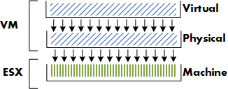
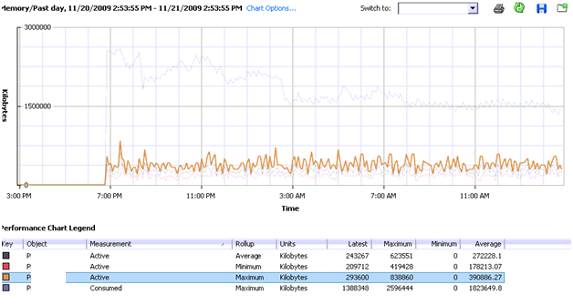

I have a customer who wants to set memory reservation on a large scale. Instead of using resource pools they were thinking of setting reservations on VM level to get a guaranteed performance level for every VM. Due to memory management on different levels, using such a setting will not get the expected results. Setting aside the question if it’s smart to use memory reservation on ALL VM’s, it raises the question what kind of impact setting memory reservation has on the virtual infrastructure, how ESX memory management handles memory reservation and even more important; how a proper memory reservation can be set. **Key elements of the memory system** Before looking at reservations, let’s take a look what elements are involved. There are three memory layers in the virtual infrastructure: • Guest OS virtual memory - Virtual Page Number (VPN) • Guest OS physical memory - Physical Page Number (PPN) • ESX machine memory - Machine Page Number (MPN) The OS inside the guest maps virtual memory ( VPN) to physical memory(PPN). The Virtual Machine Monitor (VMM) maps the PPN to machine memory (MPN). The focus of this article is on mapping physical page numbers (PPN) to Machine Page Number (MPN).  **Impact of memory management on the VM** Memory reservations guarantee that physical memory pages are backed by machine memory pages all the time, whether the ESX server is under memory pressure or not. Opposite of memory reservations are limits. When a limit is configured, the memory between the limit and the configured memory will never be backed by machine memory; it could either be reclaimed by the balloon driver or swapped even if enough free memory is available in the ESX sever. Next to reservations and limits, shares play an important factor in memory management of the VM. Unlike memory reservation, shares are only of interest when contention occurs.  The availability of memory between memory reservation and configured memory depends on the entitled shares compared to the total shares allocated to all the VMs on the ESX server. This means that the virtual machine with the most shares can have its memory backed by physical pages. For the sake of simplicity, the vast subject of resource allocation based on the proportional share system will not be addressed in this article. One might choose to set the memory reservation equal to the configured memory, this will guarantee the VM the best performance all of the time. But using this “policy” will have its impact on the environment. **Admission Control** Configuring memory reservation has impact on admission control . There are three levels of admission control; • Host • High Availability • Distributed Resource Scheduler **Host level** When a VM is powered on, admission control checks the amount of available unreserved CPU and memory resources. If ESX cannot guarantee the memory reservation and the memory overhead of the VM, the VM is not powered on. VM memory overhead is based on Guest OS, amount of CPUs and configured memory, for more information about memory overhead review the Resource management guide. **HA and DRS** Admission control also exist at HA and DRS level. HA admission control uses the configured memory reservation as a part of the calculation of the cluster slot size.The amount of slots available equals the amount of VM’s that can run inside the cluster. To find out more about slot sizes, read the [HA deepdive](http://www.yellow-bricks.com/vmware-high-availability-deepdiv/) article of Duncan Epping. DRS admission control ignores memory reservation, but uses the configured memory of the VM for its calculations. To learn more about DRS and its algorithms read the [DRS deepdive](http://www.yellow-bricks.com/drs-deepdive/) article at yellow-bricks.com **Virtual Machine Swapfile** Configuring memory reservation will have impact on the size of the VM swapfile; the swapfile is (usually) stored in the home directory of the VM. The virtual machine swapfile is created when the VM starts. The size of the swapfile is calculated as follows:

> _Configured memory – memory reservation = size swap file_

Configured memory is the amount of “physical” memory seen by guest OS. For example; configured memory of VM is 2048MB – memory reservation of 1024MB = Swapfile size = 1024MB.  ESX use the memory reservation setting when calculating the VM swapfile because reserved memory will be backed by machine memory all the time. The difference between the configured memory and memory reservation is eligible for memory reclamation. **Reclaiming Memory** Let’s focus a bit more on reclaiming. Reclaiming of memory is done by ballooning or swapping. But when will ESX start to balloon or swap? ESX analyzes its memory state. The VMkernel will try to keep 6% free (Mem.minfreepct) of its memory. (physical memory-service console memory) When free memory is greater or equal than 6%, the VMkernel is in a HIGH free memory state. In a high free memory state, the ESX host considers itself not under memory pressure and will not reclaim memory in addition to the default active Transparent Page sharing process. When available free memory drops below 6% the VMkernel will use several memory reclamation techniques. The VMkernel decides which reclamation technique to use depending on its threshold. ESX uses four thresholds high (6%), soft (4%) hard (2%) and low (1%). In the soft state (4% memory free) ESX prefers to use ballooning, if free system memory keeps on dropping and ESX will reach the Hard state (2% memory free) it will start to swap to disk. ESX will start to actively reclaim memory when it’s running out of free memory, but be aware that free memory does not automatically equal active memory. **Memory reservation technique** Let’s get back to memory reservation .How does ESX handle memory reservation? Page 17 of the Resource Management Guide states the following:

> _Memory Reservation_ If a virtual machine has a memory reservation but has not yet accessed its full reservation, the unused memory can be reallocated to other virtual machines.

> _Memory Reservation Used_ Used for powered‐on virtual machines, the system reserves memory resources according to each virtual machine’s reservation setting and overhead. After a virtual machine has accessed its full reservation, ESX Server allows the virtual machine to retain this much memory, and will not reclaim it, even if the virtual machine becomes idle and stops accessing memory.

To recap the info stated in the Resource Management Guide, when a VM hits its full reservation, ESX will never reclaim that amount of reserved memory even if the machine idles and drops below its guaranteed reservation. It cannot reallocate that machine memory to other virtual machines. **Full reservation** But when will a VM hit its full reservation exactly? Popular belief is that the VM will hit full reservation when a VM is pushing workloads, but that is not entirely true. It also depends on the Guest OS being used by the VM. Linux plays rather well with others, when Linux boots it only addresses the memory pages it needs. This gives ESX the ability to reallocate memory to other machines. After its application or OS generates load, the Linux VM can hit its full reservation. Windows on the other hand zeroes all of its memory during boot, which results in hitting the full reservation during boot time. **Full reservation and admission control** This behavior will have impact on admission control. Admission control on the ESX server checks the amount of available unreserved CPU and memory resources. Because Windows will hit its full reservation at startup, ESX cannot reallocate this memory to other VMs, hereby diminishing the amount of available unreserved memory resources and therefore restricting the capacity of VM placement on the ESX server. But memory reclamation, especially TPS will help in this scenario, TPS (transparent page sharing) reduces redundant multiple guest pages by mapping them to a single machine memory page. Because memory reservation “lives” at machine memory level and not at virtual machine physical level, TPS will reduce the amount of reserved machine memory pages, memory pages that admission controls check when starting a VM. **Transparant Page Sharing** TPS cannot collapse pages immediately when starting a VM in ESX 3.5. TPS is a process in the VMkernel; it runs in the background and searches for redundant pages. Default TPS will have a cycle of 60 minutes (Mem.ShareScanTime) to scan a VM for page sharing opportunities. The speed of TPS mostly depends on the load and specs of the Server. Default TPS will scan 4MB/sec per 1 GHz. (Mem.ShareScanGHz). Slow CPU equals slow TPS process. (But it’s not a secret that a slow CPU will offer less performance that a fast CPU.) TPS defaults can be altered, but it is advised to keep to the default.TPS cannot collapse pages immediately when starting a VM in ESX 3.5. VMware optimized memory management in ESX 4; pages which Windows initially zeroes will be page-shared by TPS immediately. **TPS and large pages** One caveat, TPS will not collapse large pages when the ESX server is not under memory pressure. ESX will back large pages with machine memory, but installs page sharing hints. When memory pressure occurs, the large page will be broken down and TPS can do it’s magic. More info on Large pages and ESX can be found at Yellow Bricks. [http://www.yellow-bricks.com/2009/05/31/nehalem-cpu-and-tps-on-vsphere/](http://www.yellow-bricks.com/2009/05/31/nehalem-cpu-and-tps-on-vsphere/) **Use resource pools** Setting memory reservation has impact on the VM itself and its surroundings. Setting reservation per VM is not best practice; it is advised to create resource pools instead of per VM reservations. Setting reservations on a granular level leads to increased administrative and operational overhead. But when the situation demands to use per VM reservation, in which way can a reservation be set to guarantee as much performance as possible without wasting physical memory and with as less impact as possible. The answer: _set reservation equal to the average Guest Memory Usage of the VMs_. **Guest Memory Usage** Guest Memory Usage shows the active memory use of the VM. Which memory is considered active memory? If a memory page is accessed in mem.sampleperiod (60sec), it is considered active. To accomplish this you need to monitor each VM, but this is where vCenter comes to the rescue. vCenter logs performance data and does this for a period of time. The problem is that the counters average-, minimum and maximum active memory data is not captured on the default vCenter statistics. vCenter logging level needs to upgraded to a minimum level of 4. After setting the new level, vCenter starts to log the data. Changing the statistic setting can be done by Administration > VirtualCenter Management Server Configuration > Statistics.  To display the average active memory of the VM, open the performance tab of the VM and change chart options, select memory  Select the counters consumed memory and average-, minimum- and maximum active memory. The performance chart of most VMs will show these values close to each other. As a rule the average active memory figure can be used as input for the memory reservation setting, but sometimes the SLA of the VM will determine that it’s better to use the maximum active memory usage.  Consumed memory is the amount of host memory that is being used to back guest memory. The images shows that memory consumed slowly decreases. The active memory use does not change that much during the monitored 24 hours. By setting the reservation equal to the maximum average active memory value, enough physical pages will be backed to meet the VM’s requests. **My advice** While memory reservation is an excellent mechanism to guarantee memory performance levels of a virtual machine, setting memory reservation will have a positive impact on the virtual machine itself and can have a negative impact on its surroundings. Memory reservation will ensure that virtual machine memory will be backed by physical memory (MPN) of the ESX host server. Once the VM hit its full reservation the VMkernel will not reclaim this memory, this will reduce the unreserved memory pool. This memory pool is used by admission control, admission control will power up a VM machine only if it can ensure the VMs resource request. The combination of admission control and the restraint of not able to allocate reserved memory to other VMs can lead to a reduced consolidation ratio. Setting reservations on a granular level leads to increased administrative and operational overhead and is not best practice. It is advised to create resource pools instead of per VM reservations. But if a reservation must be set, use the real time counters of VMware vCenter and monitor the average active memory usage. Using average active memory as input for memory reservation will guarantee performance for most of its resource requests. I recommend reading the following whitepapers and documentation; Carl A. Waldspurger. Memory Resource Management in VMware ESX Server: [http://waldspurger.org/carl/papers/esx-mem-osdi02.pdf](http://waldspurger.org/carl/papers/esx-mem-osdi02.pdf) Understanding Memory Resource Management in VMware ESX: [http://www.vmware.com/files/pdf/perf-vsphere-memory\_management.pdf](http://www.vmware.com/files/pdf/perf-vsphere-memory_management.pdf) Description of other interesting memory performance counters can be found here [http://www.vmware.com/support/developer/vc-sdk/visdk25pubs/ReferenceGuide/mem.html](http://www.vmware.com/support/developer/vc-sdk/visdk25pubs/ReferenceGuide/mem.html) Software and Hardware Techniques for x86 Virtualization: [http://www.vmware.com/files/pdf/software\_hardware\_tech\_x86\_virt.pdf](http://www.vmware.com/files/pdf/software_hardware_tech_x86_virt.pdf) Get notification of these blogs postings and more DRS and Storage DRS information by following me on Twitter: [@frankdenneman](https://twitter.com/FrankDenneman)
