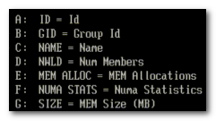

**Note: This article describes NUMA scheduling on ESX 3.5 and ESX 4.0 platform, vSphere 4.1 introduced wide NUMA nodes, information about this can be found in my new article: [ESX4.1 NUMA scheduling](http://frankdenneman.nl/2010/09/esx-4-1-numa-scheduling/)**

With the introduction of vSphere, VM configurations with 8 CPUs and 255 GB of memory are possible. While I haven’t seen that much VM’s with more than 32GB, I receive a lot of questions about 8-way virtual machines. With today’s CPU architecture, VMs with more than 4 vCPUs can experience a decrease in memory performance when used on NUMA enabled systems. While the actually % of performance decrease depends on the workload, avoiding performance decrease must always be on the agenda of any administrator.

Does this mean that you stay clear of creating large VM’s? No need to if the VM needs that kind of computing power, but the reason why I’m writing this is that I see a lot of IT departments applying the same configuration policy used for physical machines. A virtual machine gets configured with multiple CPU or loads of memory because it might need it at some point during its lifecycle. While this method saves time, hassle and avoid office politics, this policy can create unnecessary latency for large VMs. Here’s why:

**NUMA node** Most modern CPU’s, Intel new Nehalem’s and AMD’s veteran Opteron are NUMA architectures. NUMA stands for Non-Uniform Memory Access, but what exactly is NUMA? Each CPU get assigned its own “local” memory, CPU and memory together form a NUMA node. An OS will try to use its local memory as much as possible, but when necessary the OS will use remote memory (memory within another NUMA node). Memory access time can differ due to the memory location relative to a processor, because a CPU can access it own memory faster than remote memory.

_Figure 1: Local and Remote memory access_

Accessing remote memory will increase latency, the key is to avoid this as much as possible. How can you ensure memory locality as much as possible?

**VM sizing pitfall #1, vCPU sizing and Initial placement**.

ESX is NUMA aware and will use the NUMA CPU scheduler when detecting a NUMA system. On non-NUMA systems the ESX CPU scheduler spreads load across all sockets in a round robin manner. This approach improves performance by utilizing as much as cache as possible. When using a vSMP virtual machine in a non-NUMA system, each vCPU is scheduled on a separate socket. On NUMA systems, the NUMA CPU scheduler kicks in and use the NUMA optimizations to assigns each VM to a NUMA node, the scheduler tries to keep the vCPU and memory located in the same node. When a VM has multiple CPUs, all the vCPUs will be assigned to the same node and will reside in the same socket, this is to support memory locality as much as possible.

_Figure 2: NON-NUMA vCPU placement_

_Figure 3: NUMA vCPU placement_

At this moment, AMD and Intel offer Quad Core CPU’s, but what if the customer decides to configure an 8-vCPU virtual machine? If a VM cannot fit inside one NUMA node, the vCPUs are scheduled in the traditional way again and are spread across the CPU’s in the system. The VM will not benefit from the local memory optimization and it’s possible that the memory will not reside locally, creating added latency by crossing the intersocket connection to access the memory.

**VM sizing pitfall #2: VM configured memory sizing and node local memory size** NUMA will assign all vCPU’s to a NUMA node, but what if the configured memory of the VM is greater than the assigned local memory of the NUMA node? Not aligning the VM configured memory with the local memory size will stop the ESX kernel of using NUMA optimizations for this VM. You can end up with all the VM’s memory scattered all over the server. So how do you know how much memory every NUMA node contains? Typically each socket will get assigned the same amount of memory; the physical memory (minus service console memory) is divided between the sockets. For example 16GB will be assigned to each NUMA node on a two socket server with 32GB total physical. A quick way to confirm the local memory configuration of the NUMA nodes is firing up esxtop. Esxtop will only display NUMA statistics if ESX is running on a NUMA server. The first number list the total amount of machine memory in the NUMA node that is managed by ESX, the statistic displayed within the round brackets is the amount of machine memory in the node that is currently free.

_Figure 4: esxtop memory totals_

Let’s explore NUMA statistics in esxtop a little bit more based on this example. This system is a HP BL 460c with two Nehalem quad cores with 64GB memory. As shown, each NUMA node is assigned roughly 32GB. The first node has 13GB free; the second node has 372 MB free. It looks it will run out of memory space soon, luckily the VMs on that node still can get access remote memory. When a VM has a certain amount of memory located remote, the ESX scheduler migrates the VM to another node to improve locality. It’s not documented what threshold must be exceeded to trigger the migration, but its [considered](http://www.yellow-bricks.com/esxtop/) poor memory locality when a VM has less than 80% mapped locally, so my “educated” guess is that it will be migrated when the VM hit a number below the 80%. Esxtop memory NUMA statistics show the memory location of each VM. Start esxtop, press m for memory view, press f for customizing esxtop and press f to select the NUMA Statistics.

_Figure 5: Customizing esxtop_

Figure 6 shows the NUMA statistics of the same ESX server with a fully loaded NUMA node, the N%L field shows the percentage of mapped local memory (memory locality) of the virtual machines.

_Figure 6: esxtop NUMA statistics_

It shows that a few VMs access remote memory. The man pages of esxtop explain all the statistics:

| Metric | Explanation |
| --- | --- |
| NHN | Current Home Node for virtual machine |
| NMIG | Number of NUMA migrations between two snapshots. It includes balance migration, inter-mode VM swaps performed for locality balancing and load balancing |
| NRMEM (MB) | Current amount of remote memory being accessed by VM |
| NLMEM (MB) | Current amount of local memory being accessed by VM |
| N%L | Current percentage memory being accessed by VM that is local |
| GST\_NDx (MB) | The guest memory being allocated for VM on NUMA node x. "x" is the node number |
| OVD\_NDx (MB) | The VMM overhead memory being allocated for VM on NUMA node x |

**Transparent page sharing and memory locality.** So how about transparent page sharing (TPS), this can increase latency if the VM on node 0 will share its page with a VM on node 1. Luckily VMware thought of that and TPS across nodes is disabled by default to ensure memory locality. TPS still works, but will share identical pages only inside nodes. The performance hit of accessing remote memory does not outweigh the saving of shared pages system wide.

_Figure 7: NUMA TPS boundaries_

This behavior can be changed by altering the setting VMkernel.Boot.sharePerNode. As most default settings in ESX, only change this setting if you are sure that it will benefit your environment, 99.99% of all environments will benefit from the default setting.

**Take away** With the introduction of vSphere ESX 4, the software layer surpasses some abilities current hardware techniques can offer. ESX is NUMA aware and tries to ensure memory locality, but when a VM is configured outside the NUMA node limits, ESX will not apply NUMA node optimizations. While a VM still run correctly without NUMA optimizations, it can experience slower memory access. While the actually % of performance decrease depends on the workload, avoiding performance decrease if possible must always be on the agenda of any administrator.

To quote the resource management guide:

> The NUMA scheduling and memory placement policies in VMware ESX Server can manage all VM transparently, so that administrators do not need to address the complexity of balancing virtual machines between nodes explicitly.

While this is true, administrators must not treat the ESX server as a black box; with this knowledge administrators can make informed decisions about their resource policies. This information can help to adopt a scale-out policy (multiple smaller VMs) for some virtual machines instead of a scale up policy (creating large VMs) if possible. Beside the preference for scale up or scale out policy, a virtual environment will profit when administrator choose to keep the VMs as agile as possible. My advice to each customer is to configure the VM reflecting its current and near future workload and actively monitor its habits. Creating the VM with a configuration which might be suitable for the workload somewhere in its lifetime can have a negative effect on performance.

Get notification of these blogs postings and more DRS and Storage DRS information by following me on Twitter: [@frankdenneman](https://twitter.com/FrankDenneman)
