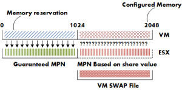

On a regular basis I come across NFS based environments where the decision is made to store the virtual machine swap files on local VMFS datastores. Using host-local swap can affect DRS load balancing and HA failover in certain situations. So when designing an environment using host-local swap, some areas must be focused on to guarantee HA and DRS functionality. **VM swap file** Lets start with some basics, by default a VM swap file is created when a virtual machine starts, the formula to calculate the swap file size is: configured memory – memory reservation = swap file. For example a virtual machine configured with 2GB and a 1GB memory reservation will have a 1GB swap file.  Reservations will guarantee that the specified amount of virtual machine memory is (always) backed by ESX machine memory. Swap space must be reserved on the ESX host for the virtual machine memory that is not guaranteed to be backed by ESX machine memory. For more information on memory management of the ESX host, please the article on the [impact of memory reservation](http://frankdenneman.nl/2009/12/impact-of-memory-reservation/). During start up of the virtual machine, the VMkernel will pre-allocate the swap file blocks to ensure that all pages can be swapped out safely. A VM swap file is a static file and will not grow or shrink not matter how much memory is paged. If there is not enough disk space to create the swap file, the host admission control will not allow the VM to be powered up. **Note:** If the local VMFS does not have enough space, the VMkernel tries to store the VM swap file in the working directory of the virtual machine. You need to ensure enough free space is available in the working directory otherwise the VM is still not allowed to be powered up. Let alone ignoring the fact that you initially didn't want the VM swap stored on the shared storage in the first place. This rule also applies when migrating a VM configured with a host-local VM swap file as the swap file needs to be created on the local VMFS volume of the destination host. Besides creating a new swap file, the swapped out pages must be copied out to the destination host. It’s not uncommon that a VM has pages swapped out, even if there is not memory pressure at that moment. ESX does not proactively return swapped pages back into machine memory. Swapped pages always stays swapped, the VM needs to actively access the page in the swap file to be transferred back to machine memory but this only occurs if the ESX host is not under memory pressure (more than 6% free physical memory). Copying host-swap local pages between source- and destination host is a disk-to-disk copy process, this is one of the reasons why VMotion takes longer when host-local swap is used. **Real-life scenario** A customer of mine was not aware of this behavior and had discarded the multiple warnings of full local VMFS datastores on some of their ESX hosts. All the virtual machines were up and running and all seemed well. Certain ESX servers seemed to be low on resource utilization and had a few active VMs, while other hosts were highly utilized. DRS was active on all the clusters, fully automated and a default (3 stars) migration threshold. It looked like we had a major DRS problem. **DRS** If DRS decide to rebalance the cluster, it will migrate virtual machines to low utilized hosts. VMkernel tries to create a new swap file on the destination host during the VMotion process. In my scenario the host did not contain any free space in the VMFS datastore and DRS could not VMotion any virtual machine to that host because the lack of free space. But the host CPU active and host memory active metrics were still monitored by DRS to calculate the load standard deviation used for its recommendations to balance the cluster. (More info about the DRS algorithm can be found on the [DRS deepdive](http://www.yellow-bricks.com/drs-deepdive/) page). The lack of disk space on the local VMFS datastores influenced the effectiveness of DRS and limited the options for DRS to balance the cluster. **High availability failover** The same applies when a HA isolation response occurs, when not enough space is available to create the virtual machine swap files, no virtual machines are started on the host. If a host fails, the virtual machines will only power-up on host containing enough free space on their local VMFS datastores. It might be possible that virtual machines will not power-up at-all if not enough free disk space is available. **Failover capacity planning** When using host local swap setting to store the VM swap files, the following factors must be considered. • Amount of ESX hosts inside cluster. • HA configured host failover capacity. • Amount of active virtual machines inside cluster. • Consolidation ratio (VM per host). • Average swap file size. • Free disk space local VMFS datastores.

|  |  |
| --- | --- |
| Number of hosts inside cluster: | 6 |
| HA configured host failover capacity: | 1 |
| Active virtual machines: | 162 |
| Average consolidation ratio: | 27:1 |
| Average memory reservation: | 0GB |
| Average swap file size: | 4GB |

  
For the sake of simplicity, let’s assume that DRS balanced the cluster load and that all (identical) virtual machines are spread evenly across every host. In case of a host failure, 27 VMs will be restarted on the remaining 5 hosts inside the cluster, HA will start 5.4 virtual machines per host, as it is impossible to start 0.4 VM, some ESX hosts will start 6 virtual machines, while other hosts will start 5 VM’s. The average swap file size is 4GB, this requires at least 24 GB of free space to be available on the local VMFS datastores to start the VM’s. Besides the 24GB, enough free space needs to be available to for DRS to move multiple VMs around to rebalance the load across the cluster. If the design of the virtual infrastructure incorporates site failover as well, enough free disk space on all the ESX hosts must be reserved to power-up all the affected virtual machines from the failed site. **Closing remarks** Using host local swap can be a valid option for some environments, but additional calculation of the factors mentioned above is necessary to ensure sustained HA and DRS functionality.
