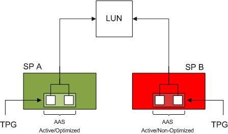

In my blog post: "[HP CA and the use of LUN balancing scripts](http://frankdenneman.nl/2009/02/hp-continuous-access-and-the-use-of-lun-balancing-scripts/)" I tried to cover the possible impact of using HP continuous Access EVA on the LUN path load balancing scheme in ESX 3.x. I received a lot of questions about this and wanted to address some issues again and try to clarify them. Let's begin with a recap of the HP CA article; The impact of CA on the load-balancing scheme is due to the fact that an EVA is an asymmetric Active-Active array that uses the Asymmetric Logical Unit Access protocol (ALUA). ESX3 is not ALUA aware and does not recognize the different specific access characteristics of the array's target ports. VMware addressed this shortcoming and added ALUA support in the new storage stack of ESX4. The ALUA support is a great feature of the new storage architecture, it reduces a lot of extra manual steps of creating a proper load-balanced environment. But how exactly does ALUA identifies which path is optimized and will HP Continuous Access still have an impact on ESX4 environments as well? <!--more--> **Asymmetric Logical Unit Access** Asymmetric Logical Unit Access occurs when the access characteristics of a storage processor port relative to the LUN differs from another port in the array. This behavior occurs on Asymmetrical Active-Active arrays (AAA). Two well-know AAA arrays are the EMC CX and the HP EVA. In a AAA array both controllers can receive IO commands (active-active), but only one controller can issue IO to the LUN. This is the asymmetrical part. The opposite of a AAA array is a symmetric Active-Active array, like the EMC Symmetrix DMX, such an array can issue IO command to the LUN via both controllers. But for now let's concentrate on AAA arrays and the HP EVA specifically. The controller in an AAA array who can issue commands is called the managing controller, paths to the LUN via ports of this controller are called _optimized paths_. IO sent to a port of the non-owning controller must be transferred to the owning controller internally and increases latency and have impact on the performance of the array. Due to this, paths leading to the LUN via the non-managing controller are called _non-optimized paths_. **Pluggable Storage Architecture** The default Native Multipathing Plugin (NMP) used by the storage stack in ESX4 uses two sub-plugins, the Storage Array Type Plug-in and Path Selection Plugins. Storage Array Type Plugins is used for path handling and the Path Selection Plugins is used for Path selection. It is interesting to know that the SATP is associated with all the physical paths to the array and is configured globally per array, but the PSP can be configured per LUN. **Storage Array Type Plugins** A default Storage Array Type Plugins (SATP) is included for each supported array as well as a generic SATP for non-specified storage arrays. The two SATP available for the HP EVA are: • VMW\_SATP\_EVA (array specific) • VMW\_SATP\_ALUA (generic SATP) The problem with the array specific VMW\_SATP\_EVA is that it doesn't use Target Port Group Support (TPGS), Funny thing is that TPGS is critical when it comes to determining optimized and non-optimized paths. Therefore the VMware HCL list the generic VMW\_SATP\_ALUA as the supported SATP on EVA Active-Active arrays. **Target Port Group Support** ALUA uses Target Port Group Support to determine the access characteristics of the path to a LUN. A port on a storage processor is called a target port and belongs to a target port group (TPG). All target ports belonging to the same TPG are always in the same Asymmetric Access State (AAS) relative to a LUN. There are a multiple of access states for a Target port: • Active/Optimized • Active/Non-optimized • Standby • Unavailable • Transitioning Note the grouping of Target Ports per TPG per Controller are vendor specific! _Active/Optimized_ A target port reporting the active/optimized state belongs to the managing owner of the LUN and communicates directly with the LUN. _Active/Non-Optimized_ A target port reporting the active/non-optimized state belongs to the non-managing owner of the LUN and the controller must send the IO via the multilink-ports to the managing controller of the LUN. _Transitioning_ If a target port is in a Transitioning state, the ownership of the LUN is being transferred between controllers, this can occur if a hardware failure happened on the managing controller or when the threshold of proxy IO's for the specific LUN is reached, this is called an Implicit Lun Transfer (ILT)  For example, a ESX host with two HBA's connected to a EVA 8100, SP A is the managing controller of LUN1. TPGS will report that the Active Optimized paths are HBA1:1:1 and HBA2:1:1. HBA1:2:1 and HBA2:2:1 are listed as the non-optimized paths.  **Path Selection Plugin** It's up to the Path Selection Plugin (PSP) to actually select the path to be used by the ESX host to communicate with the LUN. There are three PSP's are available: • _Most Recently Used Path Selection_ • _VMW\_PSP\_RR Round Robin Path Selection_ • _VMW\_PSP\_FIXED Fixed Path Selection_ The [Fibre Channel SAN Configuration Guide](http://www.vmware.com/pdf/vsphere4/r40_u1/vsp_40_u1_san_cfg.pdf) list the following:

> **MRU:** Selects the path the ESX/ESXi host used most recently to access the given device. If this path becomes unavailable, the host switches to an alternative path and continues to use the new path while it is available. **Fixed:** Uses the designated preferred path, if it has been configured. Otherwise, it uses the first working path discovered at system boot time. If the host cannot use the preferred path, it selects a random alternative available path. The host automatically reverts back to the preferred path as soon as that path becomes available. **Round Robin (RR):**Uses a path selection algorithm that rotates through all available paths enabling load balancing across the paths.

**ALUA aware PSPs** Both MRU and Round Robin PSPs are ALUA aware.MRU selects the first working optimized path discovered at system boot time and uses non-optimized paths when all optimized paths are dead. When an optimized path becomes available again, MRU will switch back to the optimized path. This differs from traditional MRU behavoir where a administrator must manually fail back to a path. Per default Round Robin will issue IO across all optimized paths and will use non-optimized paths only if no optimized paths are available. Selecting the Fixed PSP on an ALUA enabled array defeats the purpose of ALUA support of the NMP architecture. If the preferred path is configured to use a non-optimized path, ESX will use this path to issue IO, even though optimized paths might be available. My advice is to stick with MRU or Round Robin when using a ALUA aware SATP. Note! When if you have a mixed environment of ESX 3.5 and ESX 4 set the preferred paths to the LUNs according to the ALUA optimized paths listed in ESX4. If preferred paths are configured to use the non-optimized paths, repeatedly Implicit LUN transfers can occur VMware list MRU as the default supported PSP in the HCL, I asked VMware Global Support Services if Round Robin is supported even if it is not listed in the HCL.

> If the partner recommends RR for their certified arrays on ESX 4.0, then they provide their customers with the directions for configuring it and they support them. We will support it but not list it in the HCL

**MRU or RR** So the question arises, which PSP should I select? If you use [MSCS](http://www.vmware.com/pdf/vsphere4/r40/vsp_40_mscs.pdf) configurations, using Round Robin is unsupported on the LUNs that are part of MSCS VMs. By selecting MRU ESX will only use the first optimized path discovered at boot, where Round Robin uses all optimized paths. MRU will use the first optimized path and does not load balance across HBA's. ie. HBA1->LUN1, HBA2-LUN2, HBA1->LUN3, as where Round Robin will utilize all optimized paths of both HBA's to send IO. Almost every vendor list Round Robin as best practice when using an ALUA array, generating better load-balance and aggregation of the available uplinks. Another point of interest is the IOOperationlimit, this setting specifies how much IO commands will be sent across one path before switching over to the next available optimized path. Before following best practise of your vendor, my advice is to read Chad's post first: [vSphere 4 NMP RR IOoperationsLimit bug and workaround](http://virtualgeek.typepad.com/virtual_geek/2009/12/vsphere-4-nmp-rr-iooperationslimit-bug-and-workaround.html). **Continuous Access** So how about the impact of Continuous Access on the path load balancing in ESX 4? When a LUN is being replicated it becomes a member of a CA Data Replication Group (DR Group). The DR Group is a Virtual Controller Software (VCS) construct and enforces the member LUNs to have the following behavior: • _Disk in DR Group will fail over together_ • _To preserve write order within the DR Group_ • _Share a log disk_ • _Replicate to the same destination array_ To meet these requirements, CA will assign one controller as managing controller for all the member LUNS in the DR Group. Because all the target ports of controller belong to the same TPG, these target ports will report to ESX as the Active/Optimized paths to the LUNs of the DR Group. This behavior will impact the design of the DR Groups, how many LUNs will become a part of one DR Group? This will impact the load across both controllers, quite easily an imbalance can occur when "DR-Group managed controller affiliation" is not taken into consideration. Please be aware of the limitation of the amount of DR-Groups and the use of DR tunnels. The path between the source and destination controller is called a DR Tunnel (DRT), to ensure IO consistency CA uses only one path per DR Group. A DR group is allocated a set of write and copy resources per DR Tunnel and these resources are not infinite. When heavy traffic occurs, DR groups can temporarily run out of allocated write resources. Running out of write resources will have impact on the write performance of the virtual machine. For these reasons designing a balanced DR Group is something you must do together with your SAN-administrators, because the ratio DR Groups\\DR Tunnels can have impact of your virtual environment as well. Please read the following great posts as well: "[what is ALUA exactly"](http://www.yellow-bricks.com/2009/09/29/whats-that-alua-exactly/) and "[a couple of important (ALUA and SRM) Notes](http://virtualgeek.typepad.com/virtual_geek/2009/09/a-couple-important-alua-and-srm-notes.html)"
