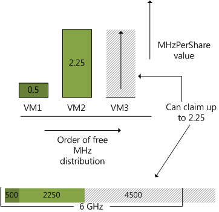

Most of my resource management articles focus more on the behavior of memory management than on CPU management. Mainly because the Memory scheduler within ESX is such an interesting complex system which comprises of memory allocation, swapping and reclamation with algorithms such as Idle Memory Tax and mechanisms like ballooning and swapping. But lately it seems that CPU scheduling seems to attract more and more my attention. The discussion Duncan and I had prior to posting his [article](http://www.yellow-bricks.com/2010/05/18/limiting-your-vcpu/) about how CPU limits actually sparked the interest how CPU scheduling works when setting reservations, so additional to Duncan excellent article, I want to take a closer look how the ESX CPU scheduler handles CPU reservations and shares and show why CPU scheduling is more fair that memory management. Similar to memory, the resource allocation settings, reservations, shares and limits can be set on CPU level. Limits and shares have similar behavior on CPU as well as Memory. Reservation act differently, let's take a quick look at the resource allocation settings:

**Shares:**Shares indicate the proportional value of the entity on the same hierarchical level. If everything else is equal, reservations, limits and active utilization, the virtual machine that is allocated twice as many shares as another virtual machine is entitled to consume twice as many CPU cycles.

**Limit:** A limit is a mechanism to restrict physical resource usage of the virtual machine. A limit ensures that the VM will never receive more CPU cycles than specified, even if extra cycles are available on the host.

**Reservation:** A reservation is a guarantee of the specified amount of physical resources regardless of the total number of shares in his environment.

Now reservations act differently when setting it on a CPU than setting it on memory. When the virtual machine does not use its CPU cycles, these CPU cycles are redistributed to other active virtual machines, so unused reservations are not wasted. Contrary to memory management, when the memory will not be reclaimed by the scheduler once the virtual machine touched the pages. By redistributing available CPU cycles and not letting the virtual machine hoard CPU resources, the VMkernel tries to properly divide the resources and achieve better fairness among virtual machines and improve utilization of the resources. To achieve both goals and divide the CPU resources among virtual machines the CPU scheduler calculates a `MHzPerShare` metric. This metric tries to identify which virtual machines are "ahead" of their entitlement and which virtual machines are "behind" and do not fully utilize their entitlement.

`MHzPerShare = MHzUsed / Shares`

`MHzUsed` is the current utilization of the virtual machine measured in Megahertz. Shares is the current configured amount of shares of the virtual machine. For example, the virtual machine is using 2500 MHZ and has 1000 shares, this means that the MHzPershare value is 2.5.The VMkernel will calculate the MHzPerShare number of each active virtual machine and the virtual machine with the lowest MHzPerShare value will have the highest priority of running on the CPU. If the virtual machine with the lowest MHzPerShare value decides not to use it right to allocate the cycles, the cycles can be used by the virtual machine with the next lower MHzPerShare value.  Although not shown, reservations play a important part in this calculation. As mentioned before, reservations overrule shares and guarantee the amount of physical resources regardless of the amount of shares. This means that the virtual machine always can use the CPU cycles specified in its reservation, even if the virtual machine has a greater MHzPerShare value. So how exactly do reservations and shares interact with each other when it comes to calculating the MHzPerShare value? For example: In a 6 GHz system, 1 virtual machine is running and 2 are powered on, VM1 is running a memory intensive app and doesn't really care much about CPU cycles, the virtual machine is configured with 1000 CPU shares and no reservation. The 2 other virtual machines run CPU intensive apps and are currently competing for resources. VM2 has a reservation of 2250 MHz and has a default share setting of 1000 shares, the other CPU intensive virtual machine, VM3 is equipped with 2vcpu's and therefore receives 2000 shares, but the administrator didn't set any reservation. Now VM1 is running at 500 MHz, with its 1000 shares, the MHzPerShare value equals 0.5. Because VM2 is in need of CPU cycles, it immediately utilizes its reservations and "occupies" all 2250 MHz, its MHzPerShare value equals 2.25 (2250/1000).  Now because VM3 doesn't have any reservation and is in need of CPU cycles, the VMkernel looks at its MHzPerShare value to decide how many CPU cycles it can use before distributing excess CPU cycles to other virtual machines. The kernel will distribute cycles to VM3 until it reaches the same MHzPerShare value of VM2, which is 2.25. In theory this means that the VMkernel will allocate 2000 x 2.25 = 4500 MHz before looking at another VM. Due to the fact that CPU scheduler already allocated 500 MHz to VM1 and 2250 MHz to VM2 of the available 6GHz, it can allocate VM3 3250 Mhz.  Because VM2 has a reservation it can allocate up to its reservation even when initially VM3 has a lower MHzPerShare value (0) and the CPU cycle requirements of VM1 are met at 500MHz. However due to the fairness principle VM2's own MHzPerShare value influences the VMkernel's decision how much cycles to allocate to VM3 before considering allocating additional cycles to vm2 again. Now for some reason the application in VM3 is leveling out at 2000 MHz, VM1 is still using 500 MHz and VM2 is in desperate need of extra CPU cycles. No settings are changed so VM1 and VM2 has a 1000 shares each and VM2 has a reservation of 2250MHz, VM3 has 2000 shares and no reservation is set. The VMkernel will satisfy the request of VM1, resulting in a MHzPerShare value of 0.5. VM2 claims its reservation and utilizes 2250 MHz resulting in a MHzPerShare value of 2.25, VM3 can allocate up to 4500 before reaching the MHzPerShare value of VM3, but stops consuming above 2000Mhz, ending up with a MHzPerShare value of 2000/2000 = 1, this means that inside the 6GHz host 1250 cycles are available. The CPU scheduler will shop around with these available cycles and see which VM is interested. Now the VMkernel will offer the cycles to the virtual machines in the increasing order of MHzPerShare, so first it will ask VM1 (0.5), because its CPU request is satisfied, it will forfeit its claim, VM2 also forfeits this claim, so VM3 will happily accepts the remaining cycles and its resource usage will increase to 3500 MHz. So here you have it, both shares and reservation interact or even battle with each other to allocate CPU cycles for the virtual machines. Shares are by many perceived as an inferior resource allocation setting, hopefully this demonstrates the power of shares, it can in combination with utilization become a very important factor in ESX resource management.
