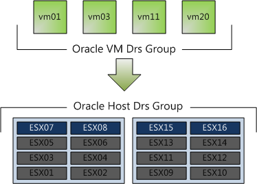

VMware vSphere 4.1 introduces a new affinity rule, called "Virtual Machines to Hosts" (VM-Host). This new rule is available in vSphere 4.1 DRS clusters in addition to the existing (anti) affinity rule, which is now called VM-VM affinity rule. The new VM-Host affinity rule provides the ability of placing a group of virtual machines on a subset of hosts inside the cluster. The new rule can very useful in blade system environments and for honoring ISV license requirements. Rules can be created to ensure that virtual machines run on ESX hosts in different blade chassis for availability reasons, or the complete opposite and limit the virtual machines to ESX hosts inside a blade chassis to optimize network speeds by keeping network traffic inside the blade chassis. VM-host are also very useful to fulfill the requirements of special ISV license models as well, for example restricting Oracle database virtual machines to run only on ESX hosts which are licensed by Oracle. **Difference between VM-Host affinity rules and VM-VM rules** The VM-host affinity rule differ from the VM-VM rule, A VM-Host (anti) affinity rule specify the (anti) affinity between a group of virtual machines and a group of ESX hosts inside the cluster, whether a VM-VM (anti) affinity rule only specify the (anti) affinity between individual virtual machines. Components. A virtual machine to host affinity rule exists out of three components: • Virtual machine DRS group • ESX host DRS group • Designation – “Must” affinity\\anti-affinity or “Should” affinity\\anti-affinity Virtual machine DRS groups and ESX host DRS Group are quite self-explanatory so let’s dive into the designations component straight away. **Designations** Two different types of VM-Host rules are available, a VM-Host affinity rule can either be a “must” rule or a “should” rule. The must-rule is a mandatory rule for HA, DRS and DPM, it confines or prevent the virtual machines to run on the ESX hosts specified in the ESX host DRS Group. The “should” rule is a preferential rule for DRS and DPM and expresses a preference. DRS and DPM use their best effort to try to confine or prevent the virtual machines from running on the ESX host they are affined to, but DRS and DPM can violate “should” rules if it compromises certain key operations, HA is not aware of preferential rules because DRS will not communicate these rules to HA. HA, DRS and DPM must take the mandatory rules into account when generating or executing operations. HA, DRS and DPM will never take any action that result in the violation of mandatory affinity rules. Because of this, mandatory rules place more constraints on VM mobility, making it more difficult for DRS to balance load and enforce resource allocation policies, HA and DPM operations are constrained as well, for example, mandatory rules will; • Limit DRS in selecting hosts to load-balance the cluster • Limit HA in selecting hosts to power up the virtual machines • Limit DPM in selecting hosts to power down Due its limiting behavior, it is recommended to use mandatory rules sparingly and only for specific cases, such as licensing requirements. Preferential rules can be used to meet availability requirements such as separating virtual machines between blade centers. **DRS and mandatory rules** DRS takes mandatory rules into account when generating load-balance recommendations. If a rule is created and the current virtual machine placement is in violation with the rule, DRS will create a priority one recommendation (five stars) and executes the recommendation if DRS is set to fully automatic. DRS will not generate recommendation that will violate the rule, it will not migrate virtual machines to or from an ESX server, even if places the source ESX host into maintenance mode. VMotion will reject the operation as well if it detects that the operation is in violation of the mandatory rule If a reservation is set on the virtual machine, DRS takes both reservation and mandatory affinity rule into account. Both requirements must be satisfied during placement or power on. If DRS is unable to honor either one of the requirements the virtual machine is not powered on or migrated to the proposed destination host. For example if a new rule is created and the current virtual machine placement is in violation of the rule, it can only migrate to a new host if the virtual machine memory reservation can be satisfied on the new host, if this is not possible, DRS will not generate the recommendation. If a rule is created that conflict with another active, the older rule overrules the newer rule and DRS will disable the new rule. As you can imagine that mandatory affinity rules can complicate troubleshooting in certain scenarios for example, why a virtual machine is not migrated from a highly utilized host to an alternative lightly utilized host in the cluster. **DPM** DPM does not place an ESX host into standby mode if it will violate the mandatory rule and will power-on ESX hosts if these are needed to meet the requirements of the mandatory riles. **High Availability** Due to the DRS-HA integration in vSphere 4.1, HA respects mandatory (must) rules. During an ESX host failure event, HA ask DRS to supply the list of hosts and places the virtual machines only on the compatible host, i.e. the host that are allowed by the mandatory rules. HA is unaware of the preferential (should) rules, so HA might unknowingly violate the rule during placement of virtual machines after an ESX failure, but the violation will be corrected by the next DRS invocation. Let’s take a look at a configuration which I think is going to be widely implemented soon, the Oracle Must affinity rule. 1. Place all Oracle virtual machines in a Cluster VM DRS group. (vm01, vm03, vm11, vm20) 2. Place all Oracle licensed ESX host in a Cluster Host DRS Group (ESX07, ESX08, ESX15, ESX16) 3. Select “Must run on Host in Group”  In this scenario, DRS never places, migrates, or recommend placement of a host-affined virtual machine on a host to which is not listed in the Cluster Host DRS Group (ESX01 - ESX06 & ESX09-ESX14). This means that DRS will never ever place the virtual machine on an unlicensed host, not for maintenance mode, not for DPM power saving and not after an ESX host failure event. This virtual machine to host affinity rule make it possible to run oracle inside big clusters without having to license all the ESX host. I have been involved in a few projects where Oracle license was a constraint. Normally separate smaller clusters were deployed for Oracle database virtual machines, increasing both OPEX and CAPEX of the environment. These rules allows the Oracle virtual machines to run inside the cluster with other virtual machines without having to license all the ESX host inside the cluster. Hereby making the lives easier of both the architect and the administrator. vSphere 4.1, you gotta love it! Get notification of these blogs postings and more DRS and Storage DRS information by following me on Twitter: [@frankdenneman](https://twitter.com/FrankDenneman)
