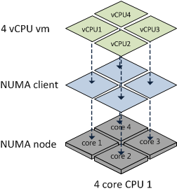
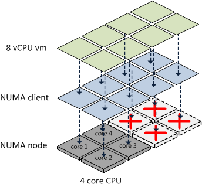
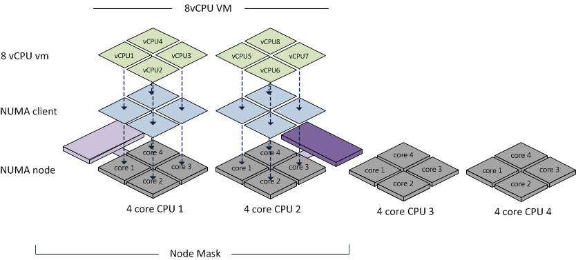

VMware has made some changes to the CPU scheduler in ESX 4.1; one of the changes is the support for Wide virtual machines. A wide virtual machine contains more vCPUs than the total amount of available cores in one NUMA node. Wide VM’s will be discussed after a quick rehash of NUMA.

**NUMA** NUMA stands for Non-Uniform Memory Access, which translates into a variance of memory access latencies. Both AMD Opteron and Intel Nehalem are NUMA architectures. A processor and memory form a NUMA node. Access to memory within the same NUMA node is considered local access, access to the memory belonging to the other NUMA node is considered remote access.

 Remote memory access is slower, because the instructions has to traverse a interconnect link which introduces additional hops. Like many other techniques and protocols, more hops equals more latency, therefore keeping remote access to a minimum is key to good performance. (More info about NUMA scheduling in ESX can be found in my previous article “[Sizing VM’s and NUMA nodes](http://frankdenneman.nl/2010/02/sizing-vms-and-numa-nodes/)".)

If ESX detects its running on a NUMA system, the NUMA load balancer assigns each virtual machine to a NUMA node (home node). Due to assigning soft affinity rules, the memory scheduler preferentially allocates memory for the virtual machine from its home node. In previous versions (ESX 3.5 and 4.0) the complete virtual machine is treated as one NUMA client. But the total amount of vCPUs of a NUMA client cannot exceed the number of CPU cores of a package (physical CPU installed in a socket) and all vCPUs must reside within the NUMA node.

 If the total amount of vCPUs of the virtual machine exceeds the number of cores in the NUMA node, then the virtual machine is not treated as a NUMA client and thus not managed by the NUMA load balancer.

 Because the VM is not a NUMA client of the NUMA load balancer, no NUMA optimization is being performed by the CPU scheduler. Meaning that the vCPUs can be placed on any CPU core and memory comes from either a single CPU or all CPUs in a round-robin manner. Wide virtual machines tend to be scheduled on all available CPUs.

 **Wide-VMs** The ESX 4.1 CPU scheduler supports wide virtual machines. If the ESX4.1 CPU scheduler detects a virtual machine containing more vCPUs than available cores in one NUMA node, it will split the virtual machine into multiple NUMA clients. At the virtual machine’s power on, the CPU scheduler determines the number of NUMA clients that needs to be created so each client can reside within a NUMA node. Each NUMA client contains as many vCPUs possible that fit inside a NUMA node.

The CPU scheduler ignores Hyper-Threading, it only counts the available number of cores per NUMA node. An 8-way virtual machine running on a four CPU quad core Nehalem system is split into a two NUMA clients. Each NUMA client contains four vCPUs. Although the Nehalem CPU has 8 threads 4 cores plus 4 HT “threads”, the CPU scheduler still splits the virtual machine into multiple NUMA clients.

 **The advantage of wide VM** The advantage of a wide VM is the improved memory locality, instead of allocating memory pages random from a CPU, memory is allocated from the NUMA nodes the virtual machine is running on. While reading the excellent whitepaper: “[VMware vSphere: The CPU Scheduler in VMware ESX 4.1 VMware vSphere 4.1 whitepaper](http://www.vmware.com/files/pdf/techpaper/VMW_vSphere41_cpu_schedule_ESX.pdf)” one sentence caught my eye:

> However, the memory is interleaved across the home nodes of all NUMA clients of the VM.

This means that the NUMA scheduler uses an aggregated memory locality of the VM to the set of NUMA nodes. Call it memory vicinity. The memory scheduler receives a list (called a node mask) of the NUMA node the virtual machine is scheduled on.

 The memory scheduler will preferentially allocate memory for the virtual machine from this set of NUMA nodes, but it can distributed pages across all the nodes within this set. This means that there is a possibility that the CPU from NUMA node 1 uses memory from NUMA node 2.

Initially this looks like no improvement compared to the old situation, but fortunately supporting Wide VM makes a big difference. Wide-VM’s stop large VM’s from scattering all over the CPU’s with having no memory locality at all. Instead of distributing the vCPU’s all over the system, using a node mask of NUMA nodes enables the VMkernel to make better memory allocations decisions for the virtual machines spanning the NUMA nodes.
