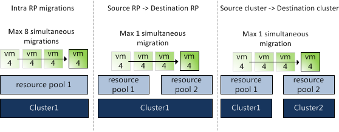

Many organizations have the bad habit to use resource pools to create a folder structure in the host and cluster view of vCenter. Virtual machines are being placed inside a resource pool to show some kind of relation or sorting order like operating system or types of application. This is not reason why VMware invented resource pools. Resource pools are meant to prioritize virtual machine workloads, guarantee and/or limit the amount of resources available to a group of virtual machines. During design workshops I always try to convince the customer why resource pools should not to be used to create a folder structure. The main object I have for this is the sibling share level of resource pools and virtual machines.  Shares specify the priority for the virtual machine or resource pool relative to other resource pools and/or virtual machines with the same parent in the resource hierarchy. The key point is that shares values can be compared directly only among siblings: the ratios of shares of VM6:VM7 tells which VM is higher priority, but the shares of VM4:VM6 does not tell which VM has higher priority. Many articles have been written about this, such as: “[The resource pool priority-pie paradox](http://www.yellow-bricks.com/2010/02/22/the-resource-pool-priority-pie-paradox/)”, (Craig Risinger) “[Resource pools and shares](http://www.yellow-bricks.com/2009/11/13/resource-pools-and-shares/)” (Duncan Epping), “[Don’t add resource pools for fun](http://www.ntpro.nl/blog/archives/1512-Dont-add-resource-pools-for-fun,-theyre-dangerous.html)” (Eric Sloof) and “[Resource pools caveats](http://www.jume.nl/articles/vmware/154-resource-pools-caveats)” (Bouke Groenescheij). But another reason not to use resource pools as a folder structure is the limitation resource pools inflict on vMotion operations. Depending on the network speed, vSphere 4.1 allows 8 simultaneous vMotion operations, however simultaneous migrations with vMotion can only occur if the virtual machine is moving between hosts in the same cluster and is not changing its resource pool. This is recently confirmed in Knowledge Base article [1026102](http://kb.vmware.com/selfservice/microsites/search.do?cmd=displayKC&docType=kc&externalId=1026102&sliceId=1&docTypeID=DT_KB_1_1&dialogID=111208416&stateId=0 0 116148556). Fortunately simultaneous cross-resource-pool vMotions can occur if the virtual machines are migrating to different resource pools, but still one vMotion operation per target resource pool. Because clusters are actually implicit resource pools (the root resource pool), migrations between clusters are also limited to a single concurrent vMotion operation.  Using resource pools to create a folder structure can not only impact the availability of resources for the virtual machines, but can also hinder your daily (maintenance) operations if batches of virtual machines are being migrated to other resource pools.
