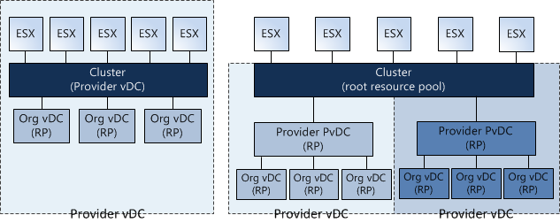
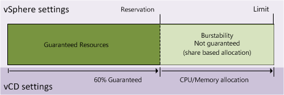
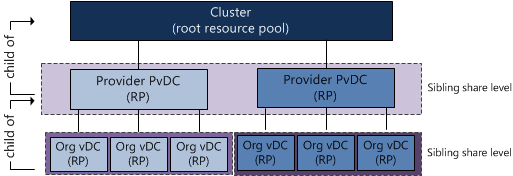
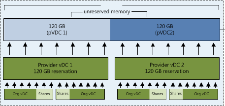

Duncan’s article on [vCloud Allocation models](http://www.yellow-bricks.com/2010/09/22/vcd-allocation-models/) states that:

> a provider vDC can be a VMware vSphere Cluster or a Resource Pool …

Although vCloud Director offers the ability to map Provider vDCs to Clusters or Resource Pool, it might be better to choose for the less complex solution. This article zooms in on the compute resource management constructs and particularly on making the choice between assigning a VMware Cluster or a Resource Pool to a Provider vDC and placement of Organization vDCs. I strongly suggest visiting Yellow Bricks to read all [vCloud Director posts](http://www.yellow-bricks.com/?s=vCD&x=0&y=0), these posts explain the new environment / cloud model used by VMware very thoroughly.

Let’s do a quick rehash of these elements before discussing whether to choose between a Cluster or Resource Pool based Provider vDC.

**Provider vDC and Organization vDC** In the vCloud a construct named vDCs exist. vDCs stands for Virtual Data Center. Two types of vDCs exists; Provider vDCs and Organization vDCs. A Provider vDC is used to offer a single type of compute resources and a single type of storage resources. This means that Provider vDCs are created for segmenting resources based on resource characteristics (Tiering) or quantity of resources (Capacity). Basically a Provider vDC will function as a SLA construct in the vCloud. At the vSphere layer a VMware vSphere Cluster or Resource Pool can be used to provide the Provider vDC raw Virtual Infrastructure resources. Now the fun part is that using Resource Pools basically contradicts the whole idea behind a Provider vDC, but we will discuss that later.

An Organization vDC (Org vDC) is an allocation out of the Provider vDC (pVDC), in other words the resources provided by the PvDC are consumed by the Org vDC. Organization vDCs inherit the resource types (Tiering\\Capacity) from the Provider vDC. At the vSphere level this means that a Resource Pool is created per Org vDC and this will carve out resources from the Provider vDC using the resource allocation settings Reservation, Shares and Limit values for compute resources.

**Note**: A vDC is not identical to a vSphere Resource Pool, a vDC provides storage additional to compute resources (leveraging resource pools) whether a resource pool only offers compute resources (CPU and Memory). Compute resource management is done at the vSphere level, Storage is enforced and maintained at the vCloud Director level. vCloud Director uses allocation models to define different usage levels of Reservation and Limits. The Share levels are identical throughout all allocation models and each model uses the _normal_ share level setting.

**Allocation Models** Each Organization vCD is configured with an allocation model, three models different types of allocation models exist.

- Pay As You Go
- Allocation Pool
- Reservation Pool

Each allocation model has a unique set of resource allocation settings and each model uses both Resource Pool level and Virtual Machine level resource allocation settings differently. Read the [vCD allocation models article](http://www.yellow-bricks.com/2010/09/22/vcd-allocation-models/) on Yellow-Bricks.com. **Note**: Reservations on resource pool act differently than reservations on VM-level, for a refresher please read the articles: “[Resource Pools memory reservations](http://frankdenneman.nl/2010/05/resource-pools-memory-reservations/)” and “[Impact of memory reservations](http://frankdenneman.nl/2009/12/impact-of-memory-reservation/)". In addition CPU type reservations behave differently from Memory reservations, please read the article “[Reservations and CPU scheduling](http://frankdenneman.nl/2010/06/reservations-and-cpu-scheduling)”. Now let’s visualize the difference between a PvDC aligned with a cluster and a pVDC aligned with a Resource Pool:

 **Using Resource Pools instead of Clusters** One thing immediately becomes obvious, when using a Resource Pool for providing Compute and Memory resources to the PvDC you share the cluster resources with other PvDCs. One might argue to create only one Resource Pool below Cluster level and create some sort of buffer, but creating a single Resource Pool below cluster level and assigning a PvDC to it will render a certain amount of cluster resources unused. By default, a Resource Pool can claim up to a maximum of 94% of its parent Resource Pool.

By using multiple Provider vDCs in one cluster you abandon the idea of segmenting resources based on resource characteristics and quantity (Tiering and Capacity). Because a Resource Pool spans the entire cluster the PvDCs will schedule the virtual machine on every host available in the cluster. By using the Resource Pool model it introduces a whole new complex resource management construct all by itself. Let’s focus on the challenges this model will introduce:

**Resource Pool creation** When creating a Provider vDC, a Cluster or Resource Pool must be selected, this means the Resource Pool must be manually configured before creating and mapping the Provider vDC to the Resource Pool. During the creation of this Resource pool, the admin must specify the resource allocation settings. The Reservation, Shares and Limit settings of a Resource Pool are not changed dynamically when adding additional ESX hosts to the cluster. The admin must change (increase) the reservation and Limit setting each time new hosts are added to the cluster.

The second drawback of the RP model is sizing. Because multiple Provider vDC Resource Pools will exists beneath the Root Resource Pool (Cluster) level the admin/architect needs to calculate a proper resource allocation ratio for the existing Provider vDCs. Mapping a Provider vDC to a Resource pool result in manually recalculation the resource allocation settings each time a new tenant is introduced and when the new Org vDC joins the Provider vDC.

**Sibling Share Level** If “Pay as You go” or “Allocation Pool” models are used, some resources might be provided via a “burstability” model. When creating an Organization vDC, a guaranteed amount of resources must be specified as well as an upper limit known as an “Allocation”. The difference between the total allocated resources and the specified guaranteed resources is a pool of resources that are available to that Organization vDC, however, it is important to note that those resources are not certain to be available at any given point in time. This is called the burstability space.

These “burstable” resources are allocated based on Shares in times of contention. Shares specify the priority for the virtual machine or Resource Pool relative to other Resource Pools and/or virtual machines with the same parent in the resource hierarchy. The key point is that shares values can be compared directly only among siblings. This means that each Provider vDC is the sibling of another Provider vDC in the cluster and they will receive resources from its parent Resource Pool (Root Resource Pool) based on their Resource Entitlement. That means that this model:

 Translates into this model: 

**Resource Entitlement** Resource Pool and virtual machine resource entitlements are based on various statistics and some estimation techniques. DRS computes a resource entitlement for each virtual machine, based on virtual machine and Resource Pool configured shares, reservations, and limits settings, as well as the current demands of the virtual machines and Resource Pools, the memory size, its working set and the degree of current resource contention.

As mentioned before, this burstable space is allocated based on the amount of shares and the active utilization (working set) when calculating the resource entitlement. Virtual machines who are idling aren’t competing for resources, so they won’t get any new resources assigned and therefore the Provider vDC will not demand it from the Root Resource Pool. Be aware that the resource entitlement is calculated at host level scheduling (VMkernel) and Global scheduling (DRS). DRS will create a pack (lump sum) of resources and divide this across the Resource pools and its children. This lump sum is recalculated every 5 minutes.

Introducing an additional layer of Provider vDC Resource Pools between the cluster and the Organization vDC Resource Pools will not only complicate the resource entitlement calculation but will also create additional unnecessary overhead on DRS. Besides the 300 second invocation period, DRS also gets invocated each time when a virtual machine is powered-off, when a resource setting of a virtual machine or Resource Pool is changed or when a Resource Pool or a virtual machine is moved in or out the Resource Pool hierarchy. This is the reason why the Resource Pool tree must be as “flat” as possible; having additional layers will complicate the resource calculation and distribution.

If you decide to map a Provider vDC to a Resource Pool is recommended allocating the amount of CPU and Memory resources of the pVDC Resource Pool identical to the combined amount of resources allocated to the Org vDCs. By accumulating all Org vDC allocation settings and setting the reservation on the Provider vDC equal to the result of that sum removes the burstable space on PvDC level. Only siblings inside the Provider vDC will have to compete for resources during contention.  **Placement of Organization vDCs in Provider vDCs** Proper Resource management is very complicated in a Virtual Infrastructure or vCloud environment. Each allocation models uses a different combination of resource allocation settings on both Resource Pool and Virtual Machine level, therefore introducing different types of resource entitlement behavior. Mixing Allocation models inside a Provider vDC makes capacity management and capacity planning a true nightmare. It is advised to create a Provider vDC per Allocation Model. This means that (preferential) a Provider vDC is mapped to a Cluster and this cluster will host only “Pay As You Go”, “Allocation Pool” or “Reservation Pool” type Organization vDCs.

**Words of advice** Using different allocation models within a Provider vDC can be a challenge to create a proper level of utilization and flexibility all by itself. Using Resource Pools to act as the compute Resource Pool construct for Provider vDCs makes it in my opinion incredibly complex. Using Resource Pools instead of Clusters deviates from the intention Provider vDCs are created (segmenting Tiering and Capacity). Although it's possible to map Provider vDC to a Resource Pool it is wiser to map Provider vDCs to Cluster levels only.

Avoid using different types of allocation models within a Provider vDC, mixing allocation models makes proper capacity management and capacity planning unnecessary difficult.

**Best practice:** Map Provider vDC to a VMware vSphere Cluster. Usage of same type of Allocation model type Organization vDC inside a Provider vDC.
