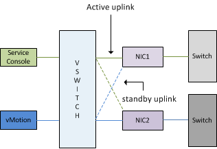

One setting most admins get caught off-guard is vSwitch Failback setting in combination with HA. If the management network vSwitch is configured with Active/Standby NICs and the HA isolation response is set to “Shutdown” VM or “Power-off” VM it is advised to set the vSwitch Failback mode to No. If left at default (Yes), all the ESX hosts in the cluster or entire virtual infrastructure might issue an Isolation response if one of the management network physical switches is rebooted. Here’s why: Just a quick rehash: **Active\\Standby** One NIC (vmnic0) is assigned as active to the management\\service console portgroup, the second NIC (vmnic1) is configured as standby. The vMotion portgroup is configured with the first NIC (vmnic0) in standby mode and the second NIC as Active (vmnic1). \[caption id="attachment\_1344" align="aligncenter" width="316" caption="Active Standby setup management network vSwitch0"\]\[/caption\] **Failback** The Failback setting determines if the VMkernel will return the uplink (NIC) to active duty after recovery of a downed link or failed NIC. If the Failback setting is set to Yes the NIC will return to active duty, when Failback is set to No the failed NIC is assigned the Standby role and the administrator must manually reconfigure the NIC to the active state. **Effect of Failback yes setting on environment** When using the default setting of Failback unexpected behavior can occur during maintenance of a physical switch. Most switches, like those from Cisco, initiate the port after boot, so called Lights on. The port is active but is still unable to receive or transmitting data. The process from Lights-on to forwarding mode can take up to 50 seconds; unfortunately ESX is not able to distinguish between Lights-on status and forwarding mode, there for treating the link as usable and will return the NIC to active status again. High Availability will proceed to transmit heartbeats and expect to receive heartbeats, after missing 13 seconds of heartbeats HA will try to ping its Isolation Address, due to the specified Isolation respond it will shut down or power-off the virtual machines two seconds later to allow other ESX hosts to power-up the virtual machines. But because it is common – recommended even – to configure each host in the cluster in an identical manner, each active NIC used by the management network of every ESX host connect to the same physical switch. Due to this design, once the switch is booted, a cluster wide Isolation response occurs resulting in a cluster wide outage. To allow switch maintenance, it’s better to set the vSwitch failback mode to No. Selecting this setting introduces an increase of manual operations after failure or certain maintenance operations, but will reduce the change of “false positives” and cluster-wide isolation responses.
