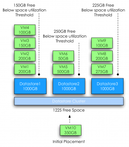
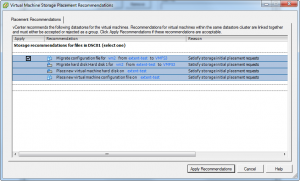

Recently an interesting question was raised about what happens if enough free space is available in the datastore cluster but not enough space is available per datastore during placement of a virtual machine. This scenario is often referred as a defragmented datastore cluster.  The short answer is that if not enough space available on any given datastore, then Storage DRS starts to consider migrating existing virtual machines from the datastore to free up space. This article zooms in on the process of generating such an initial placement recommendation. **Rules and boundaries within a datastore cluster** Storage DRS will not violate the configured space utilization and IO latency threshold of the datastore cluster. This means that Storage DRS will place virtual machines that consume space up to the configured space utilization threshold, for example setting the space utilization threshold to 80% on a 1000GB datastore will allow Storage DRS to place virtual machines that consume space up to 800 GB. Be aware of this when monitoring free space available on the datastores in the cluster. When creating or moving a virtual machine in the datastore, the first thing to consider is the affinity rules. By default virtual machine files are kept together in the working directory of the virtual machine. If the virtual machine needs to be migrated, all the files inside the virtual machines’ working directory are moved. This article features the use of the default affinity rule, however if the default affinity rule is disabled, Storage DRS will move the working directory and virtual disks separately allowing Storage DRS to distribute the virtual disk files on a more granular level. **Prerequisite migrations** During initial placement, if no datastore with enough space is available in the datastore cluster, Storage DRS starts by searching alternative locations for the existing virtual machines in the datastores and attempts to place the virtual machines to other datastores one by one. As a result Storage DRS may generate sets of migration recommendations of existing virtual machines that allow placement of the new virtual machine. These migrations generated are called prerequisite migrations and combined with the placement operations is called a recommendation set. **Depth of recursion** Storage DRS uses a recursive algorithm for searching alternative placements combinations. To keep Storage DRS from trying an extremely high number of combinations of virtual machine migrations, the “depth of recursion” is limited to 2 steps. What defines a steps and what counts towards a step? A step can be best defined as a set of migrations out of a datastore in preparation of (or to make room for) another migration into that same datastore. This step can contain one vmdk, but can also contain multiple virtual machines with multiple virtual disks attached. In some cases, room must be created on that target datastore first by moving a virtual machine out to another datastore, which results in an extra step. The following diagram visualizes the process.  Storage DRS has calculated that a new virtual machine can be placed in Datastore 1 if VM2 and VM3 are migrated to Datastore 2, however, placing these two virtual machines on datastore 2 will violate the space utilization, therefore room must be created. VM4 is moved out of Datastore2 as part of a step of creating space. This results in Step 1, moving out to Datastore 3, followed by Step 2, moving VM2 and VM3 to Datastore 2 to finally placing the new virtual machine on Datastore 1. Storage DRS stops its search if there are no 2-step moves to satisfy the storage requirement of an initial placement. An advanced setting can be set to change the number of steps used by the search. As always, it is strongly discouraged to change the defaults, as many hours of testing has been invested in researching the setting that offers good performance while minimizing the impact of the operation. If you have a strong case of changing the number of steps, set the advanced configuration option “MaxRecursionDepth”. The default value is 1 the maximum value is 5. Because the algorithm starts counting at 0, default value of 1 allows 2 steps. **Goodness value** Storage DRS will cycle through all the datastores in the datastore cluster and initiates a search for space on each datastore. A search generates a set of prerequisites migration if it can provide space that allows the virtual machine placement within the depth of recursion. Storage DRS evaluates the generated sets and award each set a goodness value. The set with the least amount of cost (i.e. migrations) is the preferred migration recommendation and shown at the top of the list. Let’s explore this a bit more by using a scenario with 3 datastores. **Scenario** The datastore cluster contains 3 datastores; each datastore has a size of 1000GB and contains multiple virtual machines with various sizes. The space consumed on the datastores range from 550GB to 650GB, while the space utilization threshold is set to 80%. At this point the administrator creates a virtual machine that requests 350GB of space. Although the datastore cluster itself contains 1225GB of free space, Storage DRS will not go forward and place the virtual machine on any of the three datastores, because placing the virtual machine will violate the space utilization threshold of the datastores. **Search process** As each ESXi host provide information about the overall datastore utilization and the vmdk statistics, Storage DRS has a clear overview of the most up to date situation and will use these statistics as input for its search. In the first step it will simulate all the necessary migrations to fit VM10 in Datastore 1. The prerequisite migration process with least number of migrations to fit the virtual machine on to Datastore 1 looks as follows: 

> Step 1: VM3 from Datastore 1 to Datastore 2 Step 1: VM4 from Datastore 1 to Datastore 3 Place new virtual machine on Datastore 1

Although VM3 and VM4 are each moved out to a different datastore, both migrations are counted as a one step prerequisite migration as both virtual machines are migrated OUT of Datastore 1. Next Storage DRS will evaluate Datastore 2. Due to the size of VM5, Storage DRS is unable to migrate VM5 out of Datastore 2 because it will immediately violate the utilization threshold of the selected destination datastore. One of the coolest parts of the algorithm is that it considers inbound migrations as valid moves. In this scenario, migrating virtual machines into Datastore 2 would free up space on another datastore to provide enough free space to place VM5, which in turn free up space on Datastore 2 allowing Storage DRS to place VM10 onto Datastore2.  The prerequisite migration process with least number of migrations to fit the virtual machine on to datastore 2 looks as follows:

> Step 1: VM2 from Datastore 1 to Datastore 2 Step 1: VM3 from Datastore 1 to Datastore 3 Step 2: VM5 from Datastore 2 to Datastore 1 Place new virtual machine on Datastore 2

Datastore 3 generates a single prerequisite migration. By migrating VM8 from Datastore 3 to Datastore 2 it will free up enough space to allow placement of VM10. Selecting VM9 would not free up enough space and migrating VM7 generates more cost than migrating VM8. By default Storage DRS attempts to migrate the virtual machine or virtual machine disk which size is closest to the required space.  The prerequisite migration process with least number of migrations to fit the virtual machine on to datastore 3 looks as follows:

> Step 1: VM8 from Datastore 3 to Datastore 2 Place new virtual machine on Datastore 3

After analyzing the cost and benefit of the three search results Storage DRS will assign the highest goodness factor to the migration set of Datastore3. Although each search result can provide enough free space after moves, recommendation set of Datastore 3 will result in the lowest number of moves and migrates the lowest amount of data. All three results will be shown; the recommended set will be placed at the top A example placement recommendation screen is displayed, note that you can only apply the complete recommendation set. Applying the recommendation results in triggering the prerequisite migrations before the initial placement of the virtual machine occurs. 
