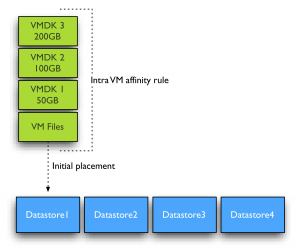
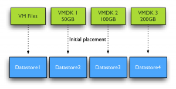

By default Storage DRS applies an Intra-VM affinity rule to all new virtual machines in the datastore cluster. The Intra-VM affinity rule keeps the virtual machine files, such as VMX file, log files, vSwap and VMDK files together on one datastore.  Keeping all files together on one datastore allows ease of troubleshooting. However Storage DRS load balance algorithms may benefit from distributing the virtual machine across datastores. Let’s zoom in how Storage DRS handles virtual machine with multiple disks when the Intra-VM affinity rule is removed from the virtual machine. **DrmDisk** Storage DRS uses the construct “DrmDisk” as the smallest entity it can migrate. A DrmDisk represent a consumer of datastore resources. This means that Storage DRS creates a DrmDisk for each VMDK belonging to the virtual machine. The interesting part is the collection of system files and swap file belonging to virtual machines. Storage DRS creates a single Drmdisk for all the system files, if an alternate swapfile location is specified, the vSwap file is represented as a separate DrmDisk and Storage DRS will be disabled on the swap DrmDisk. More info about alternate swapfile locations can be found [here](http://blogs.vmware.com/vsphere/2012/02/storage-drs-affinity-rules-and-alternate-swapfile-location.html). For example a virtual machine with three VMDK’s and with no alternate swapfile locations configured, Storage DRS creates 4 DrmDisk: • A separate DrmDisk for each Virtual Machine Disk File • A DrmDisk for system files (VMX, Swap, logs, etc)  Initial placement recommendation will look similar to this screenshot when the Intra-VM affinity rule is disabled. Notice the separate recommendation for the "virtual machine configuration file"? This is the DrmDisk containing the system files.  **Initial placement Space load balancing** Initial placement and Space load balancing benefit from this increased granularity tremendously. Instead of searching a suitable datastore that can fit the virtual machine as a whole, Storage DRS is able to seek for appropriate datastores for each DrmDisk file separately. Recently I wrote an article about d[atastore cluster fragmentation and Storage DRS ability](http://frankdenneman.nl/2012/01/storage-drs-initial-placement-and-datastore-cluster-defragmentation/) to issue prerequisite migrations. You can imagine due to the increased granularity, datastore cluster fragmentation is less likely to happen and if prerequisite migrations are required, the number of migrations is expected to be a lot less.  **IO load balancing** Similar to initial placement and load balancing, I/O load balancing benefit from the deeper level of detail. It can find a better fit for each workload generated by the VMDK files. The system file DrmDisk will not be migrated quite often as it small in size and does not generate a lot of I/O often. Storage DRS analyzes the workload and generates a workload model for each DrmDisk, it then decides which datastore it needs to place the DrmDisk to keep the load balanced within the datastore cluster while offering enough performance for each DrmDisk. You can imagine this becomes a lot harder when Storage DRS is required to keep all the VMDK files together. Usually the datastore chosen is the datastore that provides the best performance for the most demanding workload AND is able to store all the virtual machine disk files and system files. Now let’s dig into this a little deeper, for example the virtual machine used in the previous example has two DrmDisk generating heavy workloads, while the DrmDisks containing the system files and VMDK2 are “cold”.  If Intra-VM affinity rules are used, Space balancing is required to find a datastore that has 350+ GB free without exceeding the space utilization threshold. If I/O load balancing is enabled, this datastore also needs to provide enough performance to keep the latency below the I/O latency threshold (by default 15ms) after placing the 4 DrmDisks. You can imagine it’s a lot less complicated when space and I/O load balancing are allowed to place each DrmDisk on a datastore that suits their needs. **How to change default datastore cluster behavior?** Mentioned before, datastore cluster defaults in applying an Intra-VM affinity rule to each new virtual machine. Recently Duncan published an article on how to change the [affinity rules on active virtual machines](http://www.yellow-bricks.com/2012/02/07/setting-the-default-affinity-rule-for-storage-drs/). Unfortunately there is not User-Interface option available that can disable this behavior, so I turned to my good friend and colleague [Alan Renouf](https://twitter.com/#!/alanrenouf) and he created some nice PowerCLI code to solve this problem: As I’m not a powerCLI user at all, I’m relaying Alan’s instructions: _First you need to run the below code to put the function into memory:_

> function Set-DatastoreClusterDefaultIntraVmAffinity{ param( \[CmdletBinding()\] \[parameter(Position = 0, Mandatory = $true, ValueFromPipeline = $true)\] \[PSObject\]$DSC, \[Switch\]$Enabled ) process{ $SRMan = Get-View StorageResourceManager if($DSC.GetType().Name -eq "string"){ $DSC = Get-DatastoreCluster -Name $DSC | Get-View } elseif($DSC.GetType().Name -eq "DatastoreClusterImpl"){ $DSC = Get-DatastoreCluster -Name $DSC.Name | Get-View } $spec = New-Object VMware.Vim.StorageDrsConfigSpec $spec.podConfigSpec = New-Object VMware.Vim.StorageDrsPodConfigSpec $spec.podConfigSpec.DefaultIntraVmAffinity = $Enabled $SRMan.ConfigureStorageDrsForPod($DSC.MoRef, $spec, $true) } }

Once this has been run you can use this function….

> Get-DatastoreCluster "Shared Datastores" | Set-DatastoreClusterDefaultIntraVmAffinity

Shared datastores is the name of the Datastore cluster, you can change that into the name of your own datastore cluster. Or in the case you have multiple datastore clusters and want to disable the rule for all datastore clusters at once, omit the name of the datastore cluster at all. If ease of troubleshooting is not your first concern, than it might be beneficial to the performance of Storage DRS to disable the default Intra-VM affinity rule on the virtual machines in the datastore cluster. However I'm interested in reasons why you wouldn't want to disable the default affinity rule besides troubleshooting effort. **Note:** Unfortunately I'm unaware why VMware decided to use the Intra-VM affinity rule as default and I do not know if a future release of vSphere will provide a UI setting to change the affinity rule behavior of the datastore cluster. Please leave a comment if you would like this option included in a new version of vSphere. All I can do is relay this to the appopriate product manager.
