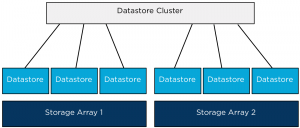

Combining datastores located on different storage arrays into a single datastore cluster is a supported configuration, such a configuration could be used during a storage array data migration project where virtual machines must move from one array to another array, using datastore maintenance mode can help speed up and automate this project. Recently I published an [article](http://blogs.vmware.com/vsphere/2012/04/using-datastore-maintenance-mode-for-migration-virtual-machines-to-datastore-clusters.html) about this method on the VMware vSphere blog. But what if multiple arrays are available to the vSphere infrastructure and you want to aggregate storage of these arrays to provide a permanent configuration? What are the considerations of such a configurations and what are the caveats? Key areas to focus on are homogeneity of configurations of the arrays and datastores.  When combining datastores from multiple arrays it’s highly recommended to use datastores that are hosted on **similar types of arrays**. Using similar type of arrays, guarantees comparable performance and redundancy features. Although RAID levels are standardized by SNIA, implementation of RAID levels by different vendors may vary from the actual RAID specifications. An implementation used by a particular vendor may affect the read and write performance and the degree of data redundancy compared to the same RAID level implementation of another vendor. Would **VASA** (vSphere Storage APIs - Storage Awareness) and Storage profiles be any help in this configuration? VASA enables vCenter to display the capabilities of the LUN/datastore. This information could be leveraged to create a datastore cluster by selecting the datastores that have similar Storage capabilities details, however the actual capabilities that are surfaced by VASA are being left to the individual array storage vendors. The detail and description could be similar however the performance or redundancy features of the datastores could differ. Would it be harmful or will Storage DRS stop working when aggregating datastores with different performance levels? Storage DRS will still work and will load balance virtual machine across the datastores in the datastore cluster. However, Storage DRS load balancing is focused on distributing the virtual machines in such a way that the configured thresholds are not violated and getting the best overall performance out of the datastore cluster. By mixing datastores that provide different performance levels, virtual machine performance could not be consistent if it would be migrated between datastores belonging to different arrays. The article “Impact of load balancing on datastore cluster configuration” explains how storage DRS picks and selects virtual machine to distribute across the available datastores in the cluster. Another caveat to consider is when virtual machines are migrated between datastores of different arrays; **VAAI hardware offloading** is not possible. Storage vMotion will be managed by one of the datamovers in the vSphere stack. As storage DRS does not identify “locality” of datastores, it does not incorporate the overhead caused by migrating virtual machines between datastores of different arrays. When could datastores of multiple arrays be aggregated into a single datastore if designing an environment that provides a stable and continuous level of performance, redundancy and low overhead? Datastores and array should have the following configuration: • Identical Vendor. • Identical firmware/code. • Identical number of spindles backing diskgroup/aggregate. • Identical Raid Level. • Same Replication configuration. • All datastores connected to all host in compute cluster. • Equal-sized datastores. • Equal external workload (best non at all). Personally I would rather create a multiple datastore clusters and group datastores belonging to a single storage array into one datastore cluster. This will reduce complexity of the design (connectivity), no multiple storage level entities to manage (firmware levels, replication schedules) and will leverage VAAI which helps to reduce load on the storage subsystem. If you feel like I missed something, I would love to hear reasons or recommendations why you should aggregate datastores from multiple storage arrays. More articles in the architecting and designing datastore clusters series: Part1: [Architecture and design of datastore clusters.](http://frankdenneman.nl/2011/09/architecture-and-design-of-datastore-clusters/) Part2: [Partially connected datastore clusters.](http://frankdenneman.nl/2011/10/partially-connected-datastore-clusters/) Part3: [Impact of load balancing on datastore cluster configuration.](http://frankdenneman.nl/2012/01/impact-of-load-balancing-on-datastore-cluster-configuration/) Part4: [Storage DRS and Multi-extents datastores.](http://frankdenneman.nl/2012/01/sdrs-and-multi-extents-datastores/) Part5: [Connecting multiple DRS clusters to a single Storage DRS datastore cluster.](http://frankdenneman.nl/2012/04/connecting-multiple-drs-clusters-to-a-single-storage-drs-datastore-cluster/)
