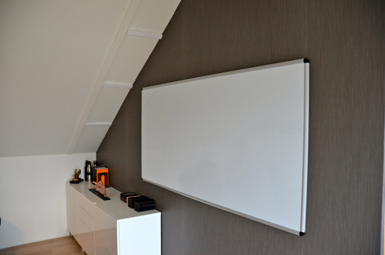
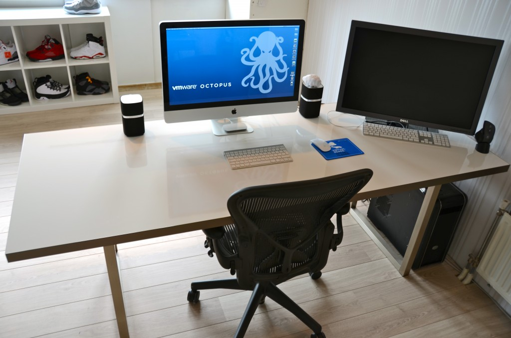
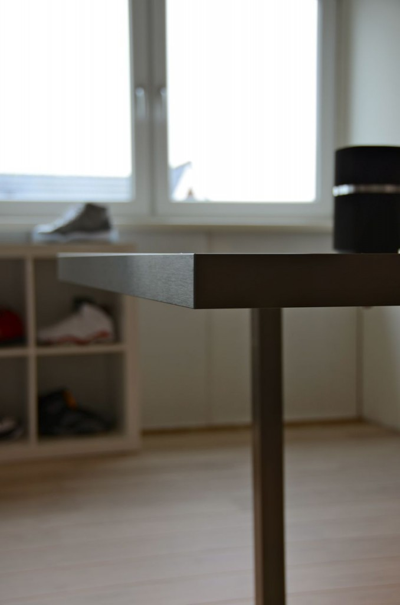
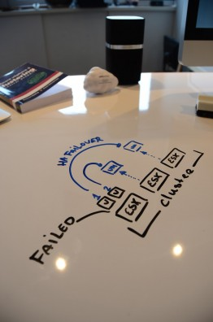
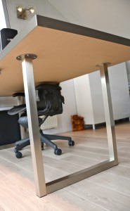
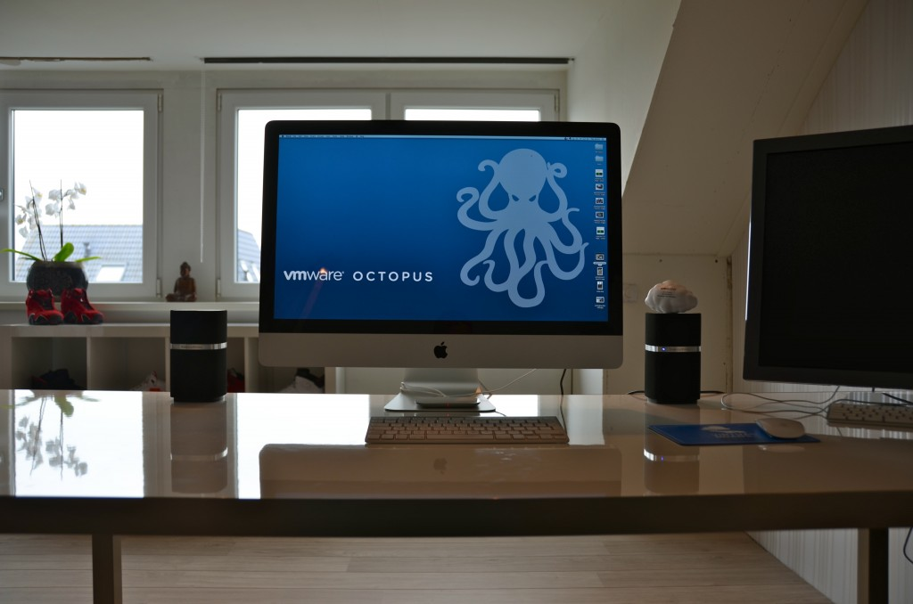

As I’m an avid fan of “post your desk topics \\ workspace ” forum threads, I thought it might be nice to publish a blog article about my own workspace. I always love to see how other people design their work environment and how they customize furniture to suit their needs. Hopefully you can find some inspiration in mine. Last year I decided to refurbish my home office. To create a space that enables me to do my work in the most optimum way, and of course that is pleasing to the eye. The first thing that came to mind was a whiteboard and a really big one. So I needed to build a wall to hang the whiteboard, as the room didn't had any wall that could hold a whiteboard big enough. After completion of the wall, a 6 x 3 feet wide whiteboard found its way to my office.  Although its roughly 5 to 6 feet away from my desk, I realized I didn't use it enough due to distance. Sitting behind the desk while on the phone or just using my computer, I found myself scribbling on pieces of paper instead of getting out of my chair and walk over to the whiteboard. Therefor I needed a small whiteboard I could grab and use at my desk. It seemed reasonable, however I like minimalistic designs where clutter is removed as much as possible. I needed to come up with something different; enter the whiteboard desk!  **Whiteboard desk** Instead of buying a mini whiteboard that needs to be stored when not used, I decided to visit my local IKEA and see what’s available. Besides “show your desk” threads I hit [ikeahackers.net](http://www.ikeahackers.net) on a daily basis. While looking at tables, I noticed that the IKEA kitchen department sells customized tabletops. Each dimension is possible in almost every shape. I decided to order a 7 feet by 3 feet high-gloss white tabletop with a stainless steel edge. The Ikea employee asked where to put the sink, she was surprised when I told her that the tabletop was going to function as a desk.  I chose to order the 2 inch thick tabletop as I need to have a desktop that is sturdy enough to hold the weight of a 27” I-mac and a 30” TFT screen. The stainless steel edge fits snug around the desk and covers each side; it doesn't stick out and is not noticeable when typing. It looks fantastic! However the downside is the price, it was more expensive than the tabletop itself. The alternative is a laminate cover that looks like it will be worn out easily. While spending most of my time behind my desk I thought it was worth the investment of buying the real thing. The high-gloss finish acts as the whiteboard surface and works like a charm with any whiteboard markers. I left notes on my desk for multiple days and could be removed without leaving a trace.  The tabletop rest on two IKEA Vika Moliden stands, due to the cast of the shadow its very difficult to notice that the color of the stands do not exactly match the color as the stainless steel edge.  The whiteboard desk is just an awesome piece of furniture. When on the phone I can take notes on my desk while immediately drawing diagrams next to it. It saves a lot of trees, saves a lot of time scrambling for a piece of paper, and a pen and decreases clutter on the desk. The only thing you need to do when building a whiteboard desk is to banish all permanent markers in your office. :)  It would be awesome to see what your workspace looks like. What do you love about your workspace and maybe show your own customizations? I would love to see blogs articles pop up describing the workspace of bloggers. Please post a link to your blog article in the comment section.
