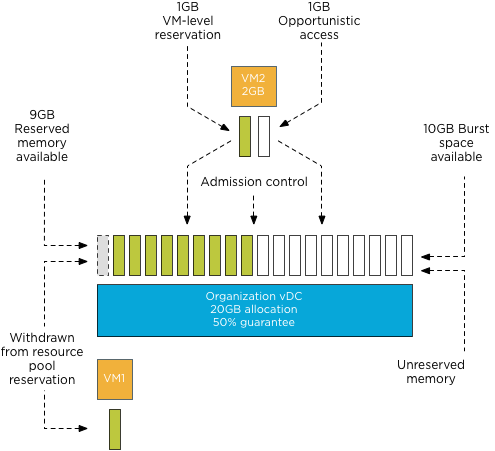
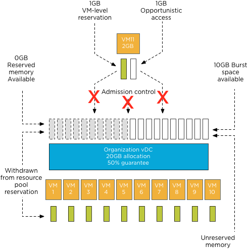

The [previous article](http://frankdenneman.nl/2012/05/the-admission-control-family/) outlines the multiple admission controls active in a virtual infrastructure. One that always interested me in particular is the admission control feature that verifies resource availability. With the introduction of vCloud director another level of resource construct were introduced. Along with Provider virtual datacenter (vDC) and Organization vDCs, allocation models were introduced. An allocation model defines how resources are allocated from the provider vDC. An organization vDC must be configured with one of the following three allocation models: “Pay As You Go”, “Allocation Pool” and “Reservation Pool”. It is out of the scope to describe all three models, please visit [Chris Colotti’s](http://www.chriscolotti.us/vmware/vsphere/vcloud-allocation-models/) blog or [Yellow Bricks]( http://www.yellow-bricks.com/2010/09/22/vcd-allocation-models/) to read more about allocation models. As mentioned before the distinction between each of the allocation models is how resources are consumed. Depending on the chosen allocation model reservations and limits will be set on resource pool, virtual machine level, or both. One of the most interesting allocation model is the Allocation Pool model as it sets reservations on both resource pool level and virtual machine level simultaneously. During configuration of the allocation pool model, an amount of guaranteed resources can be specified. (Guaranteed is the vCloud term for vSphere reservation). The question I was given is **will lowering the default value of 100% guaranteed memory result in an increase of more virtual machines inside the Organization vCD**? And the answer lies within the working of vSphere admission control. **Allocation Pool model settings** By default the Allocation Pool model sets a 100% memory reservation on both resource pool level and virtual machine level. By lowering the default guarantee, it allows for opportunistic memory allocation on both resource pool level and virtual machine level. Creating this burstable space (resources available for opportunistic access) usually provides an higher consolidation ratio of virtual machines, however due to the simultaneous configuration of reservation on both resource pool and virtual machine level, this is not the case. **Virtual machine level reservation** During power-on operation admission control checks if the resource pool can satisfy the virtual machine level reservation. Because expandable reservation is disabled in this model, the resource pool is not able to allocate any additional resources from the provider vDC. Therefor the virtual machine memory reservation can only be satisfied by the resource pool level reservation of the organization vDC itself. When a virtual machine is using memory protected by a virtual machine level reservation, this memory is withdrawn from the resource pool-level reservation. If the resource pool does not have enough available memory to guarantee the virtual machine reservation, the power-on operation fails. Let’s use a scenario to visualize the process a bit better. **Scenario** An organization vCD is created with the Allocation Pool model and the memory allocation is set to 20GB; the memory guarantee is set to 50%. These settings result in a resource pool memory limit of 20GB and a memory reservation of 10GB. When powering up a 2GB virtual machine, 1GB of reserved resources will be allocated to that virtual machine and withdrawn from the available reserved memory pool.  Admission control allows to power-on virtual machines until the reserved memory pool is reduced to zero. Following the previous example, virtual machine 2 is powered on. The resource pool providing resources to the organization vDC has 9 GB available in its pool of reserved memory. Admission control allows the power-on operation of the virtual machine as this pool can provide the reserved resources specified by the virtual machine level reservation.    During each power-on operation 1GB of reserved memory is withdrawn from the reserved memory pool available to the organization vDC. Resulting in admission control allowing to power on ten virtual machines. When attempting to deploy virtual machine 11, admission controls fails the power-on operation as the organization vDC has no available reserved memory to satisfy the virtual machine level reservation.    **Note:** This scenario excludes the impact of memory overhead reservation of each virtual machine. Under normal circumstances, the number of virtual machines that could be powered on would be close to 8 instead of 10 as the reserved pool available to the organization vDC is used to satisfy the memory overhead reservation of each virtual machine as well. Because the guarantee setting of the Allocation Pool model configures resource pool and virtual machine memory reservation settings simultaneously, the supply and demand of reserved memory resources are always equal regardless of the configured percentage setting. Therefore offering opportunistic access to resources inside the organization vDC does not allow an increase of the number of virtual machines inside the organization vDC. The next question arises, why should you lower the percentage of guaranteed resources? Providing burstable space increases the number of Organization vCDs inside the Provider vDC. **Resource pool memory reservation** Upon creation resource pools claim and withdraw the configured reserved resources from their parent instantaneously. This memory cannot be provided or distributed to other organization vDCs regardless of utilization of these resources.  Although new resource constructs are introduced in a vCloud environment, consolidation ratios and resource management still leverage traditional vSphere resource management constructs and rules. Chris Colotti and I are currently working on a technical paper describing the allocation models in details and the way they interact with vSphere resource management. We hope to see this published soon.
