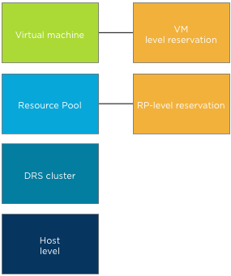
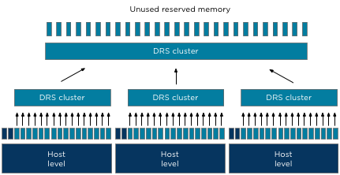
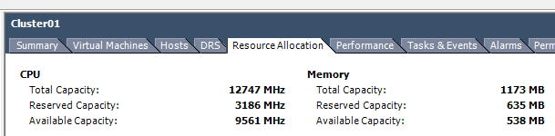
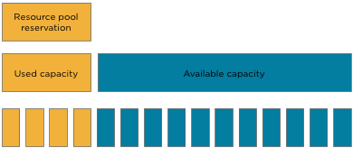

As mentioned in the [admission control family](http://frankdenneman.nl/2012/05/the-admission-control-family/), multiple features on multiple layers check to there is enough unused reserved memory available. This article is a part of a short series of articles on how memory is being claimed and provided as reserved memory; other articles will be posted throughout the week. **Refresher** I’ve published two articles that describes memory reservation at the VM level and the resource pool level. These two sources are an excellent way to refresh your memory (no pun intended) on the reservation construct: • [Impact of memory reservation (VM-level)](http://frankdenneman.nl/2009/12/impact-of-memory-reservation/) • [Resource pool memory reservations](http://frankdenneman.nl/2010/05/resource-pools-memory-reservations/) **“Unclaimed” reserved memory?** If a memory reservation is configured on a child object (virtual machine or resource pool) admission control checks if there is enough reserved memory available. Which memory can be claimed for reserved memory? And how about the host-level memory and cluster level memory? Let’s dissect the cluster tree of resource providers and resource consumers and start with a bottom-up approach.  **Host-level to DRS cluster** Both the host and DRS cluster are resource providers to the resource consumers i.e. resource pools and virtual machines. When a host is made a member of a DRS cluster, all its available memory resources are placed at the DRS disposal. The available memory of a host is the memory that is left after the VMkernel claimed host memory. The DRS cluster, also called the root resource pool, reserves this remaining memory.  As the DRS cluster reserves this memory per host, all the memory aggregated inside the root resource pool and is actually designated as reserved memory. However to prevent confusion, this reserved memory is labeled as unused reserved memory in the vSphere Client user interface and as such provided to the child resource pools and child virtual machines.At the Resource Allocation Tab of the cluster, the Total memory capacity of the cluster is listed as well as the reserved capacity. The Available capacity is the result of Total capacity – Reserved capacity. Note that if HA is configured the amount of resources reserved for failover is automatically added to the reserved capacity.  **Child resource pools** Resource pools allow for hierarchical partitioning of the cluster, but they always span the entire cluster. Resource pools draw resources from the root resource pool and do not pick and select resources from a specific hosts. The root resource pool functions as an abstraction layer. When configuring a reservation on resource pool level the specified amount of memory is claimed by that specific resource pool and cannot be allocated by other resource pools.  Note that the claim of reserved resources by the resource pool is done immediately during the creation of the resource pool. It does not matter if there are running virtual machine inside the resource pools or not. The total configured memory is withdrawn from the root resource pool and thus unavailable for other resource pools. Please keep this in mind when sizing resources pools. The next article will expand on virtual machines inside a resource pool.
