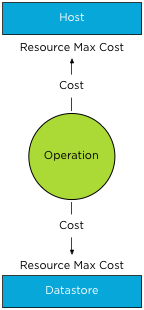

When enabling datastore maintenance mode, Storage DRS will move virtual machines out of the datastore as fast as it can. The number of virtual machines that can be migrated in or out of a datastore is 8. This is related to the concurrent migration limits of hosts, network and datastores. To manage and limit the number of concurrent migrations, either by vMotion or Storage vMotion, a cost and limit factor is applied. Although the term limit is used, a better description of limit is maximum cost. In order for a migration operation to be able to start, the cost cannot exceed the max cost (limit). A vMotion and Storage vMotion are considered operations. The ESXi host, network and datastore are considered resources. A resource has both a max cost and an in-use cost. When an operation is started, the in-use cost and the new operation cost cannot exceed the max cost.  The operation cost of a storage vMotion on a host is “4”, the max cost of a host is “8”. If one Storage vMotion operation is running, the in-use cost of the host resource is “4”, allowing one more Storage vMotion process to start without exceeding the host limit. As a storage vMotion operation also hits the storage resource cost, the max cost and in-use cost of the datastore needs to be factored in as well. The operation cost of a Storage vMotion for datastores is set to 16, the max cost of a datastore is 128. This means that 8 concurrent Storage vMotion operations can be executed on a datastore. These operations can be started on multiple hosts, not more than 2 storage vMotion from the same host due to the max cost of a Storage vMotion operation on the host level. \[caption id="attachment\_2099" align="aligncenter" width="366" caption="Storage vMotion in progress"\]\[/caption\] **How to throttle the number of Storage vMotion operations?** To throttle the number of storage vMotion operations to reduce the IO hit on a datastore during maintenance mode, it preferable to reduce the max cost for provisioning operations to the datastore. Adjusting host costs is strongly discouraged. Host costs are defined as they are due to host resource limitation issues, adjusting host costs can impact other host functionality, unrelated to vMotion or Storage vMotion processes. Adjusting the max cost per datastore can be done by editing the vpxd.cfg or via the advanced settings of the vCenter Server Settings in the administration view. If done via the vpxd.cfg, the value vpxd.ResourceManager.MaxCostPerEsx41Ds is added as follows:

> < config > < vpxd > < ResourceManager > < MaxCostPerEsx41Ds > new value < /MaxCostPerEsx41Ds > < /ResourceManager > < /vpxd > < /config >

As the max cost have not been increased since ESX 4.1, the value-name remains the same and is valid for all ESX 4.1+ hosts. Please remember to leave some room for vMotion when resizing the max cost of a datastore. The vMotion process has a datastore cost as well. During the stun/unstun of a virtual machine the vMotion process hits the datastore, the cost involved in this process is 1. For example, Changing the to 112, allows 7 concurrent Storage vMotions against a given datastore in the vCenter inventory. If 7 concurrent Storage vMotions are started on this datastore, a vMotion process of a virtual machine using this datastore is queued as the vMotion process would violate the max cost of the datastore. 7 x 16 = 112 + 1 vMotion = 113. The moment a Storage vMotion is completed, the vMotion process will resume as resources become available. Please note that cost and max values are applied to each migration process, impact normal day to day DRS and Storage DRS load balancing operations as well as the manual vMotion and Storage vMotion operations occuring in the virtual infrastructure managed by the vCenter server. As mentioned before adjusting the cost at the host side can be tricky as the costs of operation and limits are relative to each other and can even harm other host processes unrelated to migration processes. If you still have the urge to change the cost on the host, consider the impact on DRS! When increasing the cost of a Storage vMotion operation on the host, the available “slots” for vMotion operations are reduced. This might impact DRS load balancing efficiency when a storage vMotion process is active and should be avoided at all times. Get notification of these blogs postings and more DRS and Storage DRS information by following me on Twitter: [@frankdenneman](https://twitter.com/FrankDenneman)
