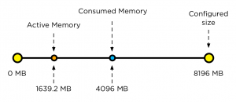
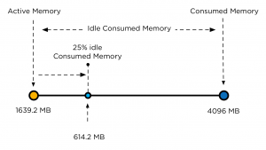
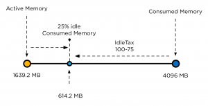

First things first, I normally do not recommend changing advanced settings. Always try to tune system behavior by changing the settings provided by the user interface or try to understand system behavior and how it aligns with your design. **The “problem”** DRS load balancing recommendations could be sub-optimal when no memory overcommitment is preferred. Some customers prefer not to use memory overcommitment. The clusters contain (just) enough memory capacity to ensure all running virtual machines have their memory backed by physical memory. Nowadays it is not uncommon seeing virtual machines with fairly highly allocated (consumed) memory and due to the use of large pages on hosts with recent CPU architectures, little to no memory is shared. Common scenario with this design is a usual host memory load of 80-85% consumed. In this situation, DRS recommendations may have a detrimental effect on performance as DRS does not consider consumed memory but active memory. **DRS behavior** When analyzing the requirements of a virtual machine during load balancing operations, DRS calculates the memory demand of the virtual machine. The main memory metric used by DRS to determine the memory demand is memory active. The active memory represents the working set of the virtual machine, which signifies the number of active pages in RAM. By using the working-set estimation, the memory scheduler determines which of the allocated memory pages are actively used by the virtual machine and which allocated pages are idle. To accommodate a sudden rapid increase of the working set, 25% of idle consumed memory is allowed. Memory demand also includes the virtual machine’s memory overhead. Let’s use an 8 GB virtual machine as example on how DRS calculates the memory demand. The guest OS running in this virtual machine has touched 50% of its memory size since it was booted but only 20% of its memory size is active. This means that the virtual machine has consumed 4096 MB and 1639.2 MB is active.  As mentioned, DRS accommodate a percentage of the idle consumed memory to accommodate a sudden increase of memory use. To calculate the idle consumed memory, the active memory 1639.2 MB is subtracted from the consumed memory, 4096 MB, resulting in a total 2456.8 MB. By default DRS includes 25% of the idle consumed memory, i.e. 614.2 MB.  The virtual machine has a memory overhead of 90 MB. The memory demand DRS uses in it’s load balancing calculation is as follows: 1639.2 MB + 614.2 MB + 90 MB = 2343.4 MB. This means that DRS will select a host that has 2343.4 MB available for this machine and the move to this host improves the load balance of the cluster. **DRS and corner stone of virtualization resource overcommitment** Resource sharing and overcommitment of resources are primary elements of the virtualization. When designing virtual infrastructure it is a challenge to build the environment in such a way that it can handle virtual machine workloads while improving server utilization. Because every workload is not equal, applying resource allocation settings such as shares, reservations and limits can make distinction in priority. DRS is designed with this corner stone in mind. And that’s makes DRS sometimes a hard act to follow. DRS is all about solving imbalance and providing enough resources to the virtual machines aligned to their demand. This means that DRS balances workload on demand and trust in its core value that overcommitment is allowed. It then relies on the host local scheduler to figure out the priority of the virtual machines. And this behavior is sometimes not in line with the perception of DRS. A common perception is that DRS is about optimizing performance. This is partially true. As mentioned before DRS looks at the demand of the VM, and will try to mix and match activity of the virtual machines with the available resources in the cluster. As it relies on resource allocation settings, it assumes that priority is defined for each virtual machine and that the host local schedulers can reclaim memory safely. For this reason the DRS memory imbalance metric is tuned to focus on VM active memory to allow efficient sharing of host memory resources. Allowing to run with less cluster memory than the sum of all running virtual machine memory sizes and reclaiming idle consumed memory from lower priority virtual machines for other virtual machines’ active workloads. Unfortunately DRS does not know when the environment is designed in such a way to avoid overcommitment. Based on the input it can place a virtual machine on a host with virtual machine that have lots of idle consumed memory laying around. Instigating memory reclamation. In most cases this reclamation is hardly noticeable due to the use of the balloon driver. However in the case where all hosts are highly utilized, ballooning might not be as responsive as required, forcing the kernel to compress memory and swap. This means that migrations for the sole purpose of balancing active memory are not useful in environments like these and, if the target host memory is highly consumed, can cause a performance impact on the migrating virtual machine as it waits to obtain memory and on the other virtual machines on the target host as they do processing to allow reclamation of their idle memory. **The solution? You might want to change the 25% idle consumed memory setting** The solution I recommend to start with is to lower the migration threshold by moving the slider to the left. This allows the DRS cluster to have an higher imbalance and allows DRS to be more conservative when recommending migrations. If this is not satisfactory, then I would suggest changing the DRS advanced option called IdleTax. Please note that this DRS advanced option is not the same setting as the memory kernel setting. Mem.IdleTax. The DRS IdleTax advanced option (default 75) controls how much consumed idle memory should be added to active memory in estimating memory demand. The calculation is as follows: 100-IdleTax. Default caluculation = 100-75=25 This means that the smaller the value of IdleTax, more consumed idle memory is added to the active memory by DRS for load balancing.  Be aware that the value of IdleTax is a heuristic, tuned to facilitate memory overcommitment; tuning it to a lower value is appropriate for environments not using overcommitment. Note that the option is set per cluster, and would need to be changed for all DRS clusters as appropriate. **Again, try to use a lower migration threshold setting and monitor if this setting provides satisfying results before setting this advanced feature.**
