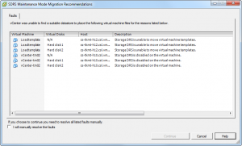

Please note that Storage DRS cannot move VM templates via storage vMotion. This can impact load balancing operations or datastore maintenance mode operations. When initiating Datastore Maintenance mode, the following message is displayed:  As maintenance mode is commonly used for array migrations of datastore upgrade operations (VMFS-3 to VMFS-5), remember to convert the VM template to a virtual machine first before initiating maintenance mode.
