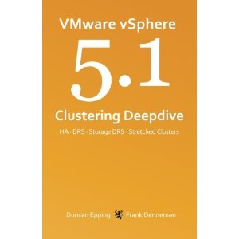

 Duncan and I released the vSphere 5.1 Clustering deepdive book this week. The book contains the new features of the vSphere 5.1 suite. We rewrote the Storage DRS chapter and have added a complete new chapter focusing on Stretched Clusters. **Font changes** The challenge for us was to include all the new content in the book without allowing the book to grow beyond its trademark dimensions. To achieve this we used a different font and decreased the font size, this resulted in a growth of 80 pages, making it 415 pages instead of the 505 pages if we used the previous font. Please note that although we decreased the font size, this did not decrease the legibility of the book. **Special cover** The cover is designed in such a way that you can actually have multiple copies with all different shades of orange, dare I say 50 shades of Orange. ;) We hope you enjoy the new version of the vSphere clustering deepdive series. It’s available in Paperback and Kindle format. [Paper copy – $ 24.95](http://www.amazon.com/gp/product/1478183411/ref=as_li_qf_sp_asin_tl?ie=UTF8&camp=1789&creative=9325&creativeASIN=1478183411&linkCode=as2&tag=frankdenneman-20) [Kindle version – $ 7.49](http://www.amazon.com/gp/product/B0092PX72C/ref=as_li_tf_tl?ie=UTF8&camp=1789&creative=9325&creativeASIN=B0092PX72C&linkCode=as2&tag=frankdenneman-20)
