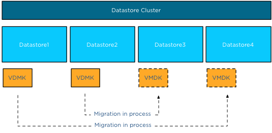

Where previous versions of vSphere copied disks serially, vSphere 5.1 allows up to 4 parallel disk copies per Storage vMotion operation When you migrate a virtual machine with five VMDK files, Storage vMotion copies of the first four disks in parallel, then starts the next disk copy as soon as one of the first four finishes.  To reduce performance impact on other virtual machines sharing the datastores, parallel disk copies only apply to disk copies between distinct datastores. This means that if a virtual machine has multiple VMDK files on Datastore1 and Datastore2, parallel disk copies will only happen if destination datastores are Datastore3 and Datastore4.  Let’s use an example to clarify the process. Virtual machine VM1 has four vmdk files. VMDK1 and VMDK2 are on Datastore1, VMDK3 and VMDK4 are on Datastore2. The VMDK files are moved from Datastore1 to Datastore4 and from Datastore2 to Datastore3. VMDK1 and VMDK3 are migrated in parallel, while VMDK2 and VMDK4 are queued. The migration process of VMDK2 is started the moment the migration of VMDK1 is complete, similar for VMDK4 as it will be started when the migration of VMDK3 is complete.  A fan out disk copy, in other words copying two VMDK files on datastore A to datastores B and C, will not have parallel disk copies. The common use case of parallel disk copies is the migration of a virtual machine configured with an anti-affinity rule inside a datastore cluster.
