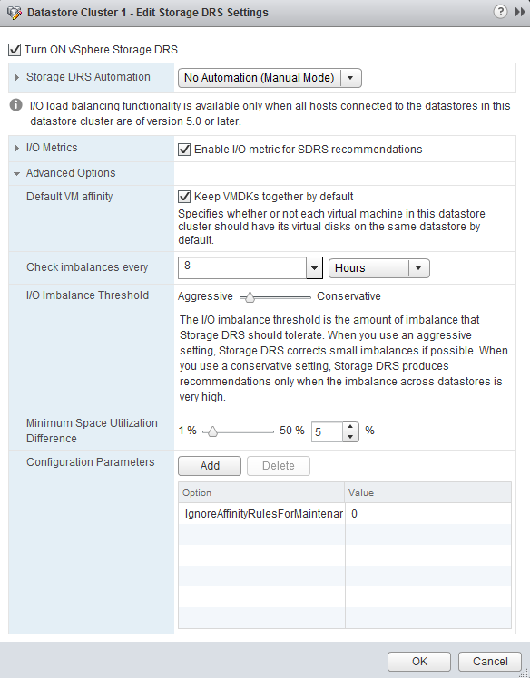

In vSphere 5.1 you can configure the default (anti) affinity rule of the datastore cluster via the user interface. Please note that this feature is only available via the web client. The vSphere client does not contain this option. By default the Storage DRS applies an intra-VM vmdk affinity rule, forcing Storage DRS to place all the files and vmdk files of a virtual machine on a single datastore. By deselecting the option “Keep VMDKs together by default” the opposite becomes true and an Intra-VM anti-affinity rule is applied. This forces Storage DRS to place the VM files and each VDMK file on a separate datastore.  Please read the article: “[Impact of intra-vm affinity rules on storage DRS](http://frankdenneman.nl/2012/02/impact-of-intra-vm-affinity-rules-on-storage-drs/ )” to understand the impact of both types of rules on load balancing.
