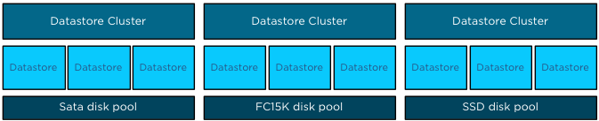
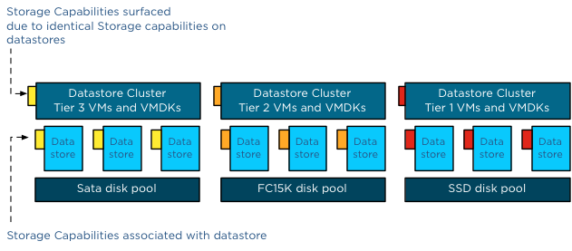
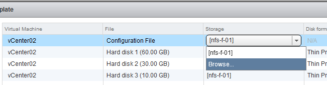
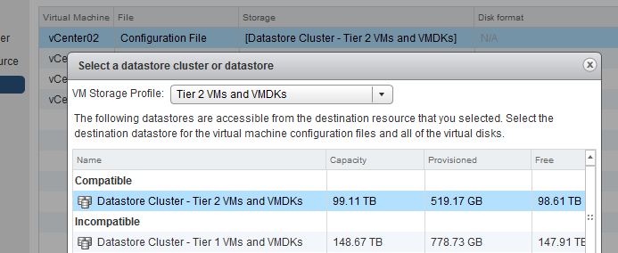
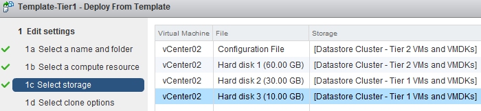
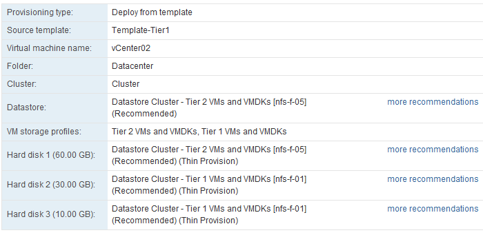
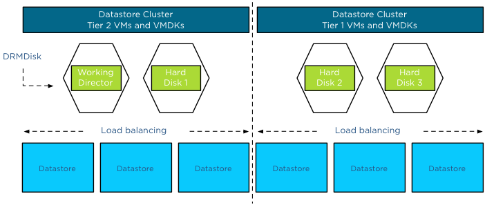

Mentioned in [part-1 of the Storage DRS and VM Storage Profiles](http://frankdenneman.nl/2012/09/vm-storage-profiles-and-storage-drs-part-1/) series, Storage DRS expects “storage characteristics –alike” datastores inside a single datastore cluster. But what if you have multiple tiers of storage and you want to span the virtual machine across them? Storage profiles can assist in deploying the VMs across multiple datastore clusters safely and inline with your SLAs. **Storage DRS Datastore architecture** When you have multiple tiers of storage, its recommended to create multiple datastore clusters and each datastore cluster contains disks from a single tier. Let’s assume you have three different kinds of disks in your array: SSD, FC 15K and SATA.  Datastores backed by disk out a single pool are aggregated into a single datastore, resulting in three datastore clusters. Having multiple datastore clusters can increase the complexity of the provisioning process, using VM storage profiles ensures you that virtual machines or disk files are placed in the correct datastore cluster. **Assign storage capabilities to datastores** All datastores within a single datastore cluster are associated with the same storage capability.

| **Storage Capability** | **Associated with datastores in Datastore cluster:** |
| --- | --- |
| SSD – Low latency disks (Tier 1 VMs and VMDKs) | Datastore Cluster Tier 1 VMs and VMDKs |
| FC 15K – Fast disks (Tier 2 VMs and VMDKs) | Datastore Cluster Tier 2 VMs and VMDKs |
| SATA – High Capacity Disks (Tier 3 VMs and VMDKs) | Datastore Cluster Tier 3 VMs and VMDKs |

 Please note that all datastores must be configured with the same storage capability. If one datastore is not associated with a storage capability or has a different storage capability than its sibling datastores, the datastore cluster will not surface a storage capability. **One virtual machine – different levels of service required** Generally faster disk have higher cost per gigabyte and have a lower maximum capacity per drive, this usually drives various design decisions and operational procedures. Typically Tier 1 applications and data caching mechanisms end up in on the fastest storage disk pools. Most virtual machines are configured with multiple hard disks. A system disk containing the Operating System and one or more disks containing log files and data. The footprint of the virtual machine is made up out of a working directory and its VMDK files. When reviewing the requirements of the virtual machine, it is common that only the VMDKs containing the log files and the databases require low latency disks while the system disk can be placed in a lower tier storage pool. And this is the reason why you can assign multiple different VM storage profiles to a virtual machine. **Multiple VM storage Profiles** Let’s use an example; in this scenario we are going to deploy the virtual machine vCenter02. The virtual machine is configured with three disks, Hard disk 1 contains the OS, Hard disk 2 contains the database and Hard disk 3 contains the log files. We associated the VM with two VM Storage Profiles. To avoid wasting precious low latency disk space in the Tier 1 datastore cluster, we are going to associate the VMs working directory (containing the VM swap file) and the 60GB system disk are to the Tier 2VM storage profile, which is connected to Tier 2 Storage capability.  When selecting storage during the deployment process, click on the button advanced.  To associate a VM storage profile to a Hard disk or the working directory, called Configuration file in this screen, double click the item in the storage column and select browse.  The VM storage Profile screen appears and you can select the appropriate VM storage profile. The VM storage profile “Tier 2 VMs and VMDKs” is selected and will be associated with the Configuration file once we click ok. As Tier 2 storage profile is associated with Storage Capability “FC 15K – Fast disks (Tier 2 VMs and VMDKs)”, the UI list “Datastore Cluster – Tier 2 VMs and VMDKs” as the only compatible datastore cluster.  These steps have to be repeated for every hard disk of the virtual machine. At this point the working directory (configuration file) and the System disk will be placed on Datastore Cluster Tier 2 and the Database disk and Log file disk will be placed on Datastore Cluster Tier 1 once the deployment process has completed.  The ready to complete screen displays the associated VM storage profiles and the destinations of the working directory and Hard disks.  Storage DRS generates placement recommendations and these can be changed if you want to select a different datastore. By selecting the option “more recommendations” a window is displayed and will show you alternative destination datastores.  **DRMDisks** Storage DRS is able to generate these stand-alone recommendations due to the construct called DRMDisks. Storage DRS generates a construct called DRMDisk for each VM working directory and each VMDK. The DRMDisk is the smallest element Storage DRS can load balance (atomic level). Therefore Storage DRS can move a system disk VMDK to a different datastore in the datastore cluster without having to move the working directory or another disk. Depending on the default Affinity rule of the cluster, DRMdisks within the datastore cluster will be placed on the same datastore (affinity) or separated on different datastores (anti-affinity).  For more information about load balancing based on DRMdisk instead of a complete VM, please read the article: [Impact of Intra VM affinity rules on Storage DRS](http://frankdenneman.nl/2012/02/impact-of-intra-vm-affinity-rules-on-storage-drs/). Part 3 will cover applying Storage Profiles to virtual machine templates Get notification of these blogs postings and more DRS and Storage DRS information by following me on Twitter: [@frankdenneman](https://twitter.com/FrankDenneman)
