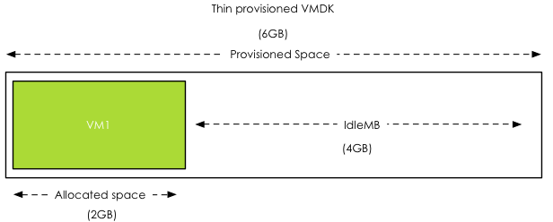

The behavior of thin provisioned disk VMDKs in a datastore cluster is quite interesting. Storage DRS supports the use of thin provisioned disks and is aware of both the configured size and the actual data usage of the virtual disk. When determining placement of a virtual machine, Storage DRS verifies the disk usage of the files stored on the datastore. To avoid getting caught out by instant data growth of the existing thin disk VMDKs, Storage DRS adds a buffer space to each thin disk. This buffer zone is determined by the advanced setting “PercentIdleMBinSpaceDemand". This setting controls how conservative Storage DRS is with determining the available space on the datastore for load balancing and initial placement operations of virtual machines. **IdleMB** The main element of the advanced option “PercentIdleMBinSpaceDemand” is the amount of IdleMB a thin-provisioned VMDK disk file contains. When a thin disk is configured, the user determines the maximum size of the disk. This configured size is referred to as “Provisioned Space”. When a thin disk is in use, it contains an x amount of data. The size of the actual data inside the thin disk is referred to as “allocated space”. The space between the allocated space and the provisioned space is called identified as the IdleMB. Let’s use this in an example. VM1 has a single VMDK on Datastore1. The total configured size of the VMDK is 6GB. VM1 written 2GB to the VMDK, this means the amount of IdleMB is 4GB.  **PercentIdleMBinSpaceDemand** The PercentIdleMBinSpaceDemand setting defines percentage of IdleMB that is added to the allocated space of a VMDK during free space calculation of the datastore. The default value is set to 25%. When using the previous example, the PercentIdleMBinSpaceDemand is applied to the 4GB unallocated space, 25% of 4GB = 1 GB. **Entitled Space Use** Storage DRS will add the result of the PercentIdleMBinSpaceDemand calculation to the consumed space to determine the “entitled space use”. In this example the entitled space use is: 2GB + 1GB = 3GB of entitled space use.  **Calculation during placement** The size of Datastore1 is 10GB. VM1 entitled space use is 3GB, this means that Storage DRS determines that Datastore1 has 7GB of available free space. **Changing the PercentIdleMBinSpaceDemand default setting** Any value from 0% to 100% is valid. This setting is applied on datastore cluster level. There can be multiple reasons to change the default percentage. By using 0%, Storage DRS will only use the allocated space, allowing high consolidation. This is might be useful in environments with static or extremely slow data increase. There are multiple use cases for setting the percentage to 100%, effectively disabling over-commitment on VMDK level. Setting the value to 100% forces Storage DRS to use the full size of the VMDK in its space usage calculations. Many customers are comfortable managing over-commitment of capacity only at storage array layer. This change allows the customer to use thin disks on thin provisioned datastores. **Use case 1: NFS datastores** A use case is for example using NFS datastores. Default behavior of vSphere is to create thin disks when the virtual machine is placed on a NFS datastore. This forces the customer to accept a risk of over-commitment on VMDK level. By setting it to 100%, Storage DRS will use the provisioned space during free space calculations instead of the allocated space. **Use case 2: Safeguard to protect against unintentional use of thin disks** This setting can also be used as safeguard for unintentional use of thin disks. Many customers have multiple teams for managing the virtual infrastructure, one team for managing the architecture, while another team is responsible for provisioning the virtual machines. The architecture team does not want over-commitment on VMDK level, but is dependent on the provisioning team to follow guidelines and only use thick disks. By setting “PercentIdleMBinSpaceDemand” to 100%, the architecture team is ensured that Storage DRS calculates datastore free space based on provisioned space, simulating “only-thick disks” behavior. **Use-case 3: Reducing Storage vMotion overhead while avoiding over-commitment** By setting the percentage to 100%, no over-commitment will be allowed on the datastore, however the efficiency advantage of using thin disks remains. Storage DRS uses the allocated space to calculate the risk and the cost of a migration recommendation when a datastore avoids its I/O or space utilization threshold. This allows Storage DRS to select the VMDK that generates the lowest amount of overhead. vSphere only needs to move the used data blocks instead of all the zeroed out blocks, reducing CPU cycles. Overhead on the storage network is reduced, as only used blocks need to traverse the storage network. Get notification of these blogs postings and more DRS and Storage DRS information by following me on Twitter: [@frankdenneman](https://twitter.com/FrankDenneman)
