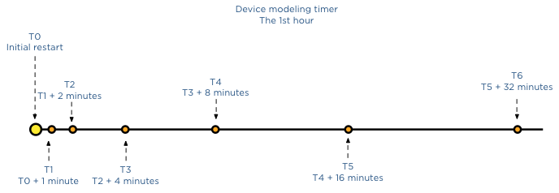

During a recent meeting the behavior of Storage DRS device modeling was discussed. When I/O load balancing is enabled, Storage DRS leverages the SIOC injector to determine the device characteristics of the disks backing the datastore. Because the injector stops when there is activity detected on the datastore, the customer was afraid that Storage DRS wasn’t able to get a proper model of his array due to the high levels of activity seen on the array. Storage DRS was designed to cope with these environments, as the customer was reassured after explaining the behavior I thought it might be interesting enough for to share it with you too. **The purpose of device modeling** Device modeling is used by Storage DRS to characterize the performance levels of the datastore. This information is used when Storage DRS needs to predict the benefit of a possible migration of a virtual machine. The workload model provides information about the I/O behavior of the VM, Storage DRS uses that as input and mixes this with the device model of the datastore in order to predict the increase of latency after the move. The device modeling of the datastore is done with the SIOC injector **The workload** To get a proper model, the SIOC injector injects random read I/O to the disk. SIOC uses different amounts of outstanding IO to measure the latency. The duration of the complete cycle is 30 seconds and is trigger once a day per datastore. Although it’s a short-lived process, this workload does generate some overhead on the array and Storage DRS is designed to enable storage performance for your virtual machines, not to interfere with them. Therefor this workload will not run when activity is detected on the devices backing the datastore. **Timer** As mentioned, the device modeling process runs for 30 seconds in order to characterize the device. If the IO injector starts and the datastore is active or becomes active, the IO injector will wait for 1 minute to start again. If the datastore is still busy, it will try again in 2 minutes, after that it idles for 4 minutes, after that 8 minutes, 16 minutes, 32 minutes, 1 hour and finally 2 hours. When the datastore is still busy after two hours after the initial start it will try to start the device modeling with an interval of 2 hours until the end of the day.  If SIOC is not able to characterize the disk during that day, it will use the average value of all the other datastores in other not to influence the load balancing operations with false information and provide information that would favor this disk over other datastores that did provide actual data. The next day SIOC injector will try model the device again, but uses a skew back and forth of 2 hours from the previous period, this way during the year, Storage DRS will retrieve info across every period of the day. **Key takeway** Overall we do not expect the array to be busy 24/7, there is always a window of 30 seconds where the datastore is idling. Having troubleshooting many storage related problems I know arrays are not stressed all day long, therefor I’m more than confident that Storage DRS will have accurate device models to use for its prediction models. Get notification of these blogs postings and more DRS and Storage DRS information by following me on Twitter: [@frankdenneman](https://twitter.com/FrankDenneman)
