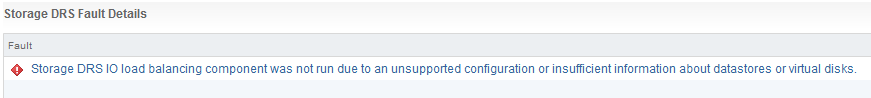
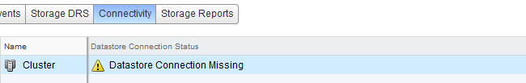
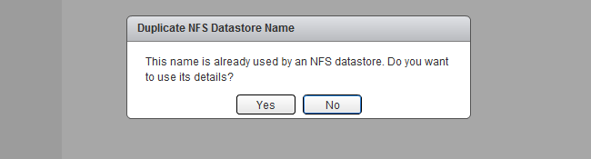

During my Storage DRS presentation at VMworld I talked about datastore cluster architecture and covered the [impact of partially connected datastore clusters](http://frankdenneman.nl/2011/10/partially-connected-datastore-clusters/). In short – when a datastore in a datastore cluster is not connected to all hosts of the connected DRS cluster, the datastore cluster is considered partially connected. This situation can occur when not all hosts are configured identically, or when new ESXi hosts are added to the DRS cluster. **The problem** I/O load balancing does not support partially connected datastores in a datastore cluster and Storage DRS disables the IO load balancing for the entire datastore cluster. Not only on that single partially connected datastore, but the entire cluster. Effectively degrading a complete feature set of your virtual infrastructure. Therefore having an homogenous configuration throughout the cluster is imperative. **Warning messages** An entry is listed in the Storage DRS Faults window. In the web vSphere client: 1. Go to Storage 2. Select the datastore cluster 3. Select Monitor 4. Storage DRS 5. Faults.  The connectivity menu option shows the Datastore Connection Status, in the case of a partially connected datastore, the message Datastore Connection Missing is listed.  When clicking on the entry, the details are shown in the lower part of the view:  **Returning to a fully connected state** To solve the problem, you must connect or mount the datastores to the newly added hosts. In the web client this is considered a host-operation, therefore select the datacenter view and select the hosts menu option. 1. Right-click on a newly added host 2. Select New Datastore 3. Provide the name of the existing datastore  4. Click on Yes when the warning “Duplicate NFS Datastore Name” is displayed.  5. As the UI is using existing information, select next until Finish. 6. Repeat steps for other new hosts. After connecting all the new hosts to the datastore, check the connectivity view in the monitor menu of the of the datastore cluster  Get notification of these blogs postings and more DRS and Storage DRS information by following me on Twitter: [@frankdenneman](https://twitter.com/FrankDenneman)
