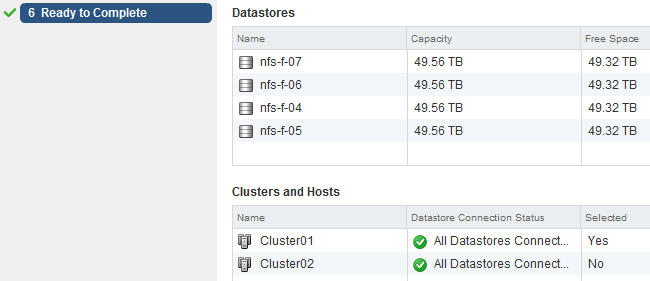
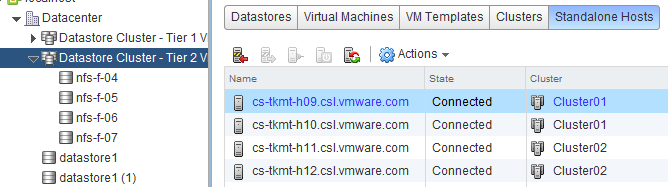

Lately I have seen the following question popping up at multiple places: “_How can I add hosts of a DRS cluster to a Storage DRS datastore cluster after the datastore cluster is created?_” This is an intriguing question as it gives insight to how datastore cluster construct is perceived and that a step in the “create datastore cluster” workflow in the user interface might be the culprit of this. **The workflow:** During the create datastore cluster, step 4 requires the use to connect the datastore cluster to a DRS cluster or stand-alone hosts.  The reason for incorporating the step of selecting clusters and stand-alone hosts is to help narrow down the list of datastores that are presented in step 5. This way, one can create a datastore cluster that consists of datastores that are connected to all the hosts in a particular DRS cluster. The article “[Partially connected datastore clusters](http://frankdenneman.nl/sdrs/partially-connected-datastore-clusters/ "Partially connected datastore clusters")” provide more information on the impact partially connected datastores on Storage DRS load balancing. **In short, the screen “Select Clusters and Hosts” is just a filter, no host to datastore connectivity is altered by this step**. To prove this theory, I attached the datastores nfs-f-04, nfs-f-05, nfs-f-06 and nfs-f-07 to all the hosts in Cluster01 and Cluster02. However I selected the Cluster 01 in step 4. Step 5 provides the following overview, indicating that all the available datastores are connected to the hosts in Cluster01.  When you review the “Ready to Complete” screen, scroll down to the “Cluster and Host” overview, this screen shows that all the datastores are connected to Cluster01 and Cluster02, but only Cluster01 is selected. In my opinion this screen doesn’t make sense and I’m already working with the User Interface team and engineering to see if we can make some adjustments. (No promises though)!  Although this Selected column can make this screen a little confusing, in essence it displays the user selection during the configuration process. The “Datastore Connection Status” is the key message of this view. Once complete, select the Storage view, select the new datastore cluster and select the Cluster tab. This view shows that both clusters are connected and can utilize the datastore cluster as destination for virtual machine placement.  Another check is the “Standalone Hosts” tab. This displays the connectivity state of the hosts to the datastore cluster. Host \*h09\* and \*h10\* are part of Cluster01, host \*h11\* and \*h12\* are part of Cluster02.  **In essence** Remember I didn’t select Cluster02 during the datastore cluster configuration, yet Cluster02 and its hosts are still connected. Long story short: DRS Cluster and Storage DRS Datastore clusters are independent load balancing domain constructs. In the end it drills down to the host to datastore connectivity, remember partially connected datastores can still be a part of a datastore cluster. DRS and Storage DRS take the connectivity of hosts and datastores into account during the initial placement and load balancing process, not the cluster constructs. Before creating a datastore cluster, ensure the following: • Check Storage adapter settings • Check Array configuration (masking, LUN ID, exports) • Check zoning • Rescan hosts that are going to use the datastores inside the datastore cluster. Get notification of these blogs postings and more DRS and Storage DRS information by following me on Twitter: [@frankdenneman](https://twitter.com/FrankDenneman)
