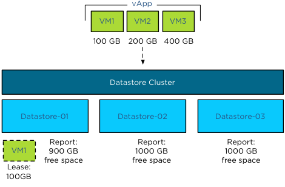

When a virtual machine is provisioned to the datastore cluster, Storage DRS algorithm runs to determine the best placement of the virtual machine. The interesting part of this process is the method Storage DRS determines the free space of a datastore or to be more precise the improvement made in vSphere 5.1 regarding free space calculation and the method of finding the optimal destination datastore. **vSphere 5.0 Storage DRS behavior** Storage DRS is designed to balance the utilization of the datastore cluster, it selects the datastore with the highest free space value to balance the space utilization of the datastores in the datastore cluster and avoids out-of-space situations. During the deployment of a virtual machine, Storage DRS initiates a simulation to generate an initial placement operation. This process is an isolated process and retrieves the current datastore free space values. However, when a virtual machine is deployed, the space usage of the datastore is updated once the virtual machine deployment is completed and the virtual machine is ready to power-on. This means that the initial placement process is unaware of any ongoing initial placement recommendations and pending storage space allocations. Let’s use an example that explains this behavior. In this scenario the datastore cluster contains 3 datastores, the size of each datastore is 1TB, no virtual machines are deployed yet, and therefor they each report a 100% free space. When deploying a 500GB virtual machine, storage DRS selects the datastore with the highest reported number of free space and as all three datastores are equal it will pick the first datastore, Datastore-01. Until the deployment process is complete the datastore remains reporting 1000GB of free space.  When deploying single virtual machines this behavior is not a problem, however when deploying multiple virtual machines this might result in an unbalanced distribution of virtual machine across the datastores. As the available space is not updated during the deployment process, Storage DRS might select the same datastore, until one (or more) of the provisioning operations complete and the available free space is updated. Using the previous scenario, Storage DRS in vSphere 5.0 is likely to pick Datastore-01 again when deploying VM2 before the provisioning process of VM1 is complete, as all three datastore report the same free space value and Datastore-01 is the first datastore it detected.  **vSphere 5.1 Storage DRS behavior** Storage DRS in vSphere 5.1 behaves differently and because Storage DRS in vSphere 5.1 supports vCloud Director, it was vital to support the provisioning process of a vApp that contains multiple virtual machines. **Enter the storage lease** Storage DRS in vSphere 5.1 applies a storage lease when deploying a virtual machine on a datastore. This lease “reserves” the space and making deployments aware of each other, thus avoiding suboptimal/invalid placement recommendations. Let’s use the deployment of a vApp as an example. The same datastore cluster configuration is used, each datastore if empty, reporting 1000GB free space. The vApp exists of 3 virtual machines, VM1, VM2 and VM3. Respectively they are 100GB, 200GB and 400GB in size. During the provisioning process, Storage DRS needs to select a datastore for each virtual machine. As the main goal of Storage DRS is to balance the utilization of the datastore cluster, it determines which datastore has the highest free space value after each placement during the simulation.  During the simulation VM1 is placed on Datastore-01, as all three datastores report an equal value of free space. Storage DRS then applies the lease of 100GB and reduces the available free space to 900GB.  When Storage DRS simulates the placement of VM2, it checks the free space and determines that Datastore-02 and Datastore-03 each have 1000GB of free space, while Datastore-01 reports 900GB. Although VM2 can be placed on Datastore-01 as it does not violate the space utilization threshold, Storage DRS prefers to select the datastore with the highest free space value. Storage DRS will choose Datastore-02 in this scenario as it picks the first datastore if multiple datastores report the same free space value.  The simulations determines that the optimal destination for VM3 is Datastore-03, as this reports a free space value of 1000GB, while Datastore-02 reports 800 free space and Datastore-01 reports 900GB of space. This lease is applied during the simulation of placement for the generation of the initial placement recommendation and remains applied until the placement process of the virtual machine is completed or when the operation times out. This means that not only a vApp deployment is aware of the storage resource lease but also other deployment processes. **Update to vSphere 5.1** This new behavior is extremely useful when deploying multiple virtual machines in batches such as vApp deployment or vHadoop environments with the use of [Serengeti](http://cto.vmware.com/project-serengeti-theres-a-virtual-elephant-in-my-datacenter/). Get notification of these blogs postings and more DRS and Storage DRS information by following me on Twitter: [@frankdenneman](https://twitter.com/FrankDenneman)
