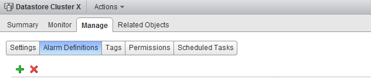
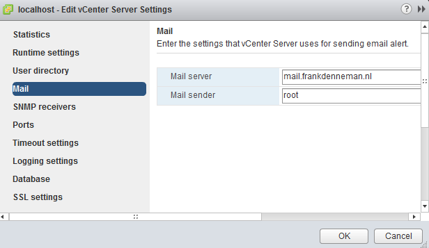

It is recommended to configure Storage DRS in manual mode when you are new to Storage DRS. This way you become familiar with the decision matrix Storage DRS uses and you are able to review the recommendations it provides. One of the drawbacks of manual mode is the need to monitor the datastore cluster on a regular basis to discover if new recommendations are generated. As Storage DRS is generated every 8 hours and doesn’t provide insights when the next invocation run is scheduled, it’s becomes a bit of a guessing game when the next load balancing operation has occurred. To solve this problem, it is recommended to create a custom alarm and configure the alarm to send a notification email when new Storage DRS recommendations are generated. Here’s how you do it: **Step 1: Select the object where the alarm object resides** If you want to create a custom rule for a specific datastore cluster, select the datastore cluster otherwise select the Datacenter object to apply this rule to each datastore cluster. In this example, I’m defining the rule on the datastore cluster object. **Step 2: Go to Manage and select Alarm Definitions** Click on the green + icon to open the New Alarm Definition wizard  **Step 3: General Alarm options** Provide the name of the alarm as this name will be used by vCenter as the subject of the email. Provide an adequate description so that other administrators understand the purpose of this alarm. In the Monitor drop-down box select the option “Datastore Cluster” and select the option “specific event occurring on this object, for example VM Power On”. Click on Next.  **Step 4: Triggers** Click on the green + icon to select the event this alarm should be triggered by. Select “New Storage DRS recommendation generated”. The other fields can be left blank, as they are not applicable for this alarm. Click on next.  **Step 5: Actions** Click on the green plus icon to create a new action. You can select “Run a Command”, “Send a notification email” and “Send a notification trap”. For this exercise I have selected “Send a notification email”. Specify the email address that will receive the messages containing the warning that Storage DRS has generated a migration recommendation. Configure the alarm so that it will send a mail once when the state changes from green to yellow and yellow to red. Click on Finish.  The custom alarm is now listed between the pre-defined alarms. As I chose to define the alarm on this particular datastore cluster, vCenter list that the alarm is defined on “this Object”. This particular alarm is therefor not displayed at Datacenter level and cannot be applied to other datastore clusters in this vCenter Datacenter.  Please note that you must configure a Mail server when using the option “send a notification email” and configure an valid SNMP receiver when using the option “Send a notification trap”. To configure a mail or SNMP server, select the vCenter server option in the inventory list, select manage, settings and click on edit. Go to Mail and provide a valid mail server address and an optional mail sender.  To test the alarm, I moved a couple of files onto a datastore to violate the datastore cluster space utilization threshold. Storage DRS ran and displayed the following notifications on the datastore cluster summary screen and at the “triggered alarm” view:  The moment Storage DRS generated a migration recommendation I received the following email:  As depicted in the screenshot above, the subject of the email generated by vCenter contains the name of the alarm you specified (notice the exclamation mark), the event itself - New Storage DRS recommendation generated" and the datastore cluster in which the event occurred.
