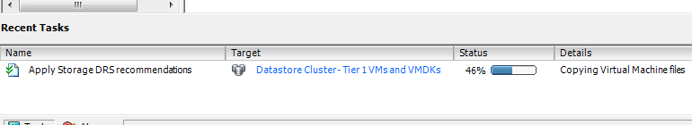

The new web client of vSphere 5.1 is my weapon of choice when working in my lab. It contains a lot of “hidden” gems, the UI team spends a lot of time crafting and aligning the user-interface to the administrator needs. One thing that drove me nuts was the lack of information when running a Storage vMotion operation. The Recent task doesn’t show anything, other than Storage vMotion operation itself and the target. When using Storage DRS, it only shows the name of the target Datastore cluster. Sometimes you just want to know which datastore the virtual machine migrated to. **The new recent task window** For example, take a look at the Recent Tasks window in the right size of the corner of the web client. When running a storage vMotion operation, it displays the Storage vMotion task similar to the vSphere client. However, when clicking on the task itself it shows the event info and task in one view. Helping you identify the source and destination datastore of the Storage vMotion process.  **Compare that to the workflow of the old vSphere client** Select the task in the Recent task bar and double click it.  This brings you in the Task and Events view of the target datastore cluster. By default the view is displaying events. Therefore you need to select Tasks, then select the task itself and then click on the related events in the bottom view.  It may look trivial, but these things do speed up your work. Eradicating unnecessary clicks and wait time before a screen refreshes sure makes your job a little easier.
