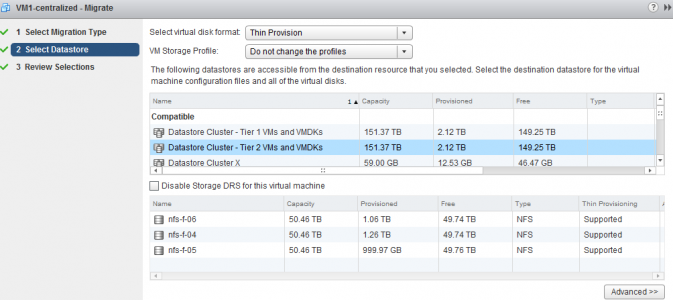
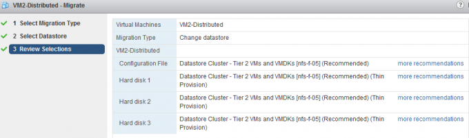
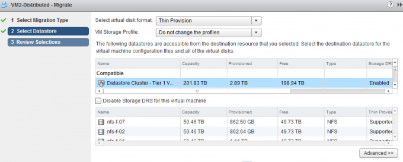
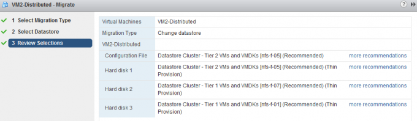

Frequently I receive questions about the impact of a manual migration into a datastore cluster, especially about the impact of the VM disk file layout. Will Storage DRS take the initial disk layout into account or will it be changed? The short answer is that the virtual machine disk layout will be changed by the default affinity rule configured on the datastore cluster. The article describes several scenarios of migrating “distributed“ and “centralized” disk layout configurations into datastore cluster configured with different affinity rules. **Test scenario architecture** For the test scenarios I’ve build two virtual machines VM1 and VM2 Both virtual machines are of identical VM configuration, only the datastore location is different. VM1-centralized has a “centralized” configuration, storing all VMDKs on a single datastore, while VM2-distributed has a “distributed” configuration, storing all VMDKs on separate datastores.

| **Hard disk** | **Size** | **VM 1 datastore** | **VM 2 datastore** |
| --- | --- | --- | --- |
| Working directory | 8GB | FD-X4 | FD-X4 |
| Hard disk 1 | 60GB | FD-X4 | FD-X4 |
| Hard disk 2 | 30GB | FD-X4 | FD-X5 |
| Hard disk 1 | 10GB | FD-X4 | FD-X6 |

Two datastore clusters exists in the virtual infrastructure:

| **Datastore cluster** | **Default Affinity rule** | **VMDK rule applied on VM** |
| --- | --- | --- |
| Tier-1 VMs and VMDKs | Do not keep VMDKs together | Intra-VM Anti-affinity |
| Tier-2 VMs and VMDKs | Keep VMDKs together | Intra-VM Affinity rule |

**Test 1: VM1-centralized to Datastore Cluster Tier-2 VMs and VMDKs** Since the virtual machine is stored on a single datastore is makes sense to start of migrating the virtual machine to the datastore cluster which applies a VMDK affinity rule, keeping the virtual machine disk files together on a single datastore in the datastore cluster.Select the virtual machine, right click the virtual machine to display the submenu and select the option “Migrate…”. The first step is to select the migration type, select change datastore.  The second step is to select the destination datastore, as we are planning to migrate the virtual machine to a datastore cluster it is necessary to select the datastore cluster object.  After clicking next, the user interface displays the Review Selection screen; notice that the datastore cluster applied the default cluster affinity rule.  Storage DRS has evaluated the current load of the datastore cluster and the configuration of the virtual machine, it concludes that datastore nfs-f-05 is the best fit for the virtual machine, the existing virtual machines in the datastore cluster and the load balance state of the cluster. By clicking “more recommendations” other datastore destinations are presented. **Test result:** Intra-VM affinity rule applied and all virtual machine disk files are stored on a single datastore **Selecting the Datastore cluster object** The user interface provides you two options, select the datastore cluster object or a datastore that is part of the datastore cluster, however for that option you explicitly need to disable Storage DRS for this virtual machine. By selecting the datastore cluster, you fully leverage the strength of Storage DRS. Storage DRS initiates it’s algorithms and evaluate the current state of the datastore cluster. It reviews the configuration of the new virtual machine and is aware of the I/O load of each datastore as well as the space utilization. Storage DRS weigh both metrics and will weigh either space of I/O load heavier if the utilization is higher. **Disable Storage DRS for this virtual machine** By default it’s not possible to select a specific datastore that is a part of a datastore cluster during the second step “Select Datastore”. In order to do that, one must activate (tick the option box) the “Disable Storage for this virtual machine”. By doing so the datastores in the lower part of the screen are available for selection. However this means that the virtual machine will be disabled for any Storage DRS load balancing operation. Not only will it affect have an effect for the virtual machine itself, it also impacts other Storage DRS operations such as Maintenance Mode and Datastore Cluster defragmentation. As Storage DRS is not allowed to move the virtual machine, it cannot migrate the virtual machine to find an optimum load balance state when Storage DRS needs to make room for an incoming virtual machine. For more information about cluster defragmentation, read the following article: [Storage DRS initial placement and datastore cluster defragmentatio](http://frankdenneman.nl/sdrs/storage-drs-initial-placement-and-datastore-cluster-defragmentation/)n. **Test 2: VM1-centralized to Datastore Cluster Tier-1 VMs and VMDKs** Migrating a virtual machine stored on a single datastore to a datastore cluster with anti-affinity rules enabled results in a distribution of the virtual machine disk files:  **Test result:** Intra-VM anti-affinity rule applied and the virtual machine disk files are placed on separate datastores. **Working directory and default anti-affinity rules** Please note that in the previous scenario the configuration file (working directory) is placed on the same datastore as Hard disk 3. Storage DRS does not forcefully attempt to place the working directory on a different datastore. It weighs the load balance state of the cluster heavier than separation from the virtual machine VMDK files. **Test 3: VM2-distributed to Datastore Cluster Tier-1 VMs and VMDKs** Following the example of VM1, I started off by migrating VM2-Distributed to Tier-1 as the datastore cluster is configured to mimic the initial state of the virtual machine and that is to distributed the virtual machine across as many datastores as possible. After selecting Datastore Cluster Tier-1 VM and VMDKs, Storage DRS provided the following recommendation:  **Test result:** Intra-VM anti-affinity rule applied on VM and the virtual machine disk files are stored on separate datastores. A nice tidbit, as every virtual disk file is migrated between two distinct datastores, this scenario leverages the new functionality of [parallel disk migration](http://frankdenneman.nl/vmware/vsphere-5-1-storage-vmotion-parallel-disk-migrations/) introduced in vSphere 5.1. **Test 4: VM2-distributed to Datastore Cluster Tier-2 VMs and VMDKs** What happens if you migrate a distributed virtual machine to a datastore cluster configured with a default affinity rule? Selecting Datastore Cluster Tier-2 VM and VMDKs, Storage DRS provided the following recommendation:  **Test result:** Intra-VM affinity rule applied on VM and the virtual machines are placed on a single datastore cluster. **Test 5: VM2-distributed to Multiple Datastore clusters** A common use case is to distribute a virtual machine across multiple tiers of storage to provide performance while taken economics into account. This test simulates the exercise of placing the working directory and guest OS disk (Hard disk 1) on datastore cluster Tier 2 and the database and logging hard disk (Hard disk 2 and Hard disk 3) on datastore cluster Tier 1. In order to configure the virtual machine to use multiple datastores, click on the button Advanced during the second step of the migration:  This screen shows the current configuration, by selecting the current datastore of a hard disk a browse menu appears:  Select the appropriate datastore cluster for each hard disk and click on next to receive the destination datastore recommendation from Storage DRS. The working directory of the VM and Hard disk 1 are stored on datastore cluster Tier 2 and Hard disk 2 and Hard disk 3 are stored in datastore cluster Tier 1.  As datastore cluster Tier 2 is configured to keep the virtual machine files together, both the working directory (designated as Configuration file in the UI) and Hard disk 1 are placed on datastore nfs-f-05. A default anti-affinity rule is applied to all new virtual machines in datastore cluster 2, therefore Storage DRS recommends to place Hard disk 2 on nfs-f-07 and Hard disk 3 on datastore nfs-f-01. **Test result:** Intra-VM anti-affinity rule applied on VM. The files stored in Tier-2 are placed on a single datastore, while the virtual machine disk files stored in the Tier-1 datastore are located on different datastores.

| **Initial VM configuration** | **Cluster default affinity rule** | **Result** | **Configured on:** |
| --- | --- | --- | --- |
| Centralized | Affinity rule | Centralized | Entire VM |
| Centralized | Anti0Affinity rule | Distributed | Entire VM |
| Distributed | Anti-Affinity rule | Distributed | Entire VM |
| Distributed | Affinity rule | Centralized | Entire VM |
| Distributed | Affinity rule | Centralized | Working directory + Hard disk 1 |
|  | Anti-Affinity rule | Distributed | Hard disk 2 and Hard disk 3 |

All types of migrations with the UI lead to a successful integration with the datastore cluster. Every migration results in an application of the correct affinity or anti-affinity rule set by the default affinity rule of the cluster.
