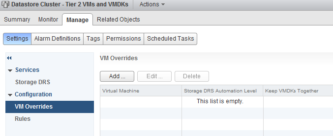
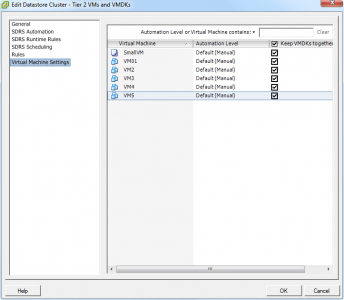
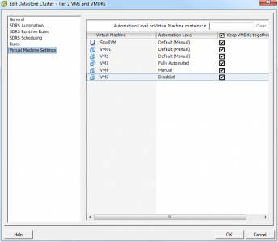
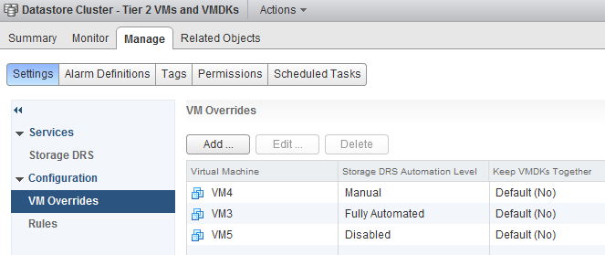
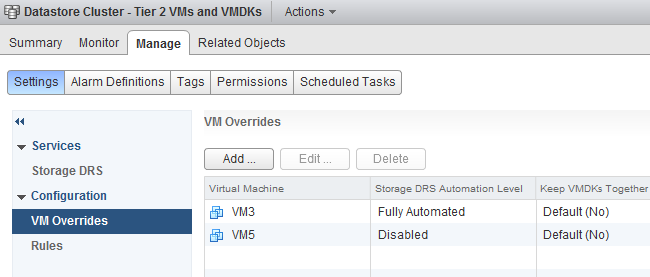

Overall the vSphere 5.1 web client attempts to mimic the behavior of menus and settings workflows of the (old) vSphere client. When editing the settings of a datastore cluster, the web client provides the same set of options that can be edited as the vSphere client. However certain functions of overviews and menus are changed in the vSphere 5.1 web client. For example the VM overrides screen. The primary purpose of the VM overrides screen is to display deviant Storage DRS Automation level of the virtual machines inside the datastore cluster. **VM overrides and Virtual Machine Settings screens** The VM overrides screen is located in the storage view, select the datastore cluster, select the tab Manage and click on the Settings button.  The VM overrides screen is the replacement of the virtual machine settings screen of the datastore cluster settings in the vSphere client.  **Difference in default behavior** As you might have noticed, the web client is not listing any virtual machine while the Virtual Machine settings overview in the vSphere client shows 5 virtual machines and a VM template. Already mentioned in the introduction paragraph, the primary purpose of the VM overrides screen has changed from the Virtual Machine settings overview in the vSphere client. The VM Overrides screen only displays a virtual machine is set to a non-default automation level. To display the different behavior, I have change the Automation level of VM3, VM4, VM5. The datastore cluster is configured with a Manual Automation Mode. Therefor the default automation mode is Default (Manual). The previous screenshot shows that all virtual machines are configured with the Default (Manual) automation level, VM3 is changed to Fully Automated, VM4 to Manual and VM5 to disabled. If you want to reproduce this behavior in your own environment, change the automation level in the vSphere client and then go the VM overrides screen in the web client to see the modified virtual machines listed.  The VM overrides screen displays the following:  Even though VM4 is configured with the same automation level as the datastore cluster, the VM overrides screen displays VM4 as it is not configured with the default automation mode. By changing the automation mode back to Default (Manual) via the Edit screen, VM4 is removed from the VM overrides list.   To be honest it took me a while to get used to the new functionality of this screen. I would like to know if you like this new behavior or if you rather prefer the way the virtual machine settings view in the old vSphere client works?
