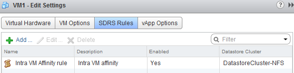
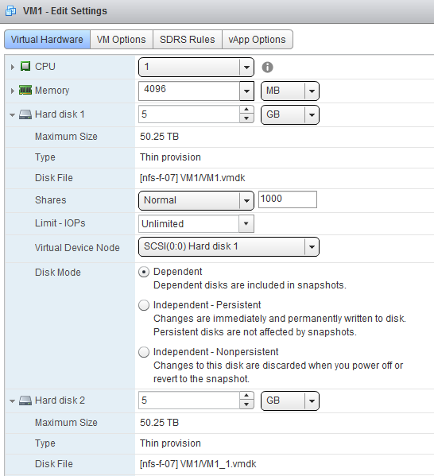

Recently I had some discussions where I needed to clarify the behavior of Storage DRS when the user adds a new disk to a virtual machine that is already running in the datastore cluster. Especially what will happen if the datastore cluster is near its capacity? When adding a new disk, Storage DRS reviews the configured affinity rule of the virtual machine. By default Storage DRS applies an affinity rule (Keep VMDKs together by default) to all new virtual machines. vSphere 5.1 allows you to change the default behavior of the cluster, you can change the default affinity rule in the Datastore cluster settings:  **Adding a new disk to an existing virtual machine** The first one to realize is that Storage DRS never can violate the affinity or anti-affinity rule of the virtual machine. For example, if the datastore cluster default affinity rule is set to "keep VMDKs together" then all the files are placed on the same datastore. Ergo if a new disk is added to the virtual machine, that disk must be stored on the same datastore in order not to violate the affinity rule. Let use an example, VM1 is placed in the datastore and is configured with the Intra-VM affinity rule (Keep the files inside the VM together).  The virtual machine is configured with 2 hard disks and both reside on the datastore \[nfs-f-07\] of the datastore cluster  When adding another disk, Storage DRS provides me with an recommendation  Although all the other datastores inside the datastore cluster are excellent candidates as well, Storage DRS is forced to place the VMDK on the same datastore together with the rest of the virtual machine files.  **Datastore cluster defragmentation** At one point you may find yourself in a situation where the datastores inside the datastore cluster are quite full. Not enough free space per datastore, but enough free space in the datastore cluster to host another disk of an exisiting virtual machine. In that situation, Storage DRS does not break the affinity rule but starts to “defragment” the datastore cluster. It will move virtual machines around to provide enough free space for the new VMDK. The article “[Storage-DRS initial placement and datastore cluster defragmentation](http://frankdenneman.nl/sdrs/storage-drs-initial-placement-and-datastore-cluster-defragmentation/ "Storage-DRS initial placement and datastore cluster defragmentation")" can provide you more information about this mechanism. **Key takeaway** Therefore in a datastore cluster you will never see Storage DRS splitting up a virtual machine if the VM is configured with an affinity rule, but you will see pre-requisite moves, migrating virtual machines out of the datastore to make room for the new vmdk.
