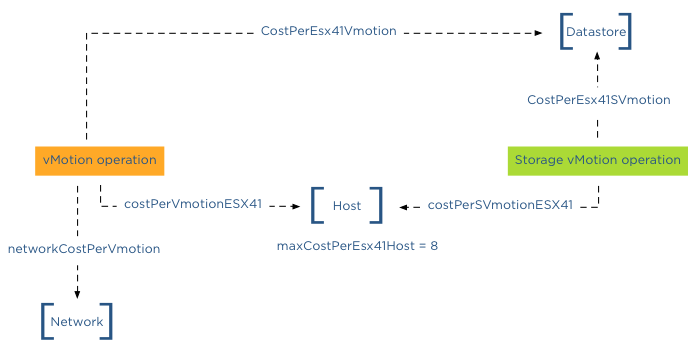

After explaining how to [limit the number of concurrent Storage vMotions operations](http://frankdenneman.nl/2012/06/28/limiting-the-number-of-storage-vmotions/  "Limiting the number of concurrent Storage vMotions"), I received multiple questions on how to limit the number of concurrent vMotion operations. This article will cover the cost and max cost constructs and show you how to calculate the correct config key values to limit the number of concurrent vMotion operations.  

**Please note**  
I usually do not post on configuration keys that change default behavior simply because I feel that most defaults are sufficient, and it should only be changed as a last resort when all other avenues are exhausted. I would like to mention that this is an unsupported configuration. Support will request to remove these settings before troubleshooting your environment!  

**Cost**  
To manage and limit the number of concurrent migrations either by vMotion or Storage vMotion, a cost and maximum cost (max cost) factor is applied. Think of the maximum cost as a limit. A resource has a max cost, and an operation is assigned a cost. A vMotion and Storage vMotion are considered operations, and the ESXi host, network, and datastore are considered resources.  
In order for a migration operation to be able to start, the cost cannot exceed the max cost. A resource has both a max cost and an in-use cost. When an operation is started, the resource records an in-use cost and allows additional operations until the maximum cost is reached. The in-use cost of an active operation and the new operation cost cannot exceed the max cost.  

As mentioned, there are three resources, host, network, and datastore. A vMotion operation interacts with the host, network, and datastore resource, while Storage vMotion interacts with the host and datastore resource. This means that changing the host or datastore-related cost can impact both vMotion and Storage vMotion. Let’s look at the individual costs and max cost before looking into which config key to change.  
**Host**

| **Operation** | **Config Key** | **Cost** |
| --- | --- | --- |
| vMotion Cost | costPerVmotionESX41 | 1 |
| Storage vMotion Cost | costPerSVmotionESX41 | 4 |
| Maximum Cost | maxCostPerEsx41Host | 8 |

**Network**

| **Operation** | **Config Key** | **Cost** |
| --- | --- | --- |
| vMotion Cost | networkCostPerVmotion | 1 |
| Storage vMotion Cost | networkCostPerSVmotion | 0 |
| Maximum Cost | maxCostPerNic | 2 |
|   | maxCostPer1GNic | 4 |
|   | maxCostPer10GNic | 8 |

**Datastore**

| **Operation** | **Config Key** | **Cost** |
| --- | --- | --- |
| vMotion Cost | CostPerEsx41Vmotion | 1 |
| Storage vMotion Cost | CostPerEsx41SVmotion | 16 |
| Maximum Cost | maxCostPerEsx41Ds | 128 |

Please note that because these values were not changed after 4.1, the advanced settings were unnecessary. Therefore these advanced settings apply to ESXi 5.0 and ESXi 5.1 as well.  

**Default concurrent vMotion limit**  
To limit vMotion we must identify which costs and max costs are involved;  

**Datastore Cost:** As we know, a vMotion transfers the memory from the source ESX host to the destination ESX host, sends over the pages stored in a non-shared page file is this exists, and finally transfers the ownership to the new VMX file. For the new host to run the new virtual machine, a new VMX file is created on the datastore; therefore, a vMotion process also includes the cost on the datastore resource. Although it generates overhead, the impact is very low. Therefore, the cost involved in the data store is 1. 

**Datastore Max Cost:** The maximum cost of a datastore is 128, therefore, a maximum of 128 concurrent vMotion operations can be active on a single datastore.  

**Network:** The cost for a vMotion on the network resource is 1  

**Network Max Cost:** This config key is very interesting as it is set dynamically. The config key depends on the line speed detected by the VMkernel. If the VMkernel detects a line speed between 1 GB and 10GB, then the max cost value is set to 4. If the VMkernel detects 10GB, then the max cost value is set to 8. Please note that the VMkernel will set the max cost to 10GB ONLY if it detects 10GB line speed. It does not matter if you use 10GB Ethernet cards. It’s the line speed that counts. Please read the article “The impact of QoS network traffic on VM performance” and “Adaptive MaxMovesPerHost” if you apply a QOS on your converged network and wonder what impact this might have on vMotion performance and DRS load balancing.  

If the VMkernel detects a line speed below 1GB, it sets the max cost to 2, resulting in a maximum number of concurrent vMotions of 2 with the default network vMotion cost. Please note that the supported minimum required bandwidth is 1GB! This < 1gB line speeds setting is included for “just-in-case” scenarios where the vMotion network is temporarily incorrectly configured. It should not be used to justify a < 1gb line speed when designing the virtual infrastructure! **Host cost:** The cost for a vMotion on the host resource is 1  

**Host max cost:** The host max config for all vMotion operations is 8. 
  
**In-use cost**  
If a vMotion is configured with a 1GB line speed, the max cost of the network allows for 4 concurrent vMotion, while the host max cost allows 8 concurrent vMotions. The most conservative max cost wins as the vMotion network does not allow the in-use cost to exceed the max cost. In the datastore cost section, I explained that the datastore allows for 128 concurrent vMotions. What usually is more common is to see multiple Storage vMotion operations active on a datastore due to Storage DRS Datastore Maintenance. If you are vMotioning a virtual machine that resides on the datastore to another host and you put a datastore into datastore maintenance mode, Storage DRS cannot initiate 8 storage vMotion because 8 Storage vMotion and the in-use cost of a vMotion exceeds the max cost of 128 of the data store. “Only” 7 concurrent Storage vMotions can be initiated while the vMotion is active. The in-use cost of the datastore is 7 x 16 = 112 + 1 (vMotion) = 113. Although it has 15 “points” left, it cannot start another Storage vMotion.  

Let’s assume the vMotion network is configured with 10GB line speed. This means that the host will allow for 8 concurrent vMotions. But if a Storage vMotion is already active, the in-use cost of the host is 4; therefore, the host can only allow for 1 additional Storage vMotion or 4 concurrent vMotions.  
  
networkCostPerVmotion  
As both Storage vMotion and vMotion use the host resource max cost, it is “recommended” to adjust the config key “networkCostPerVmotion”. Setting this config key to 2 allows for 2 concurrent vMotions on a 1GB vMotion network per host or 4 concurrent vMotions on a 10GB vMotion per host.The networkCostPerVmotion can be adjusted by editing the vpxd.cfg or via the advanced settings of the vCenter Server Settings in the administration view.  

If done via the vpxd.cfg, the value vpxd.ResourceManager.networkCostPerVmotion is added as follows:

< config >  
< vpxd >  
< ResourceManager >  
< networkCostPerVmotion > new value < /networkCostPerVmotion >  
< /ResourceManager >  
< /vpxd >  
< /config >

  
**Word of caution**  
Please note that cost and max values are applied to each migration process within vCenter! Therefore modification of costs impacts normal day-to-day DRS and Storage DRS load balancing operations as well as the manual vMotion and Storage vMotion operations occurring in the virtual infrastructure managed by the vCenter server. Adjusting the cost at the host side can be tricky as the costs of operation and limits are relative to each other and can even harm other host processes unrelated to migration processes.
