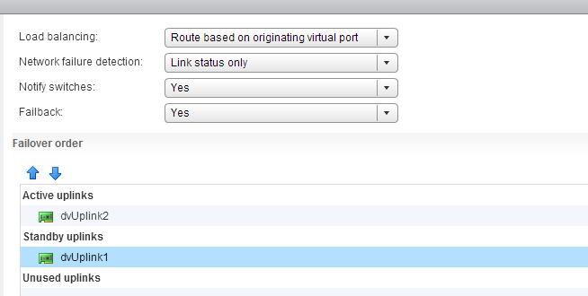
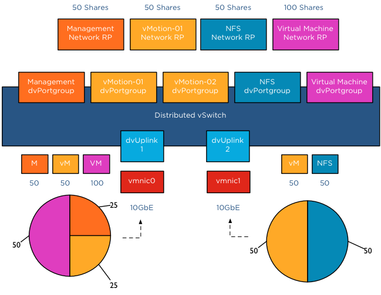

Designing a vMotion network can be quite a challenge. You want to provide vMotion as much bandwidth as possible but not at the expense of other network traffic streams. Network I/O Control (NetIOC) can provide you bandwidth management tools to shape and form your vMotion network. NetIOC provides a QoS that allows vMotion to utilize as much bandwidth as possible until contention occurs. The moment a physical NIC is saturated NetIOC distributes network bandwidth according to the relative share value of the network resource pool. In the article “[A primer of Network I/O Control](http://frankdenneman.nl/2013/01/17/a-primer-on-network-io-control/ "A primer on Network I/O Control")” I explain the various resource management constructs of Network I/O Control. How does NetIOC work with a Multi-NIC vMotion network? **Multi-NIC vMotion network on a distributed switch** NetIOC is only supported on a distributed switch therefor you need to create multiple vMotion portgroups on your distributed switch. In order to have a supported vMotion network, both distributed port groups need to be configured with an alternate failover order configuration. In my lab I’ve named the two dvPortgroups vMotion-01 and vMotion-02. dvPortgroups vMotion-01 is configured with a failover order where dvUplink1 is active and dvUplink2 is standby. vMotion-02 is configured with dvUplink2 as active and dvUplink1 as standby.  If you wonder why I’m configuring the redundant uplink as Unused please review the article: “[Multi-NIC vMotion – failover order configuration](http://frankdenneman.nl/2012/12/20/multi-nic-vmotion-failover-order-configuration/ "Multi-NIC vMotion – failover order configuration")”. The reason why “Route Based on originating virtual port” is chosen is described in the initial article of this series: “[Designing your vMotion network](http://frankdenneman.nl/2012/12/18/designing-your-vmotion-network/ "Designing your vMotion network")”. **vMotion network resource pool** Each host in my lab is connected to the distributed switch has two dvUplink portgroups. A virtual adapter with vMotion enabled is connected to a uplink and vMotion is able to leverage both physical adapters to send out vMotion traffic. When enabling NetIOC, 7 predefined system network resource pools become active. One system network resource pool is vMotion, vMotion traffic binds to the vMotion system network resource pool and if contention occurs the network resource pool competes for bandwidth with the other active streams. It’s important to realize that the shares apply at the physical adapter layer. Therefore as vMotion is able to utilize both uplinks it “receives” 50 shares per physical adapter.  As mentioned in the NetIOC primer article, shares are only active when contention exists and they only count when it is transmitting. Consequently, if vMotion is not active, the shares are not counted when an adapter is congested. Also when vMotion uses a single link only 50 shares are active. Although the dvUplink portgroup is configured with 2 dvUplinks, one dvUplink is configured as standby. When the active NIC is operating normally, the dvPortgroups cannot utilize the standby link. This results in the utilization of only 1 link and therefor only 50 shares become active during congestion. **Example Scenario 1; vmnic0 saturated** The distributed switch is configured with 5 dvPortgroups, management, vMotion01, vMotion02, NFS and a virtual machine portgroup. Each network resource pool is configured with the default physical adapter shares. In this scenario vMotion is load-balancing traffic across both dvPortgroups, however the VMkernel decides to also send management and virtual machine traffic through dvUplink1, saturating vmnic0.  In this scenario, bandwidth is distributed following relative share values. As NFS traffic isn’t transmitting across dvUplink1, its shares are not active. Available bandwidth for vMotion is reduced to 2.5Gb as long as this situation persists. vMotion is also using dvUplink2, as a result traffic flows through vmnic1 as well. Fortunately vmnic1 is not saturated and vMotion can utilize as much bandwidth it can allocate. Restricted by the CPU speed of the host, vMotion is able to utilize 6Gb of bandwidth on vmnic1 while having an additional bandwidth allocation of 2.5Gb on vmnic0. In total vMotion utilizes 8.5Gb at that moment. **Example Scenario 2; Both NICs saturated** The moment both NICs are saturated, the available bandwidth available to vMotion is calculated on a NIC basis. vMotion traffic wanting to use vmnic0 is assigned bandwidth relative to their share value, similar to example scenario 1. vMotion traffic wanting to use vmnic1 is assigned bandwidth relative to their share value compared to the active traffic streams, in this case NFS and vMotion are sending traffic to the dvUplink.  The distributed switch receives traffic from NFS and vMotion destined for vmnic1, as a result NetIOC will assign half of the bandwidth to vMotion and NFS as each owns 50 shares of the total active 100 shares. In this case the amount of bandwidth vMotion can utilize is 2.5Gb on vmnic0 and 5 Gb on vmnic1, allowing vMotion to utilize 7.5Gb of the total available 20Gb. **Host Limits** vSphere 5.1 introduced a big adjustment to hosts limits, the host limits now applies to each individual uplink. This means that when setting a host limit on the network resource pool for vMotion of 3000Mbps, vMotion is limited to transmit a maximum of 3Gb per uplink. In the case of a Multi-NIC vMotion configuration (2NICs) the maximum traffic vMotion can issue to the vmnics is 6Gb. Divide the host limit by the number of active NICs if you decide to set a limit on a particular network resource pool. If you want to limit vMotion to 3Gb with a 2 NIC Multi-NIC configuration, set the host limit on the network resource pool to 1500 Mbps.  As for limits, limits are always active! Host limits are always enforced on the physical adapter regardless of the utilization rate of the adapter. This means setting a host limit on a network resource pool restricts the traffic to utilize more bandwidth even if this bandwidth is available. Saturating an adapter is not by definition wrong you are utilizing the infrastructure. Taking precaution and limiting certain network streams unconditionally might hurt you more than your assumed gain. Before limiting a network stream my recommendation is always to measure traffic patterns over a longer period of time. **Ingress only** NetIOC shares and limits are only applied to ingress traffic. In ESX , the ingress and egress traffic are with respect to a distributed switch. Ingress traffic is traffic that flows from the VMkernel or vNic from the running VM towards the distributed switch. Egress is traffic that flows from the distributed vSwitch to the physical nic or to the vNIC  It is important to know NetIOC only controls ingress traffic initiated from within the ESX host. This means that you can set a limit the vMotion network resource pool, this only affects traffic send towards the uplink inside the host. If you have a cluster with a small number of hosts, it can happen that multiple vMotion operations are inbound to that host. In that scenario, NetIOC cannot prevent the Uplinks to get saturated by incoming vMotion traffic.  To avoid this situation, traffic shaping needs to be configured on the dvPortgroups. The upcoming article Designing your vMotion network - vMotion dvPortgroups traffic shaping explores this feature in depth. [Part 1 - Designing your vMotion network](http://frankdenneman.nl/2012/12/18/designing-your-vmotion-network/ "Part 1 - Designing your vMotion network") [Part 2 - Multi-NIC vMotion failover order configuration](http://frankdenneman.nl/2012/12/20/multi-nic-vmotion-failover-order-configuration/ "Multi-NIC vMotion – failover order configuration") [Part 4 – Choose link aggregation over Multi-NIC vMotion?](http://frankdenneman.nl/2013/01/25/designing-your-vmotion-networking-choose-link-aggregation-over-multi-nic-vmotion/ "Designing your vMotion network – Choose link aggregation over Multi-NIC vMotion?") [Part 5 – 3 reasons why I use a distributed switch for vMotion networks](http://frankdenneman.nl/2013/01/30/designing-your-vmotion-network-3-reasons-why-i-use-a-distributed-switch-for-vmotion-networks/ "Designing your vMotion network – 3 reasons why I use a distributed switch for vMotion networks")
