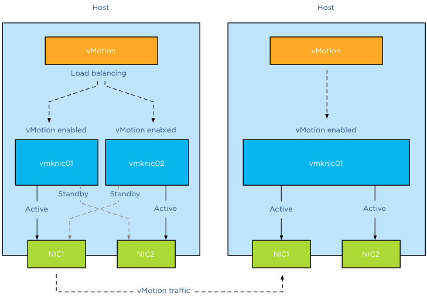
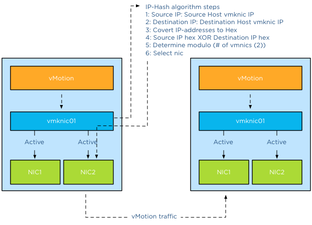

The “[Designing your vMotion network](http://frankdenneman.nl/2012/12/18/designing-your-vmotion-network/ "Designing your vMotion network")” series have lead me to have some interesting conversations. A recurring question is why not use Link Aggregation technologies such as Etherchannel to increase bandwidth for vMotion operations. When zooming into vMotion load balancing operations and how the vNetwork load balancing operations work, it becomes clear that Multi-NIC vMotion network will provide a better performance that an aggregated link configuration. **Anatomy of vMotion configuration** In order to use vMotion a VMkernel network adapter needs to be configured. This network adapter needs to be enabled for vMotion and the appropriate load balancing policy and network adaptor failover mode needs to be selected.  The vMotion load-balancing algorithm distribute vMotion traffic between the available VMkernel NICs, it does not consider the network configuration backing the VMkernel NIC (vmknic). vMotion expects that a vmknic is backed by a [single active physical NIC](http://frankdenneman.nl/2012/12/20/multi-nic-vmotion-failover-order-configuration/ "Multi-NIC vMotion – failover order configuration"), therefore when sending data to the vmknic the traffic will traverse a dedicated physical NIC. It’s important to understand that vMotion traffic flows between distinct vmknics! Migrating a virtual machine from a source host configured with Multi-NIC vMotion to a destination host with a single vmknic vMotion configuration result in the utilization of a single vmknic on the source host. Even though the single NIC vMotion is configured with two active uplinks, the source vMotion operation just selects one vmknic to transmit its data.  **Link aggregation** My esteemed colleague [Vyenkatesh “ Venky” Deshpande](https://twitter.com/VMWNetworking "twitter account VMWNetworking") published an excellent article on the [new LACP functionality](http://blogs.vmware.com/vsphere/2013/01/vsphere-5-1-vds-new-features-link-aggregation-control-protocol-lacp.html "vSphere 5.1 – VDS New Features – Link Aggregation Control Protocol (LACP)") on the vSphere blog. Let me highlight a very interesting section:

> Link aggregation allows you to combine two or more physical NICs together and provide higher bandwidth and redundancy between a host and a switch or between two switches. Whenever you want to create a bigger pipe to carry any traffic or you want to provide higher reliability you can make use of this feature. However, it is important to note that the increase in bandwidth by clubbing the physical NICs depends on type of workloads you are running and type of hashing algorithm used to distribute the traffic across the aggregated NICs.

And the last part is the key, when you aggregate links into a single logical link, it depends on the load balancing / hashing algorithm how the traffic is distributed across the aggregated links. When using an aggregated link configuration, it’s required to select the IP-HASH load balancing operation on the portgroup. I’ve published an article in 2011 called “[IP-hash versus LBT](http://frankdenneman.nl/2011/02/24/ip-hash-versus-lbt/ "IP-Hash versus LBT")” explaining how the hashing and distribution of traffic across a link aggregation group works. Let’s assume you have Etherchannels in your environment and want to use it for your vMotion network. 2 x 1GB aggregated in one pipe, should beat 2 x 1GB right? As we learned vMotion deals only with vmknics and as vMotion detects a single vmknic it will send all the traffic to that vmknic.  The vMotion traffic hits the load-balancing policy configured on the portgroup and the IP-Hash algorithm will select a vmnic to transmit the traffic to the destination host. Yes you read it correct, although the two links are aggregated the IP-Hash load balancing policy will always select a single NIC to send traffic. Therefor vMotion will use a single uplink (1GB in this example) to transfer vMotion traffic. With IP-hash a vMotion operation utilizes a single link, leaving the other NIC idle. Would you have used Multi-NIC vMotion, vMotion would have balanced the traffic across the multiple vmknics even for a single vMotion operation. **Utilization aware** Using the same scenario, vMotion determines that this host is allowed to have 4 concurrent vMotion operations. Unfortunately IP-Hash does not take utilization into account when selecting the NIC. The selection is done on a source-destination IP hash, decreasing the probability of load balancing across multiple NICs when using a small number of IP-addresses. This situation is often applicable to the vMotion subnet; this subnet contains a small number of IP-addresses used by the vMotion vmknics. Possibly resulting IP-HASH selecting the same NIC for the same concurrent vMotion operations. This in turn may lead to oversaturating a single uplink while leaving the other uplink idling. Would you have used Multi-NIC vMotion, vMotion would have balanced the traffic across the multiple vmknics, providing an overall utilization of both NICs. **Key takeaways** Link aggregation does not provide a big fat pipe to vMotion, due to the IP-Hash load balancing policy, a single nic will be used for a vMotion operation. IP-Hash is not utilization aware, possibly distributing traffic unevenly due to small number of source and destination IP-addresses. Multi-NIC vMotion distributes vMotion traffic across all available vmknics, for both single vMotion operations and multiple concurrent vMotion operations. Multi-NIC vMotion provides a better overall utilization of NICs allocated for the vMotion processes. [Part 1 - Designing your vMotion network](http://frankdenneman.nl/2012/12/18/designing-your-vmotion-network/ "Part 1 - Designing your vMotion network") [Part 2 - Multi-NIC vMotion failover order configuration](http://frankdenneman.nl/2012/12/20/multi-nic-vmotion-failover-order-configuration/ "Multi-NIC vMotion – failover order configuration") [Part 3 – Multi-NIC vMotion and NetIOC](http://frankdenneman.nl/2013/01/18/designing-your-vmotion-network-multi-nic-and-netioc/ "Designing your vMotion network – Multi-NIC vMotion and NetIOC") [Part 5 – 3 reasons why I use a distributed switch for vMotion networks](http://frankdenneman.nl/2013/01/30/designing-your-vmotion-network-3-reasons-why-i-use-a-distributed-switch-for-vmotion-networks/ "Designing your vMotion network – 3 reasons why I use a distributed switch for vMotion networks")
