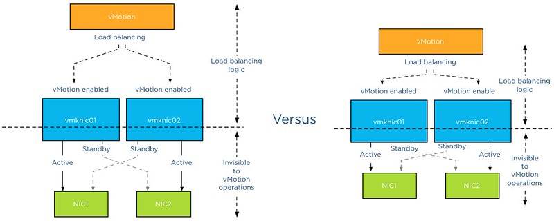

Frequently I receive the question which application I use to create my diagrams. I used to use Microsoft Visio but starting to use Omnigraffle a year ago. However I feel it’s not the program that makes these diagrams. Although it’s true that some functionality help me to create the diagrams more easily, it’s more about following some basic guidelines. I've picked up these guidelines along the way, they work for me and hopefully they can help you too. **1: Find a suitable color scheme** A color scheme plays a very important role in a diagram. Colors have various functions within a diagram. I like to use various tints of a color to indicate a relation between objects, whether it has to indicate a relation within the same structure layer or the same consumer or provider. For example all storage related functions or objects have different shades of blue or resource pool structure of customer A have different shades of green. Picking the correct color for a diagram is very difficult and trying to select the perfect collection of colors wasted (I should say invested) many hours of my life. During that time I learned a lot, here are a few tips:

- Use a color scheme that provides contrast between different objects.
- Use the wheel of color to easily select complimentary colors (Colors on opposite sides of the color wheels). I prefer using multiple triad (3-point) complement color schemes.
- When using multiple triads, uses colors of similar saturation levels. Saturation refers how a “color” appears under a particular lighting condition. Mixing primary and secondary colors with similar saturation levels provides a more cohesive looking design. For example, a bright red color mixed with a blue-ish green color can give some strange effects, sometimes giving the illusion of vibrating when not looking directly at them (very annoying).
- Use a limited set of colors, don’t allow your diagram to become the poster-child for circus publication guidelines.

**Resources:**

- [Smashing magazine](http://www.smashingmagazine.com/2010/01/28/color-theory-for-designers-part-1-the-meaning-of-color/ "color-theory-for-designers-part-1-the-meaning-of-color") have published an excellent series on color theory
- [colorschemedesiginer.com](http://colorschemedesigner.com/# "colorschemedesigner.com") shows the Color wheel, use the triad function

**2: Fonts** Besides legibility and readability a proper font (typeface) makes the diagram “look right”. Objects and fonts are interrelated when it comes to conveying a subject. Both the font type and the objects in the diagram translate and visualize an idea or concept. Colors evoke feelings and moods, while the font determine the tone of voice in which the message is broadcasted. Two major categories of typefaces can be identified in the world of fonts. Serif and sans-serif. Serif fonts can be recognized by having small lines at the end of the strokes of a letter. Times new roman is a good example of a serif font. Serif fonts mimic handwriting and can provide a outdated but also formal feeling. Sans-serif fonts lack the small lines and provide a much cleaner and modern look. I have seen diagrams illustrating technologies and features that weren’t released yet, but still gave me an outdated, well-worn feeling. Try use sans-serif fonts when creating computer technology related diagrams.

- Use a sans-serif font ([PT sans](http://www.google.com/webfonts/specimen/PT+Sans "PT Sans") or corbel are excellent choices)
- Try to use a font that compliments the font used in the articles
- Use a single font in a diagram; use different font weights (light, medium, bold) to emphasize.
- Color contrast; use dark colors on white background, white on black background. Tip: dark blue on white gives a rich feeling to the labels.
- Use handwritten fonts only if you use hand drawn objects. Match font style with objects. Swooping lines as connectors allow for the use of a more elegant font, however keep it in style with your overall blog theme and used fonts.
- Do not use Comic sans, unless you are diagramming your lemonade stand!

**Resources:**

- [Google fonts](http://www.google.com/webfonts "Google web fonts") and [myfonts.com](http://www.myfonts.com/ "Myfonts.com") provide an enormous font collection. Most of them can be downloaded for free.
- Use [whatthefont](http://www.myfonts.com/WhatTheFont/ "What the font") service to identify a specific font used in an image.

 **3: Lines** Lines come in all shapes and forms. Try to be consistent with the types of lines you use. If you use a dashed line for indicating standby functionality, do not use the same line pattern for an active connection. Think about the thickness of the lines used. If you selected a very clean lightweight font, don’t use thick lines for the framework of boxes and other objects. Mix and match line weight with font weight. Strive for balance across the entire diagram. **4: Whitespace** Whitespace or often revered to as negative space is the portion of the diagram left unused. It’s the space between the objects and this is what I believe actually the most important thing to get right. The balance between the positive (objects) and the negative (whitespace) is fundamental to create an aesthetic pleasing diagram. Whitespace can help to emphasize particular elements but also help to balance the objects in the diagram. Using too much whitespace and a relationship between two objects may get lost.  **5: Align!** Always align objects horizontally and if applicable vertically. These details matter. It might not be easily identified by eye, but your subconscious picks it up and alerts you “something is not right”. Most people tend to shy away and that’s conflicts the first reason why you made the diagram. To help people better understand the subject by creating additional visual aids. Omnigraffle is far more advanced than Visio when it comes to auto alignment. Omnigraffle provides automatic guides displaying the white space between objects in the same line. That feature saved me many hours **6: Go minimal** Try to reduce the number of objects as much as possible. Get to the essence of the subject as much as possible. IT people like to put in as much as detail as possible. If these objects are not relevant to the subject you are trying to depict, leave them out. This increases the focus point of the diagram. Going minimal is harder than it sounds. By using as little objects as possible you spend a lot time focusing on spacing, positioning, typography and contrast. **7: Shadows** The novelty of shadows beneath lines and boxes wear off quickly. After viewing the diagram a couple of times, the shadows give the diagram an unclean and grimy feeling. It doesn’t look clean, fresh and rapidly feels outdated after seeing the diagram a couple of times. My advice: Try to avoid it as much as possible. **8: Real men make block diagrams** Sometimes I jokily reply this when somebody is asking for vendor stencils and icon-packs on twitter. Vendor stencils can be very useful for some types of diagrams, for example wiring diagram of a core Ethernet switch. I prefer to stay away from using pre-made icons in diagrams indicating architecture or relationships. Pre made icons come in their own color scheme and are usually in an isometric perspective to give that 3d feel. Forcing you to design the whole diagram in an isometric perspective. Certain Icon designs distract the viewer, reducing the ability of the diagram to convey the message. By creating your own objects, you can choose your own color scheme, your own level of detail, and your own direction of perspective. **9: Commit to a single perspective** Already mentioned in the number 8, when using an icon in isometric perspective commit to drawing in an isometric perspective. The viewpoint of an isometric diagram is slightly rotated to reveal other surfaces than those visible from a top-down perspective. Isometric diagrams are a great way for illustrating all the physical components of (virtual) architectures. A while ago I stumbled upon an [old isometric diagram](http://frankdenneman.nl/2012/10/05/from-the-archives-an-old-isometric-diagram/ "From the archives – An old Isometric diagram") I created for a client of mine. Mixing isometric icons with top-down icons provides an unbalanced view. Usually the lines do not connect well or are just to complete parallel or horizontally aligned, providing hours of frustration to the stickler for details.  **10: Relevance** A picture is worth a thousand words, but don’t draw a giraffe after you wrote three paragraphs about the feeding habits of elephants. This is an extreme example, but use a diagram to help the reader to understand the aspect of the topic and assist him with the identification of the subject. Don’t allow a diagram to confuse your audience. I’ve seen countless diagrams in VCDX architecture designs of arrays connected to an FC architecture, when the candidate was using an iSCSI. If you use 6 LUNs, don’t use a diagram that shows an object with the words “LUN 1 …. LUN 99” in it. Allow the diagram relay information to strengthen the written word. **Be consistent and have fun** In almost all of the other guidelines I provide examples why consistency is important. It helps the reader to identify components and their relation more easily. Especially when you use a series of diagrams in the same presentation or publication. Do it well and allow it to become your trademark. But most of all have fun while creating diagrams. It shows!
