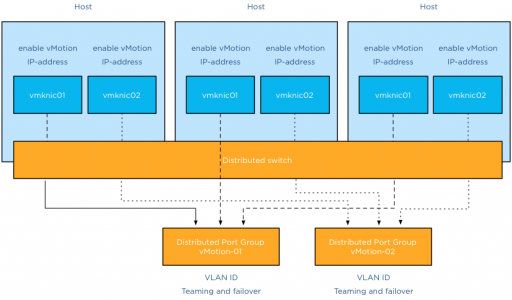
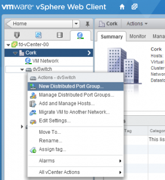
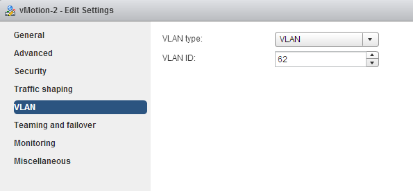
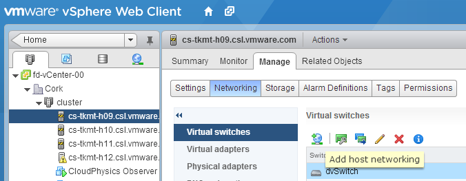
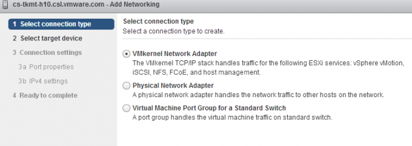
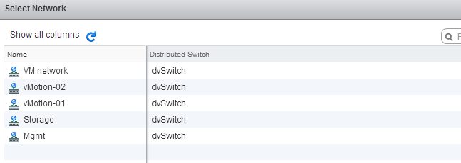

This article provides you an overview of the steps required to setup a Multi-NIC vMotion configuration on an existing distributed Switch with the vSphere 5.1 web client. This article is created to act as reference material for the [designing your vMotion network series](http://frankdenneman.nl/vmotion/ "vMotion"). Configuring Multi-NIC vMotion is done at two layers, first the distributed switch layer where we are going to create two distributed port groups and the second layer is the host layer. At the host layer we are going to configure two VMkernel NICs and connect them to the appropriate distributed port group.  Before you start you need to have ready two ip-addresses for the VMkernel NICs, their respective subnet and their VLAN ID. **Distributed switch level** The first two steps are done at the distributed switch level, click on the networking icon in the home screen and select the distributed switch. **Step 1: Create the vMotion distributed port groups on the distributed switch** The initial configuration is pretty much basic, just provide a name and use the defaults:   1: Select the distributed switch, right click and select “New Distributed Port Group”.  2: Provide a name, call it “vMotion-01” and confirm it’s the correct distributed switch.  3: Keep the defaults at Configure settings and click next.  4: Review the settings and click finish. Do the same for the second distributed port group, name that vMotion-02 **Step 2: Configuring the vMotion distributed port groups** Configuring the vMotion distributed port groups consist of two changes. Enter the VLAN ID and set the correct failover order. 1: Select distributed Port Group vMotion-01 in the left side of your screen and right click and select edit settings. 2: Go to VLAN, select VLAN as VLAN type and enter the first VLAN used by the first VMkernel NIC.  3: Select “Teaming and failover” , move the second dvUplink down to mark it as a “Standby uplink”. Verify that load balancing is set to “Route based on originating virtual port”.  4: Click OK Repeat the instructions of step 2 for distributed Portgroup vMotion-02, but use the VLAN ID used by the IP-address of the second VMkernel NIC.  Go to teaming and failover and configure the uplinks in an alternate order, ensuring that the second vMotion VMkernel NIC is using dvUplink2.  **Host level** We are done at the distributed switch level, the distributed switch now updates all connected hosts and each host has access to the distributed port groups. Two vMotion enabled VMkernel NICs are configured at host level. Go to Hosts and Clusters view. **Step 3: Create vMotion enabled VMkernel NICs** 1: Select the first host in the cluster, go to manage, networking and “add host networking”.  2: Select VMkernel Network Adapter.  3: Select an existing distributed portgroup, click on Browse and select distributed Port Group “vMotion-01” Click on OK and click on Next.   4: Select vMotion traffic and click on Next.  5: Select static IPv4 settings, Enter the IP-address of the first VMkernel NIC corresponding with the VLAN ID set on distributed Port Group vMotion-01.  6: Click on next and review the settings. Create the second vMotion enabled VMkernel NIC. Configure identically except: 1: Select vMotion-02 portgroup 2: Enter IP-address corresponding with the VLAN ID on distributed Port Group vMotion-02. The setup of a Multi-NiC vMotion configuration on a single host is complete. Repeat Step 3 on each host in the cluster.
