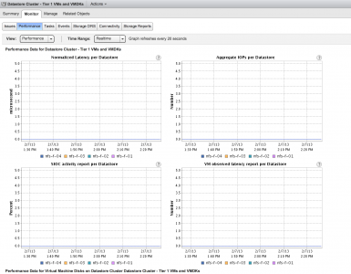

**The problem** Recently I noticed that my datastore cluster was not providing Latency statistics during initial placement. The datastore recommendation during initial placement displayed space utilization statistics, but displayed 0 in the I/O Latency Before column  The performance statistics of my datastores showed that there was I/O activity on the datastores.  However the SIOC statistics all showed no I/O activity on the datastore  The SIOC log file (storagerm.log) showed the following error: `Open /vmfs/volumes/ /.iorm.sf/slotsfile (0x10000042, 0x0) failed: permission denied Giving UP Permission denied Error -1 opening SLOT file /vmfs/volumes/datastore/.iorm.sf/slotsfile Error -1 in opening & reading the slot file Couldn’t get a slot Successfully closed file 6 Error in opening stat file for device: datastore. Ignoring this device` The following permissions were applied on the slotfile:  **The Solution** Engineering explained to me that these permissions were not the default standards and default permissions are read and execute access for everyone and write access for the owner of the file. The following command sets the correct permissions on the slotsfile: `Chmod 755 /vmfs/volumes/datastore/.iorm.sf/slotsfile` Checking the permission shows that the permissions are applied:  The SIOC statistics started to show the I/O activity on the datastore  Before changing the permissions on the slotsfile I stopped the SIOC service on the host by entering the command: `/etc/init.d/storageRM stop` However I believe this isn’t necessary. Changing the permissions without stopping SIOC on the host should work. **Cause** We are not sure what causes this problem and support and engineering are troubleshooting this error. In my case I believe it has to do with the frequent restructuring of my lab. vCenter and ESXi servers are reinstalled regularly, but I have never reformatted my datastores. I do not expect to see this error appear in stable production environments. Please check the current permissions on the slotsfile if Storage DRS does not show I/O utilization on the datastore. (VMs must be running and I/O metric on the Datastore cluster must be enabled of course) I expect the knowledge base article to be available soon.
