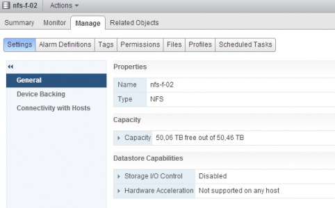

Today on twitter, [David Chadwick](https://twitter.com/tGs_Optic "David Chadwick on Twitter"), [Cormac Hogan](https://twitter.com/VMwareStorage "Cormac Hogan on Twitter") and I were discussing SIOC stats only mode. SIOC stats only mode gathers statistics to provide you insights on the I/O utilization of the datastore. Please note that Stats only mode does not enable the datastore-wide scheduler and will not enforce throttling. Stats only mode is disabled due to the (significant) increase of log data into the vCenter database. SIOC stats only mode is available from vSphere 5.1 and can be enabled via the web client. To enable SIOC stats only mode go to:

1. Storage view
2. Select the datastore
3. Select Manage
4. Select Settings

 By default both SIOC and SIOC stats only mode is disabled. Click on the edit button at the right side of the screen. Un-tick the check box “Disable Storage I/O statistics collection (applicable only if Storage I/O Control is disabled)”. Click on OK  To test to see if there is any difference, I used a datastore that SIOC had enabled. I disabled SIOC and un-ticked the “Disable Storage I/O statistics collection (applicable only if Storage I/O Control is disabled)” option. I opened up the performance view and selected the “Realtime” Time Range.

1. Storage view
2. Select the datastore
3. Select Monitor
4. Select Performance
5. Select “Realtime” Time range

 At 15:35 I disabled SIOC, which explains the dip, at 15:36 SIOC stats only mode was enabled and it took vCenter roughly a minute to start displaying the stats again.  As all new vSphere 5.1 features, SIOC stats only mode can only be enabled via the vSphere web client.
