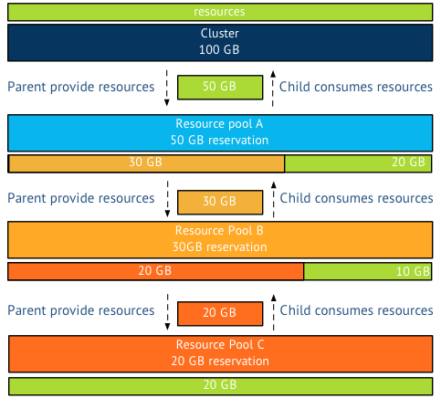

It seems that the expandable reservation setting of a resource pool appears to be shrouded in mystery. How does it work, what is it for, and what does it really expand? The expandable reservation allows the resource pool to allocate physical resource (CPU/memory) protected by a reservation from a parent source to satisfy its child object reservation. Let’s dig a little deeper into this. **Parent-child relation** A resource pool provides resources to its child objects. A child object can either be a virtual machine or a resource pool. This is what called the parent-child relationship. If a resource pool (A), contains a resource pool (B), which contains a resource pool (C), then C is the child of B. B is the parent of C, but is the child of A, A is the parent of B. There is no terminology for the relation A-C as A only provides resource to B, it does not care if B provide any resource to C.  As a virtual machine is placed in to a resource pool, the virtual machine becomes a child-object of the resource pool. It is the responsibility of the resource pool to provide the resources the virtual machine requires. If a virtual machine is configured with a reservation, than it will request the physical resources from its parent resource pool.  Remember that a reservation guarantees that the resources protected by the reservation will and cannot be reclaimed by the VMkernel, even during memory pressure. Therefor the reservation of the virtual machine is directed to its parent and the parent must exclusively provide this to the virtual machine. It can only provide these resources from its own pool of protected resources. The resource pool can only distribute the resources it has obtained itself. **Protected or reserved resources?** I’m deliberately calling a resource claimed by a reservation a protected resource, as the VMkernel cannot reclaim it. However when a resource pool is configured with a reservation, it immediately claims this memory from its parent. This goes on all the way up to the cluster level. The cluster is the root resource pool and all the resources provided by the ESXi hosts are owned by the resource pool and protected by a reservation. Therefor the cluster – root resource pool – contains and manages the protected pool of resources.  For example, the cluster has 100GB of resources, meaning that the root resource pool consists of 100GB of protected memory. Resource pool A is configured with a 50GB reservation, consuming this 50Gb from the root resource pool. However resource pool B is configured with a 30GB reservation, immediately claiming 30 GB of resources protected by the reservation of resource pool A. Leaving resource pool A with only 20 GB of protected resources for itself. Resource Pool C is configured with a 20GB memory reservation. Resource pool C claims this from its parent, resource pool B which is left with 10GB of protected resources for itself. But what happens if the resource pool runs out of protected resources? Or is not configured with a reservation at all? In other words, If the child objects in the resource pool are configured with reservations that exceeds the reservation set on the resource pool, the resource pool needs to request protected resources from its parent. This can only be done if expandable reservation is enabled. Please note that the resource pool request protected resources, it will not accept resources that are not protected by a reservation.  Now in this scenario, the five virtual machines in the resource pool are each configured with 5GB memory reservation, totaling it to 25GB. Resource pool C is configured with a 20GB memory reservation. Therefor resource pool is required to make a request for 5GB of protected memory resources on behalf of the virtual machines to its parent resource pool B. If resource pool B does not have the protected resources itself, it can request these protected resources from its parent. This can only occur when the resource pool is configured with expandable reservation enabled. The last stop in the cluster it the cluster itself. What can stop this river of requests? Two things, the request for protected resources is stopped by a resource limit or by a disabled expandable reservation. If a resource pool has expandable reservation disabled, it will try to satisfy the reservation itself if it’s unable to do so, it will deny the reservation request. If a resource pool is set with a limit, the resource pool is limited to that amount of physical resources. For example if the parent resource pool has a reservation and a limit of 20GB, the reservation on behalf of its child need to be satisfied by the protected pool itself otherwise it will deny the resource request. Now lets use a more complex scenario, resource pool B is configured with expandable reservation enabled and a 30 GB reservation. A limit is set to 35GB. Resource pool C is requesting an additional 10GB on top of the 20GB it is already granted. Resource pool B is running 2 VM with a total reservation of 10GB. This means the protected pool of Resource pool B is servicing 20GB resource request from resource pool C and 10 GB for its own virtual machines. Its protected pool is depleted, the additional 10GB request of resource pool C is denied, as this would raise the protected pool of resource pool B to a total of 40GB memory, which exceeds the 35GB limit. **Virtual machine memory overhead** Please remember that each virtual machine is configured with a memory reservation. To run the virtual machine a small amount of memory resources are required by the VMkernel. This is called the virtual machine memory overhead. To be able to run a virtual machine inside a resource pool, either the expandable reservation should be enabled or a memory reservation is configured on the resource pool.
