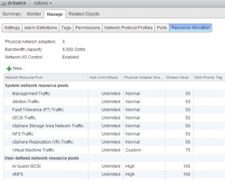

After posting the [Network I/O Control primer](http://frankdenneman.nl/2013/01/17/a-primer-on-network-io-control/ "A primer on Network I/O Control") I received a couple of questions about the vSAN traffic system network resource pool, such as:

> What’s the “vSphere Storage Area Network Traffic” system network resource pool for? I tried to further investigate by searching practically everywhere, but I didn’t manage to find any detailed description…

The vSphere Storage Area Network Traffic is a system network pool designed for a future vSphere storage feature that is not released yet. Unfortunately Network I/O Control exposes this system network resource pool in vSphere 5.1 already.  Although it is defined as system network resource pool, the vSphere client lists the network pool as user-defined, providing the impression that this pool can be assigned to other streams of traffic. Unfortunately this is not possible. The pool is a system network resource pool and therefor only available to traffic that is specifically tagged by the VMkernel. I received the question if this network pool could be assigned to a third party NIC or an FCoE card. As mentioned, network pools only manage traffic that is assigned with the appropriate tag. Tagging of traffic is only done by the VMkernel and this functionality is not exposed to the user. Although its exposed in the user-interface, this system network pool has no function and it will not have any affect on other network streams. It can be happily ignored.
