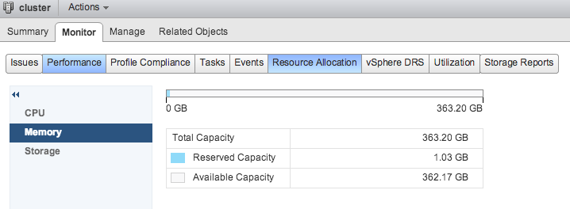

**Disclaimer:** This article contains references to the words master and slave. I recognize these as exclusionary words. The words are used in this article for consistency because it's currently the words that appear in the software, in the UI, and in the log files. When the software is updated to remove the words, this article will be updated to be in alignment.

HA admission control is quite challenging to understand as it interacts with multiple layers of resource management. In the upcoming series of articles I want to focus on the HA Percentage based admission control and how it interacts with vCenter and Host management. Let’s cover the basis first before diving into percentage based admission control.

**Virtual machine service level agreements** HA provides the service to start up a virtual machine when the host it’s running on fails. That’s what HA is designed to do, however, HA admission control is tightly interlinked with virtual machine reservations and that because virtual machines is a hard SLA for the entire virtual infrastructure. Let’s focus on the two different “service level agreements” you can define for your virtual machine.

**Share-based priority**: A shared based priority allows the virtual machine to get all the resources it demands until the demand exceeds supply on the ESXi host. Depending on the number of shares and activity, the resource manager will determine the relative priority to resource access. Resources will be reclaimed from inactive virtual machines and distributed to high priority active virtual machines. If all virtual machines are active, then the share values determine the distribution of resources. Let’s coin the term “Soft SLA” for shared based priority as the resource manager allows a virtual machine to be powered on even if there are not enough resources available to provide an adequate user experience/performance of the application running inside the virtual machine.

The resource manager just distributes resources based on the shares value set by the administrator, it expects that correct shares were set to provide an adequate performance level at all times.

**Reservation based priority**: Reservations can be defined as a “Hard SLA”. Under all circumstances, the resources protected by a reservation must be available to that particular virtual machine. Even if every other virtual machine is in need of resources, the resource manager cannot reclaim these resources as it is restricted by this Hard SLA. It must provide. In order to meet the SLA, the host checks to see if it has enough free unreserved resources available during the power-on operation of the virtual machine. If it doesn’t have the necessary unreserved resources available, the host cannot meet the Hard SLA and therefore the host rejects the virtual machine. Go look somewhere else buddy ;)

**Percentage based admission control** The percentage-based admission control is my favorite HA admission control policy because it gets rid of the over-conservative slot mechanism used by the “host failure tolerates” policy. With percentage-based admission control, you set a percentage of the cluster resources that will be reserved for failover capacity.

For example, when you set a 25% percent of reserved failover memory capacity, 25% of the cluster resources are reserved. In a 4-host cluster, this makes sense as the 25% embodies the available resources of a single host, thus 25% equals a failover tolerance of one host. If one host fails, the remaining three hosts can restart the virtual machines that were potentially using 75% of resources of the failed host.

 For the sake of simplicity, this diagrams show an equal load distribution, however, due to the VM reservations and other factors, the distribution of virtual machines might differ.

Let's take a closer look at that 25% and that 75 %. The 25% of reserved failover memory capacity is not done on a per-host basis; therefore the previous diagram is not completely accurate. It’s because this failover capacity is tracked and enforced by HA at the vCenter layer, to be more precise it's on the HA cluster level. This is crucial information to understand the difference between admission control during normal provisioning/ power-on operations and admission control during restart operations done by HA.

**25% reserved failover memory capacity** The resource allocation tab of the cluster shows what happening after enabling HA. The first screenshot is the resource allocation of the cluster before HA is enabled. Notice the 1 GB reservation.

  When setting the reserved failover memory capacity to 25% the following thing happens: 25% of the cluster capacity (363.19\*0.25=90.79) is added to the reserved capacity, plus the existing 1.03GB, totaling the reserved capacity to 91.83GB. This means that this cluster has 271.37 of available capacity left. Exactly what is this available capacity? This is capacity what’s often revered as “unreserved capacity”. What will happen with this capacity when we power-on a 16GB virtual machine without a reservation? Will it reduce the available capacity to 255.37? No, it will not. This graph shows only how much of the total capacity is assigned to an object with a hard SLA (reservations).  Thus when a virtual machine is powered on or provisioned into the cluster via vCenter by the user it goes through HA admission controls first:  After HA accepts the virtual machine, DRS admissions control and Host admission control review the virtual machine first before powering it on. The article [admission control family](http://frankdenneman.nl/2012/05/10/the-admission-control-family/ "The Admission Control Family") describes the admission control workflow in-depth.

**75% unreserved capacity** What happened to that 90 GB? Is it gone? Is a part of this capacity reserved on each host in the cluster and unavailable for virtual machines to use? No luckily the 90GBs are not gone, HA just reduced the available capacity so that during a placement operation (deployment or power-on of an existing VM) vCenter knows if one of the clusters can meet the hard SLA of a reservation. To illustrate this behavior I took a screenshot of ESXtop output of a host:

 In this capture, you can see that the host is serving 5 virtual machines (W2K8-00 to W2K8-04). Each virtual machine is configured with 16GB (Memsz) and the resource manager has assigned a size target of memory above the 16GB (SZTGT). This size target is the number of resources the resource manager has allocated. The reason why it’s higher than the memsize is because of the overhead memory reservation. The memory needed by the VMkernel to run the virtual machine. As you can see these 5 virtual machines use up 82GB, which is more than the 67.5 GB is supposed to have if 25% was reserved as failover capacity on each host.

**Failover process and the role of host admission control** This is the key to understand why HA “ignores” reserved failover capacity during a failover process. As HA consists of [FDM agents](http://www.yellow-bricks.com/vmware-high-availability-deepdiv/#HA-50 "Yellow bricks HA deepdive") running on each host, it is the master FDM agent who reviews the protected list and initiates a power-on operation of a virtual machine that is listed as protected but is not running. The FDM agent ensures that the virtual machines are powered on. As you can see this all happens on a host-level basis, vCenter is not included in this party. Therefore the virtual machine start-up operation is reviewed by the host admission control. If the virtual machine is configured with a soft SLA, host admission control only checks if it can satisfy the VM overhead reservation. If the VM is protected by a VM reservation, host admission control checks if it can satisfy both the VM reservation as well as the VM overhead reservation. If it cannot if will fail the startup and FDM has to find another host that can run this virtual machine. If all host fail to power-on the virtual machine, HA will request DRS to “defragment” the cluster by moving virtual machines around to make room on a host and free up some unreserved capacity.

But remember, if a virtual machine has a soft SLA, HA will restart the virtual machine regardless of the amount of capacity to run the virtual machines providing adequate performance to the users. This behavior is covered in-depth in the article: “[HA admission control is not a capacity management tool](http://frankdenneman.nl/2012/10/17/ha-admission-control-is-not-a-capacity-management-tool/ "HA admission control is not a capacity management tool.")”. To ensure virtual machine performance during a host failure, one must focus on capacity planning and/or configuration of resource reservations.

Part 2 of this series will take a closer look at how to configure a proper percentage value that avoids memory overcommitment.
