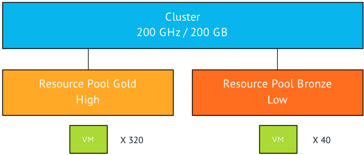
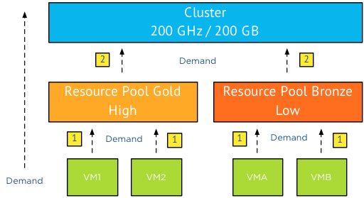
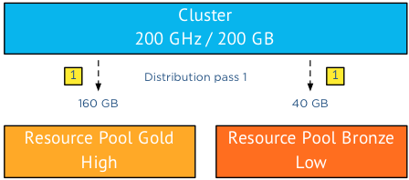
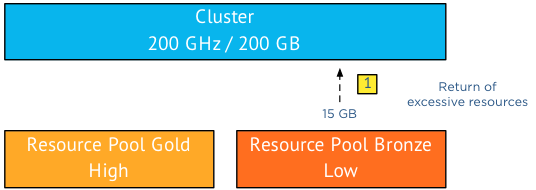
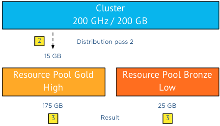

Unfortunately Resource pools seem to have a bad rep, pair them with the word shares and we might as well call death and destruction to our virtual infrastructure while we’re at it. Now in reality shares and resource pools are an excellent way of maintaining a free flow of resource distribution to the virtual machine who require these resources. Some [articles](http://www.yellow-bricks.com/2010/12/14/shares-set-on-resource-pools/), and the examples I use in the book are meant to illustrate the worst-case scenario, but unfortunately those examples are perceived to be the default method of operation. Let me use an example:  In a cluster two resource pool exist, resource pool gold is used for production and is configured with a high share level. Resource pool bronze is used for development and test and is configured with a low share level. Meaning that the ratio of shares is 4:1. Now this environment contains a 8:1 ratio when it comes to virtual machines. The gold resource pool contains 320 virtual machines and the bronze resource pool contains 40 virtual machines. The cluster contains 200 GB of memory and 200 GHz of CPU, this means that the each virtual machine in the gold resource pool has access to 0.5 MHz and 0.5 GB right? Well yes BUT…. (take a deep breath because this will be one long sentence)… Only in the scenario where all the virtual machines in the environment are 100% utilized (CPU and memory), where the ESXi hosts can provide enough network bandwidth and storage bandwidth to back the activity of the virtual machines, no other operations are active in the environment and where all virtual machines are configured identically in size and operating system than yes that happens. In all other scenarios a more dynamic distribution of resources is happening. **The distribution process** Now let’s deconstruct the distribution process. First of all let’s refresh some basic resource management behavior and determine the distinction between shares and reservations. A share is a relative weight, identifying the priority of the virtual machine during contention. It is only relative to its peers and only relative to other active shares. This means that using the previous scenario, the resource pool shares compete against each other and the virtual machine shares inside a single resource pool compete against each other. It’s important to note that only active shares are used when determining distribution. This is to prevent resource hoarding based on shares, if you do not exercise you shares, you lose the rights to compete in the bidding of resources. Reservations are the complete opposite, the resource is protected by a reservation the moment you used it. Basically the virtual machine “owns” that resources and cannot be pressured to relinquish it. Therefor reservations can be seen as the complete opposite of shares, a basic mechanism to hoard resources. Back to the scenario, what happens in most environments?  First of all the demand is driven from bottom to top, that means that virtual machines ask their parent if they can have the resources they demand. The resource pool will ask the cluster for resources.  The distribution is going in the opposite direction; top to bottom and that’s where activity and shares come in to play. If both resource pools are asking for more resources than the cluster can supply, then the cluster needs to decide which resource pool gets the resources. As resource pool (RP) Gold contains a lot more virtual machines its safe to assume that RP Gold is demanding more resources than RP Bronze. The total demand of the virtual machines in RP Gold is 180 GB while the virtual machines in RP Bronze demand a total of 25GB. In total the two RP’s demand 205GB while the cluster can only provide 200GB. Notice that I split up demand request into two levels, VMs to RP, RP to cluster. The cluster will take multiple passes to distribute the resources. In the first pass the resources are distributed according to the relative share value, in this case 4:1 that means that RP Gold is entitled to 160GB of memory (4/5 of 200) and RP Bronze 40GB (1/5 of 200).  While RP Bronze gets awarded 40GB, it is only requesting 25GB, returning the excessive 15GB of memory to the cluster. (Remember if you don’t use it, you lose it)  As the cluster has a "spare" 15GB to distribute it executes a second distribution pass and since there are no other resource consumers in the cluster it awards these 15GB of memory resources to the claim of RP Gold.  This leads to a distribution of 175GB to Resource Pool Gold and 25GB of memory of Resource Pool Bronze. Please note that in this scenario I broke down the sequence into multiple passes, in reality these multiple passes are contained within a (extremely fast) single operation. The moment resource demand changes, a new distribution of resources will occur. Allowing the cluster resources to satisfy the demand in the most dynamic way. The same sequence is happening in the resource pool itself; virtual machines receive their resources based on their activity and their share value. Hereby distributing the resources “owned” by the resource pool to the most important and active virtual machines within the pool If no custom share values are configured on the virtual machine itself, the virtual machine CPU and memory configuration along with the configured share level will determine the amount of shares the virtual machine posses. For example a virtual machine configured with a normal share value and a configuration of 2vCPU and 2GB will posses 2000 shares of CPU and 20480 shares of memory. For more info about share calculation please consult the [VMware vSphere 5.1 resource management guide](http://pubs.vmware.com/vsphere-51/topic/com.vmware.ICbase/PDF/vsphere-esxi-vcenter-server-51-resource-management-guide.pdf "VMware vSphere 5.1 resource management guide"), table 2-1 page 12. (share values have not been changed since the introduction, therefor it's applicable to ESX and all vSphere versions) **Key takeaway** I hope that by using this scenario it’s clear that shares do not hoard resources. The most important thing to understand that it all comes down to activity. Supply is to meet its demand, whenever demand changes new distribution of resources are executed. And although the number of the virtual machines might not be comparable to the share ratio of the resource pools, it’s the activity that drives the dynamic distribution. **Mixing multiple resource allocation settings** In theory an unequal distribution of resources is possible, in reality the presences of more virtual machines equal more demand. Now architecting an environment can be done in many ways, a popular method is to design for worst-case scenario. Great designs usually do not rely on a single element and therefor a configuration with the use of multiple resource allocation settings (reservations, shares and limits) might provide the level of performance throughout the cluster. If you are using a cluster design as described in the scenario and you want to ensure that load and smoke testing do not interfere with the performance levels of the virtual machines in RP Gold, than a mix of resource pool reservations and shares might be a solution. Determine the amount of resources that need to be permanently available to your production environment and configure a reservation on RP Gold. Hereby creating a pool of guaranteed resources and a pool for burstability. Allowing the remaining resources to be allocated by both resource pools on a dynamic and opportunistic basis. You can even further restrict the use of physical resources to the RP bronze by setting a limit on the resource pool. **Longing for SDDC? Start with resource pools!** Its too bad resource pools got a bad rep and maybe I have been a part of it by only describing worst-case scenarios. When understanding resource pool one recongnizes that resource pools are a crucial element in the Software Defined Datacenter. By using the correct mix of resource allocation settings you can provide an abstraction layer that is able to isolate resources for specific workloads or customers. Resources can be flexibly added, removed, or reorganized in resource pools as per changing business needs and priorities. All this is available to you without the need for tinkering with low-level settings on virtual machines or using power-cli scripts to adjust the shares on resource pools.
