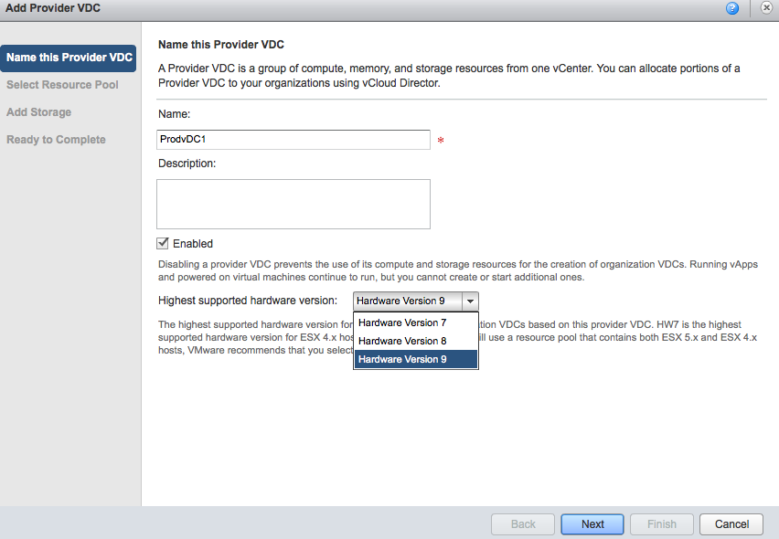
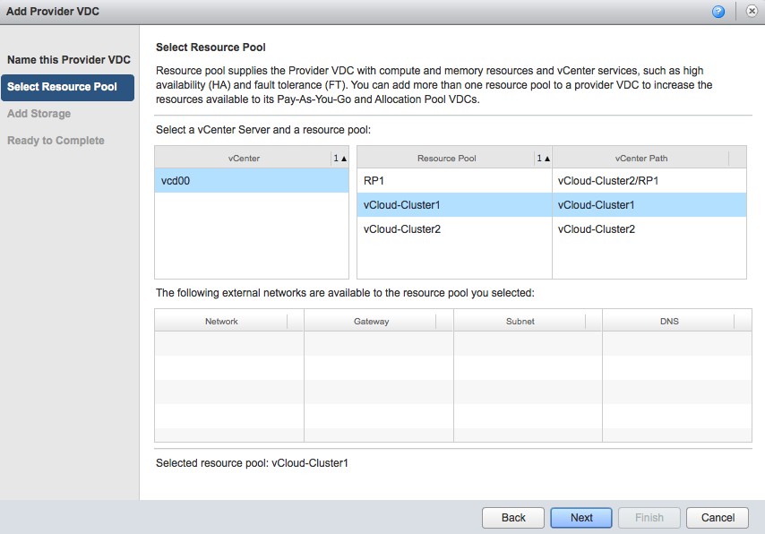
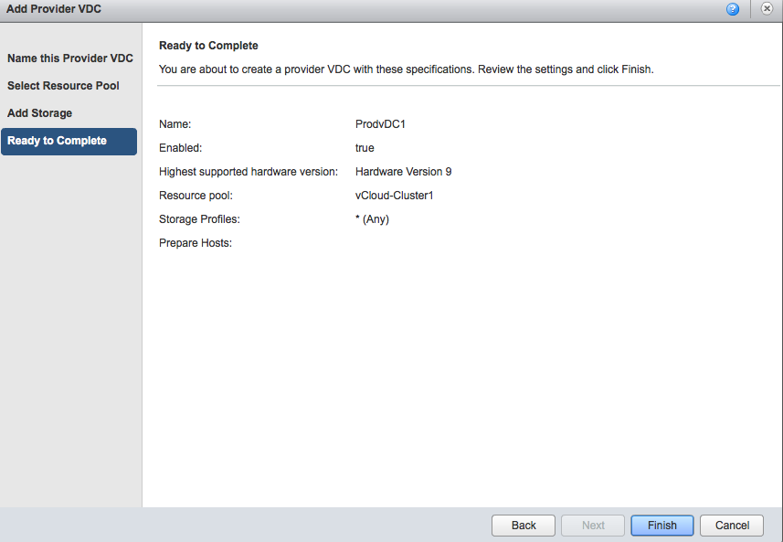
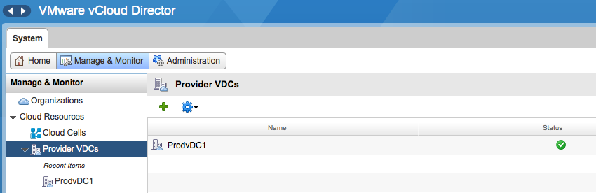

vCloud director 5.1 provides the ability to create elastic vDC which allows an organization vDC to consume resources from multiple DRS clusters. By having the provider vDC abstract the resources from multiple DRS clusters, its simpler to grow capacity when needed. Before elastic vDC, a new provider vDC and Org vDCs needed to be created when an org vDC wanted to grow beyond the capacity of the provider vDC. With Elastic vDC you just add new clusters when needed and allow the Provider vDC to manage initial placement of vApps. During research of elastic vDCs I discovered that the way to span a provider vDC isn’t that intuitive. In order to save you some time, here are the steps to create a provider vDC that spans multiple DRS clusters. Create a Provider vDC, give it a name and select the highest supported hardware version. If you run a homogenous environment with solely 5.1 ESX hosts I highly recommend changing it to Hardware Version 9. If the clusters run different ESX versions, lower the hardware version to the appropriate supported level.  Please note that the provider vDC is responsible for initial placement of the vApp. It will place the vApp on the cluster that contains the most available “unreserved” compute resources and storage resources. It is possible that vApps of the same organization run on different ESX versions. Select Resource pool. This screen is a little bit ambiguous. The user interface “talks” about resource pools, but that doesn’t mean you cannot select a complete DRS cluster for consumption by the provider vDC. A DRS cluster is in essence a resource pool, the root resource pool for all its child resource pools. So don’t worry if you want to select an entire cluster, in matter of fact, when you select the vCenter it shows the DRS clusters as well as the resource pools. In this example, the vCenter contains two DRS clusters; vCloud-Cluster1 and vCloud-Cluster2. The DRS cluster vCloud-Cluster2 contains a resource pool called RP1. Unfortunately the user interface does not use any icons to differentiate between clusters and resource pools, but shows a vCenter path notation. As RP1 is the child resource pool of vCloud-Cluster2, the vCenter path is as follows: vCloud-Cluster2/RP1. Unfortunately the interface only allows to select a single resource pool or cluster, therefor I select the vCloud-Cluster1 and select next.  Select an appropriate Storage profile and click on next. The ready to complete screen displays an overview of your selected configuration. Click on Finish to create the Provider vDC.  At this point in time, the provider vDC maps to only one DRS cluster. To add additional clusters, go to the Manage and Monitor tab and select Provider vDCs.  Click on the provider vDC and select the resource pools tab  Click on the green plus icon to add another DRS cluster. The attach resource pool window is displayed and you can select another cluster from the same vCenter as the primary cluster. Please note that a provider vDC can only span clusters managed by the same vCenter server. Click on Finish to add the DRS cluster to the provider vDC.  The Provider vDC is now able to provider resources from multiple DRS clusters. In vCloud Director 5.1 both the Pay-as-You-Go and Allocation Pool model org vCD are able to consume resources from an elastic vDC. In order to allow the Allocation Pool model to leverage an Elastic vDC changes needed to be made. Massimo Re Ferrè wrote an extensive post about the changes of the [different allocation models in vCloud director 5.1](http://it20.info/2012/10/vcloud-director-5-1-1-changes-in-resource-entitlements/ "http://it20.info/2012/10/vcloud-director-5-1-1-changes-in-resource-entitlements/").
