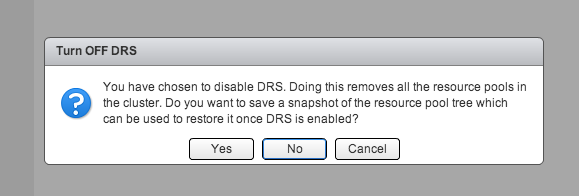
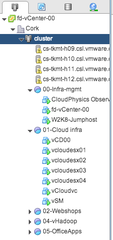

During a troubleshooting exercise of a problem with vCenter I needed to disable DRS to make sure DRS was not the culprit. However a resource pool tree exisited in the infrastructure and I was not looking forward reconfiguring all the resource allocation settings again and documenting which VM belonged to which resource pool. The web client of vSphere 5.1 has a cool feature that helps in these cases. When deactivating DRS (Select cluster, Manage, Settings, Edit, deselect “Turn ON vSphere DRS”) the user interface displays the following question:  **Backup resource pool tree** Click “Yes” to backup the tree and select an appropriate destination for the resource pool tree snapshot file. This file uses the name structure clustername.snapshot and should the file size be not bigger than 1 or 2 KB. **Restore resource pool tree** When enabling DRS on the cluster, the User interface does not ask the question to restore the tree. In order to restore the tree, enable DRS first and select the cluster in the tree view. Open the submenu by performing a right-click on the cluster, expand the “All vCenter Actions” and select the option “Restore Resource Pool Tree…”  A window appears and click browse in order to select the saved resource pool tree snapshot and click on OK  vCenter restores the tree, the resource pool settings (shares, reservations limits) and moves the virtual machines back to the resource pool they were placed in before disabling DRS.  If you want to save the complete vCenter inventory configuration I suggest you download the fling ["InventorySnapshot"](http://labs.vmware.com/flings/inventorysnapshot "InventorySnapshot"). **Update:** If you want to use this tool to backup and restore resource pool trees used by vCloud Director, please read this article: [Saving a Resource Pool Structure web client feature not suitable for vCD environments](http://frankdenneman.nl/2013/04/08/saving-a-resource-pool-structure-web-client-feature-not-suitable-for-vcd-environments/ "Saving a Resource Pool Structure web client feature not suitable for vCD environments")
