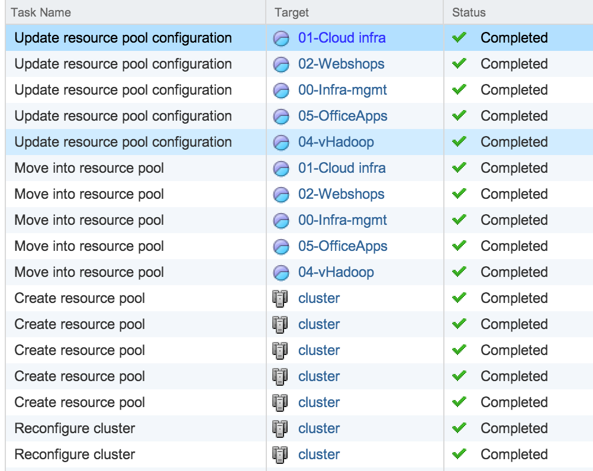

Last week I published the article “[Saving a Resource Pool Structure](http://frankdenneman.nl/2013/04/05/saving-a-resource-pool-structure/ "Saving a Resource Pool Structure")” describing the RP-tree backup and restore feature of vSphere 5.1 web client. Multiple people immediately asked if the feature keeps the Managed Object Reference ID (MoRef) of the resource pools identical when it restores the resource pool tree? This is important for vCloud Director as it creates a relationship between vCloud Director objects organization vCD and the vSphere level resource pool. vCloud Director ties the org vCD UUID with the vSphere resource pool Moref id within vCD database. For more information read Chris his post: "[Gotcha: Disabling VMware DRS with vCloud Director](http://www.chriscolotti.us/vmware/gotcha-disabling-vmware-drs-with-vcloud-director/)". Unfortunately the feature just captures the old tree structure and rebuilds a new tree structure. I tested it by using William Lam’s custom Perl script called moRefFinder.pl. Please visit Williams site to [download his script](http://www.virtuallyghetto.com/2011/11/vsphere-moref-managed-object-reference.html).  Then I proceeded to backup and restore the resource pool tree. vCenter showed the follow commands being processed.  Then I checked if the MoRef ID was the same as prior to disabling DRS.  As shown, the current MoRef ID of the “00-Infra-mgmt” resource pool is 137 contrary to MoRef ID of 129 before disabling DRS. Therefor you should not use this feature when planning to backup and restore the resource pool used by VCD for its organization vCD structures.
